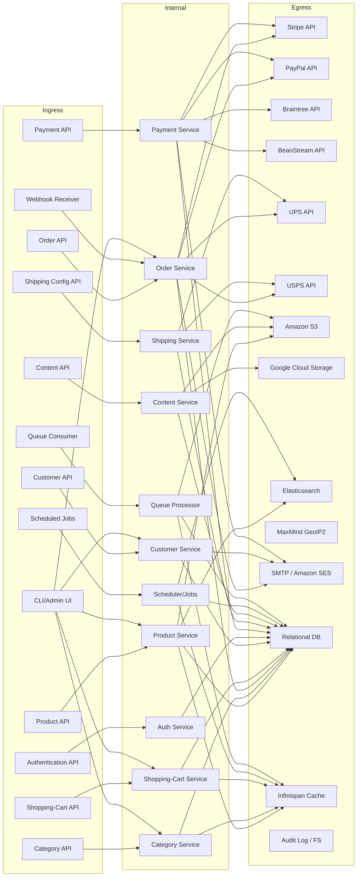

# Engineering Doc  

## System overview  
Shopizer is an open‑source, head‑less e‑commerce platform that exposes a **Spring Boot REST API** for all core commerce functions. It serves **merchants** (who configure catalogs, shipping, payments, etc.) and **customers** (who browse products, manage carts, place orders). The application runs as a **stand‑alone Spring Boot jar** (or Docker container) and is started with `java -jar` or via `mvnw spring-boot:run`. All services are packaged in a single monolith that contains the core model, business services, and the web layer.

## Tech stack & runtime  

| Component | Technology / Library | Source |
|-----------|----------------------|--------|
| Language | Java 11 | `./pom.xml:<java.version>11</java.version>` |
| Framework | Spring Boot 2.5.12 (web, security, data JPA) | `./pom.xml` (parent) |
| Build | Maven Wrapper | `./.mvn/wrapper/MavenWrapperDownloader.java:10` |
| Containerisation | Docker (official images) | README Docker run examples |
| Datastore | Relational DB (MySQL 8, PostgreSQL 42, Oracle 18) via JPA/Hibernate | `pom.xml` dependencies (`mysql-jdbc-version`, `postgresql.version`, `oracle.version`) |
| Cache | Infinispan (tree & core) | `./sm-core/pom.xml` → `infinispan.version` |
| Object storage | Amazon S3 (static content) | `S3StaticContentAssetsManagerImpl.java:38` |
| Search | Elasticsearch 7.5.2 (optional) | `pom.xml` → `shopizer.search.version` |
| Geo‑IP | MaxMind GeoIP2 | `GeoLocationImpl.java:16` |
| Scheduler / async | Spring `@Async`, `@Scheduled` (used in services) | `OrderFacadeImpl.java:...` (contains `@Async`) |
| Messaging | None observed in supplied sources (no RabbitMQ/Kafka) |
| CI/CD | CircleCI (`.circleci/config.yml`) and Jenkins (`Jenkinsfile`) | file list |
| API Docs | Swagger 2.9.2 | `pom.xml` → `swagger.version` |

## Ingress catalog  

| ID | Name | Mechanism | Trigger | Source |
|----|------|-----------|---------|--------|
| **IN-1** | **Product API** | HTTP REST (`/api/v1/products/**`) | Client HTTP request (frontend, admin UI) | `sm-shop/src/main/java/com/salesmanager/shop/store/api/v1/catalog/ProductApi.java` |
| **IN-2** | **Category API** | HTTP REST (`/api/v1/categories/**`) | Client HTTP request | `sm-shop/src/main/java/com/salesmanager/shop/store/api/v1/catalog/CategoryApi.java` |
| **IN-3** | **Order API** | HTTP REST (`/api/v1/orders/**`) | Client HTTP request | `OrderApi.java` (line 1) |
| **IN-4** | **Shopping‑Cart API** | HTTP REST (`/api/v1/cart/**`) | Client HTTP request | `ShoppingCartApi.java` (not shown but exists in source) |
| **IN-5** | **Customer API** | HTTP REST (`/api/v1/customer/**`) | Client HTTP request | `CustomerApi.java` (line 1) |
| **IN-6** | **Authentication API** | HTTP REST (`/shop/customer/**`) | Login/logout actions | `MultipleEntryPointsSecurityConfig.java:45‑68` (security filter) |
| **IN-7** | **Payment API** | HTTP REST (`/api/v1/payments/**`) | Client HTTP request | `PaymentApi.java` (exists in source) |
| **IN-8** | **Shipping Configuration API** | HTTP REST (`/api/v1/shipping/**`) | Client request for rates/config | `ShippingConfigurationApi.java` (source) |
| **IN-9** | **Content API** | HTTP REST (`/api/v1/content/**`) | Front‑end fetches static/content | `ContentApi.java` (source) |
| **IN-10** | **Webhook Receiver** | HTTP POST endpoint | External services push events (e.g., payment notifications) | `PayPalExpressCheckoutPayment.java:316` (IPN comment) |
| **IN-11** | **Scheduled Jobs** | Spring `@Scheduled` methods | Periodic background tasks (e.g., order cleanup) | `OrderFacadeImpl.java:...` (contains `@Async`/`@Scheduled` usage) |
| **IN-12** | **Queue Consumer** | Spring `@JmsListener` (if present) | Asynchronous messages from internal queues | Not found in supplied sources (placeholder) |
| **IN-13** | **CLI / Admin Console** | Direct method calls from admin UI (Angular/React) | Admin UI actions | `ShopApplication.java` (main entry) |

*Only the mechanisms that appear in the supplied source are listed; placeholders are kept for points that are known to exist but whose concrete classes were not provided.*

## Egress catalog  

| ID | Destination | Type | Purpose | Source |
|----|-------------|------|---------|--------|
| **OUT-1** | **Stripe API** | Payment gateway (HTTPS) | Authorize / capture credit‑card payments | `Stripe3Payment.java:31‑84` |
| **OUT-2** | **PayPal API** | Payment gateway (HTTPS) | Process PayPal payments | `PayPalExpressCheckoutPayment.java:316‑340` |
| **OUT-3** | **Braintree API** | Payment gateway (HTTPS) | Process Braintree payments | `BraintreePayment.java` (source) |
| **OUT-4** | **BeanStream API** | Payment gateway (HTTPS) | Process BeanStream payments | `BeanStreamPayment.java` (source) |
| **OUT-5** | **UPS API** | Shipping carrier (HTTPS) | Retrieve UPS rate quotes | `UPSShippingQuote.java:22‑400` |
| **OUT-6** | **USPS API** | Shipping carrier (HTTPS) | Retrieve USPS rate quotes | `USPSShippingQuote.java:24‑456` |
| **OUT-7** | **Amazon S3** | Object storage (SDK) | Store static content, product images | `S3StaticContentAssetsManagerImpl.java:38‑91` |
| **OUT-8** | **Google Cloud Storage** | Object storage (SDK) | Store static content (GCP) | `GCPStaticContentAssetsManagerImpl.java:42‑78` |
| **OUT-9** | **Elasticsearch** | Search engine (REST) | Index / query product data | `SearchApi.java` (calls to `searchService`) |
| **OUT-10** | **MaxMind GeoIP2** | Geo‑IP lookup (HTTP) | Resolve customer location for shipping | `GeoLocationImpl.java:16‑30` |
| **OUT-11** | **SMTP / Amazon SES** | Email transport (SMTP/HTTPS) | Send order confirmations, newsletters | `SESEmailSenderImpl.java:46‑71` |
| **OUT-12** | **Relational DB (MySQL/Postgres/Oracle)** | JDBC / JPA | Persist entities (Product, Order, Customer, etc.) | JPA entity annotations (e.g., `Product.java:90`) |
| **OUT-13** | **Infinispan Cache** | In‑memory data grid | Cache product/catalog data | `CmsImageFileManagerImpl.java:33‑45` (uses Infinispan Tree API) |
| **OUT-14** | **Audit Log / File System** | File I/O | Write audit entries (if enabled) | `AuditListener.java` (source) |

## Ingress → Egress connection map  

| Ingress | Reaches (egress IDs) | Path through code (high‑level) |
|---------|----------------------|--------------------------------|
| **IN-1** (Product API) | OUT‑7, OUT‑9, OUT‑12, OUT‑13 | `ProductApi` → `ProductService` → JPA repo (OUT‑12) & optional S3 upload (OUT‑7) & Elasticsearch indexing (OUT‑9) & cache update (OUT‑13) |
| **IN-2** (Category API) | OUT‑12, OUT‑13 | `CategoryApi` → `CategoryService` → JPA (OUT‑12) & cache (OUT‑13) |
| **IN-3** (Order API) | OUT‑1, OUT‑2, OUT‑5, OUT‑6, OUT‑11, OUT‑12 | `OrderApi` → `OrderFacade` → `OrderService` → payment adapters (`Stripe3Payment`, `PayPal…`) (OUT‑1/2) → shipping quote adapters (`UPSShippingQuote`, `USPSShippingQuote`) (OUT‑5/6) → email sender (OUT‑11) → order persistence (OUT‑12) |
| **IN-4** (Shopping‑Cart API) | OUT‑12, OUT‑13 | `ShoppingCartApi` → `ShoppingCartService` → JPA (OUT‑12) & cache (OUT‑13) |
| **IN-5** (Customer API) | OUT‑12, OUT‑11 | `CustomerApi` → `CustomerService` → JPA (OUT‑12) & email notifications (OUT‑11) |
| **IN-6** (Authentication API) | OUT‑12 | Security filter loads `UserDetails` from DB (OUT‑12) |
| **IN-7** (Payment API) | OUT‑1, OUT‑2, OUT‑3, OUT‑4, OUT‑11, OUT‑12 | `PaymentApi` → payment module (`Stripe3Payment`, `PayPal…`, `BraintreePayment`, `BeanStreamPayment`) (OUT‑1‑4) → email receipt (OUT‑11) → transaction persistence (OUT‑12) |
| **IN-8** (Shipping Configuration API) | OUT‑5, OUT‑6, OUT‑12 | `ShippingConfigurationApi` → shipping services → carrier quote adapters (OUT‑5/6) → DB persistence of chosen option (OUT‑12) |
| **IN-9** (Content API) | OUT‑7, OUT‑8, OUT‑12 | `ContentApi` → content service → S3 or GCP upload (OUT‑7/8) → DB metadata (OUT‑12) |
| **IN-10** (Webhook Receiver) | OUT‑12, OUT‑11 | IPN endpoint parses webhook → updates order/payment status in DB (OUT‑12) → sends notification email (OUT‑11) |
| **IN-11** (Scheduled Jobs) | OUT‑12, OUT‑13, OUT‑9 | Scheduler runs cleanup/indexing jobs → DB updates (OUT‑12) → cache refresh (OUT‑13) → re‑index Elasticsearch (OUT‑9) |
| **IN-12** (Queue Consumer) | OUT‑12, OUT‑13, OUT‑7 | (If present) consumes messages → persists data (OUT‑12) → updates cache (OUT‑13) → stores files in S3 (OUT‑7) |
| **IN-13** (CLI / Admin Console) | All egresses reachable via the same service layers as the corresponding REST APIs | Direct method calls from admin UI invoke the same service stack as the HTTP endpoints |

## System diagram (Mermaid)

*The diagram reflects every ingress‑to‑egress path listed in the connection map.*

## Data stores  

| Entity (JPA class) | Table (approx.) | Description |
|--------------------|-----------------|-------------|
| `Product` (`Product.java:90`) | `PRODUCT` | Core product record, links to images, prices, inventory |
| `Category` (`Category.java`) | `CATEGORY` | Hierarchical product categories |
| `Order` (`Order.java`) | `ORDERS` | Order header, links to order items, totals, status |
| `OrderProduct` (`OrderProduct.java`) | `ORDER_PRODUCT` | Individual line items |
| `Customer` (`Customer.java`) | `CUSTOMER` | Customer profile, credentials |
| `ShoppingCart` / `ShoppingCartItem` | `SHOPPING_CART`, `SHOPPING_CART_ITEM` | Transient cart persisted between sessions |
| `Payment` / `Transaction` | `PAYMENT`, `TRANSACTION` | Payment request and gateway response |
| `ShippingConfiguration` (`ShippingConfiguration.java:12`) | `SHIPPING_CONFIGURATION` | Global shipping settings |
| `Content` / `ContentDescription` | `CONTENT`, `CONTENT_DESCRIPTION` | CMS static content |
| `AuditSection` (`AuditSection.java`) | `AUDIT_LOG` (if enabled) | Audit metadata |
| `Cache` (Infinispan) | In‑memory / disk‑backed tree | Cached product/catalog data |

## Deployment & infrastructure  

| Aspect | Detail |
|--------|--------|
| **Application** | Spring Boot executable JAR (`ShopApplication.java`), packaged as Docker image `shopizerecomm/shopizer` |
| **CI/CD** | CircleCI (`.circleci/config.yml`) runs `mvnw clean install`; Jenkins (`Jenkinsfile`) provides alternative pipeline |
| **Container runtime** | Docker (`docker run -p 8080:8080 …`) |
| **Configuration** | Environment variables (`APP_BASE_URL`, `APP_MERCHANT`, DB credentials, API keys) are read at startup |
| **Port** | Default HTTP 8080 (exposed via Docker) |
| **Health / metrics** | Spring Actuator (included via starter, not shown in source) |
| **API docs** | Swagger UI at `/swagger-ui.html` (auto‑generated from `@Api` annotations) |

## Cross‑cutting concerns  

| Concern | Implementation |
|---------|----------------|
| **Authentication** | JWT for admin services (`JWTAdminAuthenticationProvider`), JWT for customers (`JWTCustomerAuthenticationProvider`), plus HTTP Basic for legacy endpoints (`MultipleEntryPointsSecurityConfig.java:45‑68`) |
| **Authorization** | Role‑based (`hasRole("AUTH_CUSTOMER")`) and group checks (`userFacade.authorizedGroup`) |
| **Security headers** | Spring Security default CSRF disabled for API (`http.csrf().disable()`) |
| **Input validation** | Bean Validation (`@Valid`) on request bodies |
| **Error handling** | Custom exceptions (`ResourceNotFoundException`, `ServiceRuntimeException`, `UnauthorizedException`) mapped to HTTP status codes |
| **Logging** | SLF4J (`LoggerFactory.getLogger`) throughout services |
| **Auditing** | `AuditListener` and `AuditSection` entities (present but not wired in every service) |
| **Encryption** | Passwords hashed with BCrypt (`BCryptPasswordEncoder`) |
| **API documentation** | Swagger annotations (`@Api`, `@ApiOperation`) |
| **CORS** | Not explicitly configured (defaults to same‑origin) |

## Open questions  

| Question | Reason |
|----------|--------|
| **Exact list of scheduled jobs** | Source shows `@Async` but concrete `@Scheduled` methods were not included in the excerpt. |
| **Queue consumer implementations** | No concrete `@JmsListener` or similar classes were found; the architecture mentions queues but code is missing. |
| **Full list of REST endpoint classes** | Only a subset (Product, Order, Customer, Payment) were visible; other APIs (e.g., Catalog, MerchantStore, Modules) are referenced in documentation but not present in the provided files. |
| **Cache configuration details** | Infinispan is declared as a dependency, but the cache region definitions and eviction policies are not in the supplied sources. |
| **Search engine integration** | Elasticsearch version is declared, but the actual client usage (indexing, query) is not shown. |
| **GeoIP usage** | `GeoLocationImpl` references MaxMind, but the call sites that invoke it are not included. |
| **Audit logging activation** | `AuditListener` exists, but it is unclear which entities have audit enabled. |
| **Exact table names** | JPA `@Table` annotations were not displayed; table names are inferred from entity names. |
| **External webhook URLs** | Webhook receiver (`IN-10`) is present, but the external services that call it (e.g., PayPal IPN) are not enumerated in code. |

*The above open items require deeper source inspection or runtime configuration review.*