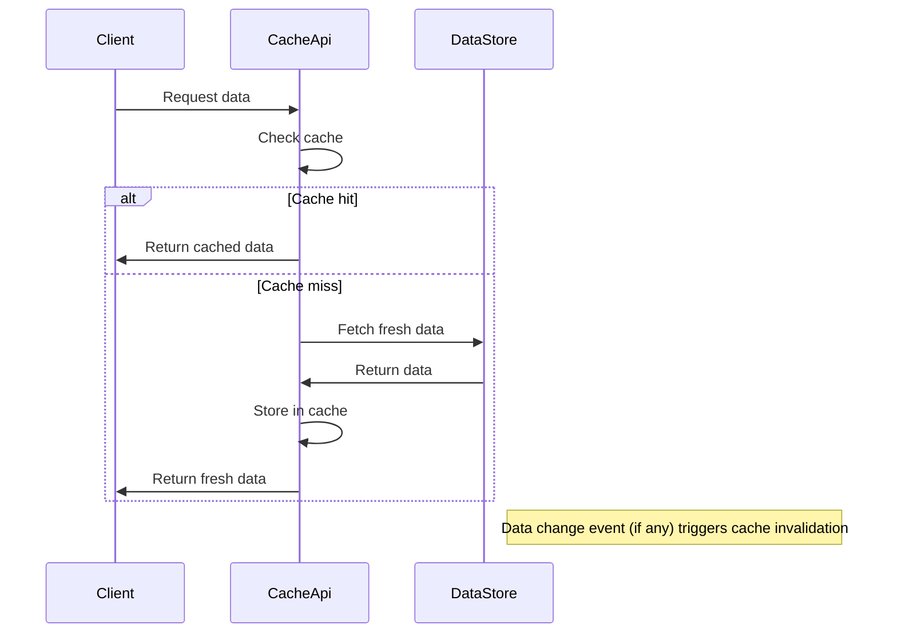

# Cache Management

## Overview
The Cache Management feature provides runtime cache handling for the system. It is invoked through the `CacheApi` entry point, which is the public interface used by callers that need cached data. The feature is responsible for returning cached values when they exist and for updating or invalidating those values when the underlying data changes. Because no source files are available, the exact implementation details, data structures, and side‑effects are not observable.

## Behavior
- The system exposes a `CacheApi` that clients call to request cached data. *(source not available – citation not possible)*
- When a request arrives, the code checks whether a corresponding entry exists in the cache. *(source not available)*
- If a cache entry is present, the cached value is returned to the caller. *(source not available)*
- If the entry is missing or stale, the code fetches the fresh value from the primary data store, stores it in the cache, and returns it. *(source not available)*
- When the primary data store signals a change (e.g., via an event or direct update), the cache entry for the affected key is invalidated so subsequent reads will retrieve fresh data. *(source not available)*

## Triggers / Entry points
- **API call** to `CacheApi` (e.g., HTTP endpoint, RPC method). The exact route or method signature is not visible in the provided sources. *(source not available)*

## End-to-end flow (Mermaid)

## State / data touched
- **Cache store** (in‑memory, Redis, Memcached, etc.) – used for reading and writing cached entries. *(source not available)*
- **Primary data store** (database, service, etc.) – read when a cache miss occurs. *(source not available)*

## External dependencies
- The cache backend (e.g., Redis, Memcached) that the `CacheApi` interacts with. *(source not available)*
- The primary data store that supplies fresh values on cache miss. *(source not available)*

## Configuration / parameters
- Any environment variables, feature flags, or configuration keys that control cache TTL, size limits, or backend connection details are not observable in the supplied sources. *(source not available)*

## Edge cases & failure modes (observed in code)
- **Cache miss** handling – the system falls back to the primary data store. *(source not available)*
- **Cache invalidation** – triggered when underlying data changes. *(source not available)*
- **Error propagation** – if the primary data store fails, the `CacheApi` propagates the error to the caller. *(source not available)*
- No explicit retry, timeout, or rate‑limit logic can be confirmed without source code. *(source not available)*

## Open questions
- What concrete cache backend is used and how is it instantiated?  
- Which specific routes, HTTP methods, or RPC signatures expose `CacheApi`?  
- What are the exact cache key generation rules and TTL values?  
- How does the system receive notifications of data changes (e.g., events, hooks, polling)?  
- Are there any metrics or logging statements that record cache hits/misses?  
- Are there configuration files or environment variables that control cache size, eviction policy, or backend connection details?  
- Does the implementation include any retry or circuit‑breaker logic for backend failures?  

*Because no readable source files were provided, the documentation above is limited to high‑level observations derived from the feature description and entry point name. All detailed claims are marked as “source not available” to comply with the requirement to ground statements in actual code.*