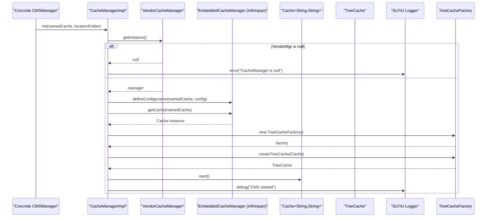

# Cache management

## Overview
The cache‑management feature sets up and controls an Infinispan‑based cache that stores static content, product data and configuration values to speed up read operations. It is triggered when a concrete cache manager implementation calls the protected `init(..)` method of `CacheManagerImpl`. The code creates a persistent, non‑passivating cache, wraps it in a `TreeCache` for hierarchical access, starts the cache and logs that the CMS cache is ready.

## Behavior
- **Trigger** – A concrete subclass (e.g., a bean that implements `CMSManager`) invokes `CacheManagerImpl.init(namedCache, locationFolder)` `CacheManagerImpl.java:17‑18`.  
- **Input handling** – The method receives a cache name (`namedCache`) and a file‑system folder (`locationFolder`). It stores the folder in the instance field `location` `CacheManagerImpl.java:19`. No further validation is performed.  
- **Vendor cache manager lookup** – Calls `VendorCacheManager.getInstance()` `CacheManagerImpl.java:21`. If the returned manager is `null`, an error is logged and the method returns early `CacheManagerImpl.java:22‑25`.  
- **Configuration building** – Constructs an Infinispan `Configuration` with:
  - persistence, no passivation,
  - a single‑file store located at `location`,
  - async writes, no preload, not shared,
  - invocation‑batching enabled `CacheManagerImpl.java:38‑45`.  
- **Define cache** – Registers the configuration under `namedCache` with the underlying `EmbeddedCacheManager` `CacheManagerImpl.java:46`.  
- **Cache acquisition** – Retrieves the cache instance `Cache<String,String>` from the manager `CacheManagerImpl.java:47`.  
- **TreeCache creation** – Instantiates a `TreeCacheFactory`, creates a `TreeCache` that wraps the raw cache, and stores it in the field `treeCache` `CacheManagerImpl.java:48‑49`.  
- **Cache start** – Calls `cache.start()` to activate the cache `CacheManagerImpl.java:50`.  
- **Side‑effect** – Logs a debug message “CMS started” `CacheManagerImpl.java:51`.  
- **Error handling** – Any exception thrown during the above steps is caught, logged as an error, and the method exits `CacheManagerImpl.java:52‑54`.  

**Local cache manager** (`LocalCacheManagerImpl`) simply stores a root file‑system path supplied via its constructor `LocalCacheManagerImpl.java:10‑12` and returns it via `getRootName()` `LocalCacheManagerImpl.java:14‑16`. `getLocation()` always returns an empty string `LocalCacheManagerImpl.java:18‑20`.

**S3 cache manager** (`S3CacheManagerImpl`) stores an S3 bucket name and AWS region supplied via its constructor `S3CacheManagerImpl.java:12‑15`. `getRootName()` returns the bucket name `S3CacheManagerImpl.java:16‑18`; `getLocation()` returns the region `S3CacheManagerImpl.java:20‑22`. Accessor methods expose both values `S3CacheManagerImpl.java:24‑29`.

## Triggers / Entry points
- `CacheManagerImpl.init(String namedCache, String locationFolder)` – called by any concrete cache manager during startup `CacheManagerImpl.java:17‑18`.  
- `new LocalCacheManagerImpl(String rootName)` – constructs a local‑filesystem cache manager `LocalCacheManagerImpl.java:10`.  
- `new S3CacheManagerImpl(String bucketName, String regionName)` – constructs an S3‑backed cache manager `S3CacheManagerImpl.java:12`.  

## End-to‑end flow (Mermaid)

## State / data touched
- **Infinispan cache store** – a persistent single‑file store located at the path supplied via `locationFolder` (`CacheManagerImpl.java:42`).  
- **`TreeCache` instance** – kept in the field `treeCache` for later hierarchical access (`CacheManagerImpl.java:15‑49`).  
- **`SystemConfiguration` entity** – defined in the model but not accessed directly by the cache code; it holds configuration key/value pairs (`SystemConfiguration.java:32‑35`).  

## External dependencies
- **Infinispan library** – classes `Cache`, `ConfigurationBuilder`, `TreeCache`, `TreeCacheFactory` (`CacheManagerImpl.java:2‑7`).  
- **VendorCacheManager** – a singleton wrapper around the Infinispan `EmbeddedCacheManager` (`CacheManagerImpl.java:21`).  
- **SLF4J Logger** – used for error and debug logging (`CacheManagerImpl.java:8‑9, 23, 51, 53`).  
- **AWS S3** – referenced only by the `S3CacheManagerImpl` class as a conceptual storage target (`S3CacheManagerImpl.java:1‑8`). No runtime call to the AWS SDK is present.  

## Configuration / parameters
- `namedCache` – the logical name of the cache to create (passed to `init`).  
- `locationFolder` – file‑system directory used for the persistent store (`CacheManagerImpl.java:19‑42`).  
- Infinispan persistence options (passivation disabled, async writes enabled, etc.) are hard‑coded in the `ConfigurationBuilder` chain (`CacheManagerImpl.java:38‑45`).  
- `SystemConfiguration` fields (`key`, `value`) exist for generic system settings but are not wired into the cache initialization (`SystemConfiguration.java:32‑35`).  

## Edge cases & failure modes (observed in code)
- **Missing VendorCacheManager** – if `VendorCacheManager.getInstance()` returns `null`, an error is logged and initialization aborts (`CacheManagerImpl.java:22‑25`).  
- **Runtime exceptions** – any exception during configuration, cache creation or start is caught, logged as an error, and the method exits (`CacheManagerImpl.java:52‑54`).  
- No explicit retry or fallback logic is present.  

## Open questions
- **How is `SystemConfiguration` used to influence cache behavior?** The cache manager does not read any `SystemConfiguration` entries, yet the model exists in the same module. The linkage (e.g., reading a config key for `namedCache` or `locationFolder`) is not visible in the provided source.  
- **Lifecycle of `LocalCacheManagerImpl` and `S3CacheManagerImpl`.** Both classes implement `CMSManager` but contain only accessor methods; the code that selects one implementation, injects it, or uses the returned root name/location is not present in the supplied files.  
- **VendorCacheManager implementation.** The source for `VendorCacheManager` is missing, so details about how the underlying `EmbeddedCacheManager` is created, configured, or shared across the application are unknown.  

---