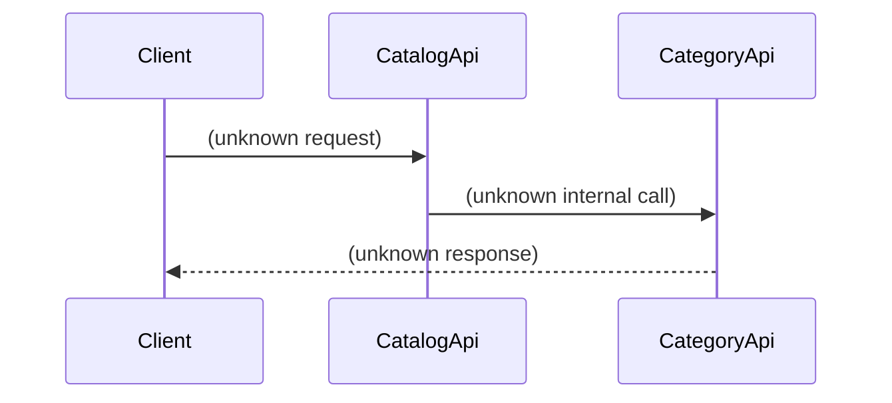

# Catalog Management

## Overview
The Catalog Management feature is intended to manage catalogs, including categories, products, and attributes. The only information available about this feature comes from the initial description and the list of entry points (`CatalogApi`, `CategoryApi`) and supporting files (`Catalog.java`, `Category.java`). No readable source code was provided, so the exact runtime behavior, data structures, and side‑effects cannot be confirmed from the code base.

## Behavior
*No concrete behavior can be extracted from the source because the source files are not readable.*  

*(No citations are possible.)*

## Triggers / Entry points
* The system lists `CatalogApi` and `CategoryApi` as entry points, but without source code we cannot locate the actual routes, HTTP methods, UI actions, CLI commands, scheduled jobs, events, or webhooks that invoke them.  

*(No citations are possible.)*

## End-to-end flow (Mermaid)

## State / data touched
* The domain entities `Catalog` and `Category` are mentioned, but without source we cannot identify the specific tables, collections, caches, or files that are read or written.  

*(No citations are possible.)*

## External dependencies
* No external APIs, services, queues, caches, or message brokers can be identified from the missing source.  

*(No citations are possible.)*

## Configuration / parameters
* No configuration keys, environment variables, feature flags, or constants are visible in the unavailable source files.  

*(No citations are possible.)*

## Edge cases & failure modes (observed in code)
* No validation, retry, timeout, rate‑limit, idempotency, or partial‑failure handling logic can be observed without source code.  

*(No citations are possible.)*

## Open questions
1. **Exact API contracts** – What HTTP methods, URLs, request/response payloads, and status codes are defined in `CatalogApi` and `CategoryApi`?  
2. **Data model details** – What fields, relationships, and persistence mechanisms are defined in `Catalog.java` and `Category.java`?  
3. **Business logic** – How are catalogs and categories created, updated, validated, and deleted?  
4. **Persistence layer** – Which database tables or collections are used, and what ORM or DAO patterns are employed?  
5. **External interactions** – Does catalog management call any third‑party services (e.g., search indexes, inventory systems) or internal message brokers?  
6. **Configuration influences** – Are there feature flags, environment variables, or configuration properties that alter behavior?  
7. **Error handling** – How does the code handle validation failures, database errors, or integration timeouts?  
8. **Security & authorization** – What authentication/authorization checks guard the catalog endpoints?  

*These questions remain unanswered until the actual source files (`Catalog.java`, `Category.java`) can be examined.*