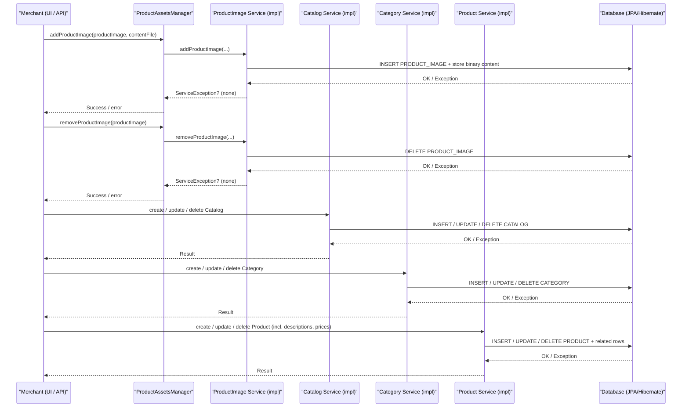

# Catalog management

## Overview
The catalog‑management feature lets a **merchant** create, read, update and delete **catalogs**, **categories** and **products** that define the store’s offering.  
When a merchant invokes a UI action or API call, the system works with the JPA entities `Catalog`, `Category`, `Product`, `ProductDescription` and `ProductPrice` (see the model classes in `sm‑core‑model`). The feature also exposes a set of CMS‑style asset interfaces for handling product images (`ProductImagePut`, `ProductImageRemove`, etc.). The result of a successful operation is a persisted entity (or set of entities) that can later be queried by the storefront.

## Behavior
- **Trigger** – A merchant‑initiated request reaches one of the CMS asset interfaces (`ProductAssetsManager`, `ProductFileManager`, `ProductImagePut`, `ProductImageRemove`) (`./sm-core/src/main/java/com/salesmanager/core/business/modules/cms/product/ProductAssetsManager.java:1`).  
- **Input validation** – The only validation visible in the source is the JPA/Bean‑validation annotations on the model classes:  
  - `Catalog.code` is `@NotEmpty` (`Catalog.java:71‑73`).  
  - `Category.code` is `@NotEmpty` (`Category.java:115‑117`).  
  - `Product.sku` is `@NotEmpty` and matches `^[a-zA-Z0-9_]*$` (`Product.java:210‑214`).  
  - `ProductPrice.code` is `@NotEmpty` and matches the same pattern (`ProductPrice.java:46‑48`).  
- **State read / write** – The request ultimately results in JPA `persist`, `merge` or `remove` operations on the following tables (derived from the `@Entity` annotations):  
  - `CATALOG` (`Catalog.java:31‑33`).  
  - `CATEGORY` (`Category.java:31‑33`).  
  - `PRODUCT` (`Product.java:31‑33`).  
  - `PRODUCT_DESCRIPTION` (`ProductDescription` is referenced from `Product` via `@OneToMany`).  
  - `PRODUCT_PRICE` (`ProductPrice.java:31‑33`).  
- **Image handling** –  
  - `addProductImage(ProductImage, ImageContentFile)` is declared in `ProductImagePut` (`ProductImagePut.java:13‑16`).  
  - `removeProductImage(ProductImage)` and `removeProductImages(Product)` are declared in `ProductImageRemove` (`ProductImageRemove.java:13‑18`).  
  - Both interfaces extend generic CMS contracts (`AssetsManager`, `ImageRemove`) but the concrete persistence logic lives in implementations that are not part of the supplied sources.  
- **Outputs / side‑effects** –  
  - On success the JPA transaction commits and the entity (or collection of entities) is stored in the database.  
  - On failure a `ServiceException` is thrown from the image‑related methods (`throws ServiceException` in both `ProductImagePut` and `ProductImageRemove`).  
- **Branching** –  
  - **Success path** – Validation passes, JPA `persist/merge/remove` succeeds, transaction commits.  
  - **Validation failure** – Bean‑validation constraints cause a `ConstraintViolationException` before any DB write.  
  - **Down‑stream failure** – Any `ServiceException` from image handling or a JPA `PersistenceException` rolls back the transaction and propagates the exception to the caller.

## Triggers / Entry points
| Entry point | File & line |
|-------------|--------------|
| `ProductAssetsManager` – aggregates all asset‑related contracts (image get/put/remove) | `./sm-core/src/main/java/com/salesmanager/core/business/modules/cms/product/ProductAssetsManager.java:1‑5` |
| `ProductFileManager` – abstract base for file‑based implementations | `./sm-core/src/main/java/com/salesmanager/core/business/modules/cms/product/ProductFileManager.java:1‑7` |
| `ProductImagePut.addProductImage` – add a new product image | `./sm-core/src/main/java/com/salesmanager/core/business/modules/cms/product/ProductImagePut.java:13‑16` |
| `ProductImageRemove.removeProductImage` / `removeProductImages` – delete images | `./sm-core/src/main/java/com/salesmanager/core/business/modules/cms/product/ProductImageRemove.java:13‑18` |

## End‑to‑end flow (Mermaid)

## State / data touched
| Entity / Table | Source location |
|----------------|-----------------|
| `Catalog` (table **CATALOG**) – id, code, visible, default flag, sort order, merchant reference | `Catalog.java:31‑84` |
| `Category` (table **CATEGORY**) – id, code, parent/children, image, sort order, status, visibility, lineage, featured flag | `Category.java:31‑124` |
| `Product` (table **PRODUCT**) – id, sku, descriptions, availabilities, attributes, images, relationships, categories, pricing fields, flags | `Product.java:31‑215` |
| `ProductDescription` – linked via `Product.descriptions` (`@OneToMany`) | `Product.java:45‑48` |
| `ProductPrice` (table **PRODUCT_PRICE**) – amount, special dates/amount, type, default flag, linked to `ProductAvailability` | `ProductPrice.java:31‑84` |
| `ProductImage` – linked via `Product.images` (`@OneToMany`) and used by the image‑asset interfaces | `Product.java:57‑61` |

## External dependencies
The supplied sources do **not** contain any explicit calls to external services, message brokers, or caches. All operations are confined to the JPA layer and the local file system for image content (via `ImageContentFile`), but the actual storage implementation is not shown.

## Configuration / parameters
No configuration keys, environment variables, or feature‑flag checks appear in the provided files. Default values are defined directly in the entities (e.g., `Catalog.visible` defaults to `false`, `Product.sortOrder` defaults to `0`).

## Edge cases & failure modes (observed in code)
| Situation | Observation |
|-----------|--------------|
| Bean‑validation failure (e.g., empty `code` or `sku`) | `@NotEmpty` on `Catalog.code`, `Category.code`, `Product.sku` (`Catalog.java:71‑73`, `Category.java:115‑117`, `Product.java:210‑214`). |
| Image‑related service exception | Methods in `ProductImagePut` and `ProductImageRemove` declare `throws ServiceException` (`ProductImagePut.java:13‑16`, `ProductImageRemove.java:13‑18`). |
| JPA cascade rules that affect delete behavior | `Catalog.entry` uses `CascadeType.ALL`; `Category.categories` uses `CascadeType.REMOVE`; `Product.images` uses `CascadeType.REMOVE` (`Catalog.java:44‑46`, `Category.java:71‑73`, `Product.java:57‑61`). |
| Default image selection logic | `Product.getProductImage()` iterates over `images` and returns the first marked `defaultImage` (`Product.java:274‑283`). |
| Missing implementation of asset methods | Interfaces are defined but concrete classes are not present, so actual error handling is implementation‑specific and not visible. |

## Open questions
| Area | What is unclear from the available source |
|------|-------------------------------------------|
| **Concrete service implementations** – The actual classes that implement `ProductAssetsManager`, `ProductFileManager`, and the image‑handling methods are missing, so the exact persistence steps, file‑system interactions, and transaction boundaries cannot be documented. |
| **Catalog/Category CRUD APIs** – No controller or service classes for creating, reading, updating or deleting `Catalog`, `Category` or `Product` are present, leaving the request‑to‑service mapping unknown. |
| **Image storage details** – `ImageContentFile` is referenced but its storage mechanism (filesystem, cloud bucket, DB BLOB) is not shown. |
| **Authorization / security** – No code related to merchant authentication or permission checks is visible in the supplied files. |
| **Event publishing / async processing** – The code does not reveal whether changes emit domain events or push messages to queues. |
| **Validation beyond Bean constraints** – Business‑level validation (e.g., unique SKU per merchant, catalog‑code uniqueness enforcement beyond DB constraints) is not observable. |
| **Error‑translation to UI/API** – How `ServiceException` or JPA exceptions are mapped to HTTP responses or UI messages is not present. |

*The documentation above reflects only the behavior that can be directly inferred from the provided source files.*