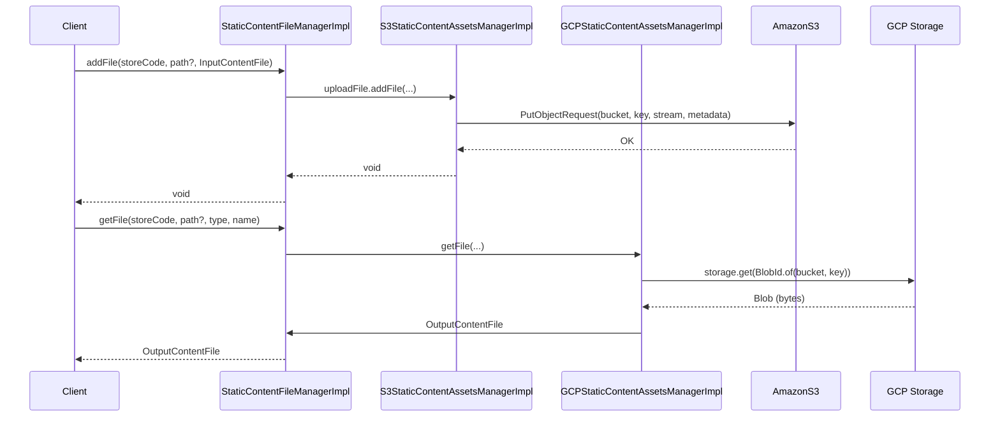

# Content management (CMS)

## Overview
The CMS feature stores and retrieves static assets (images, files, pages) for a merchant store.  
Calls are made through the `StaticContentFileManagerImpl` service, which delegates to a concrete `ContentAssetsManager` implementation (Amazon S3 or Google Cloud Storage). The manager writes the binary payload to the external bucket and returns an `OutputContentFile` wrapper when reading. All operations are performed synchronously and any lower‑level exception is wrapped in a `ServiceException`.

## Behavior
- **Trigger** – A client (e.g., storefront UI, admin UI, or another service) invokes one of the public methods on `StaticContentFileManagerImpl` (`addFile`, `addFiles`, `removeFile`, `removeFiles`, `getFile`, `getFileNames`, `getFiles`, `addFolder`, `removeFolder`, `listFolders`). `StaticContentFileManagerImpl` is the entry point. `StaticContentFileManagerImpl.java:31‑71`  
- **Input validation** – The manager does not perform explicit validation; it forwards the received parameters to the underlying `FilePut`, `FileGet`, `FileRemove`, etc., objects. `StaticContentFileManagerImpl.java:33‑70`  
- **State read / change** –  
  * For **add** operations the binary stream (`InputContentFile.getFile()`) and metadata (`mimeType`, `fileName`, `fileContentType`) are sent to the bucket via the concrete manager (`S3StaticContentAssetsManagerImpl.addFile` or `GCPStaticContentAssetsManagerImpl.addFile`). `S3StaticContentAssetsManagerImpl.java:115‑138`, `GCPStaticContentAssetsManagerImpl.java:84‑106`  
  * For **remove** operations the manager builds the object key (`nodePath(...) + fileName`) and calls `deleteObject` (S3) or `storage.delete` (GCP). `S3StaticContentAssetsManagerImpl.java:158‑166`, `GCPStaticContentAssetsManagerImpl.java:124‑131`  
  * For **read** operations the manager builds the object key and calls `getObject` (S3) or `storage.get` (GCP) to obtain a byte array, which is wrapped in an `OutputContentFile`. `S3StaticContentAssetsManagerImpl.java:71‑79`, `GCPStaticContentAssetsManagerImpl.java:46‑55`  
  * Folder‑related methods (`addFolder`, `removeFolder`, `listFolders`) are declared but contain only `TODO` stubs, so no state change occurs today. `S3StaticContentAssetsManagerImpl.java:191‑199`, `GCPStaticContentAssetsManagerImpl.java:166‑176`  
- **Outputs / side‑effects** –  
  * `addFile` / `addFiles` → binary data stored in the external bucket; method returns `void`. `S3StaticContentAssetsManagerImpl.java:115‑138`, `GCPStaticContentAssetsManagerImpl.java:84‑106`  
  * `removeFile` / `removeFiles` → object(s) deleted from the bucket; method returns `void`. `S3StaticContentAssetsManagerImpl.java:158‑166`, `GCPStaticContentAssetsManagerImpl.java:124‑131`  
  * `getFile` → `OutputContentFile` containing a `ByteArrayOutputStream` (S3) or raw byte array (GCP). `S3StaticContentAssetsManagerImpl.java:71‑79`, `GCPStaticContentAssetsManagerImpl.java:46‑55`  
  * `getFileNames` → list of file names filtered by MIME type detection. `S3StaticContentAssetsManagerImpl.java:84‑108`, `GCPStaticContentAssetsManagerImpl.java:71‑92`  
  * `getFiles` → list of `OutputContentFile` objects (S3 builds each file manually; GCP re‑uses `getFile`). `S3StaticContentAssetsManagerImpl.java:110‑133`, `GCPStaticContentAssetsManagerImpl.java:98‑108`  
- **Branching / error handling** – Each bucket operation is wrapped in a `try { … } catch (Exception e)` block; on error the exception is logged and re‑thrown as a `ServiceException`. `S3StaticContentAssetsManagerImpl.java:71‑79`, `S3StaticContentAssetsManagerImpl.java:115‑138`, `S3StaticContentAssetsManagerImpl.java:158‑166`, `GCPStaticContentAssetsManagerImpl.java:46‑55`, `GCPStaticContentAssetsManagerImpl.java:84‑106`, `GCPStaticContentAssetsManagerImpl.java:124‑131`

## Triggers / Entry points
| Entry point | File & line |
|-------------|--------------|
| `StaticContentFileManagerImpl.addFile` | `StaticContentFileManagerImpl.java:47‑50` |
| `StaticContentFileManagerImpl.addFiles` | `StaticContentFileManagerImpl.java:55‑58` |
| `StaticContentFileManagerImpl.removeFile` | `StaticContentFileManagerImpl.java:63‑66` |
| `StaticContentFileManagerImpl.removeFiles` | `StaticContentFileManagerImpl.java:71‑73` |
| `StaticContentFileManagerImpl.getFile` | `StaticContentFileManagerImpl.java:71‑73` |
| `StaticContentFileManagerImpl.getFileNames` | `StaticContentFileManagerImpl.java:77‑80` |
| `StaticContentFileManagerImpl.getFiles` | `StaticContentFileManagerImpl.java:82‑85` |
| `S3StaticContentAssetsManagerImpl.addFile` | `S3StaticContentAssetsManagerImpl.java:115‑138` |
| `S3StaticContentAssetsManagerImpl.addFiles` | `S3StaticContentAssetsManagerImpl.java:140‑148` |
| `S3StaticContentAssetsManagerImpl.getFile` | `S3StaticContentAssetsManagerImpl.java:71‑79` |
| `S3StaticContentAssetsManagerImpl.getFileNames` | `S3StaticContentAssetsManagerImpl.java:84‑108` |
| `S3StaticContentAssetsManagerImpl.getFiles` | `S3StaticContentAssetsManagerImpl.java:110‑133` |
| `S3StaticContentAssetsManagerImpl.removeFile` | `S3StaticContentAssetsManagerImpl.java:158‑166` |
| `S3StaticContentAssetsManagerImpl.removeFiles` | `S3StaticContentAssetsManagerImpl.java:170‑178` |
| `GCPStaticContentAssetsManagerImpl.addFile` | `GCPStaticContentAssetsManagerImpl.java:84‑106` |
| `GCPStaticContentAssetsManagerImpl.addFiles` | `GCPStaticContentAssetsManagerImpl.java:108‑115` |
| `GCPStaticContentAssetsManagerImpl.getFile` | `GCPStaticContentAssetsManagerImpl.java:46‑55` |
| `GCPStaticContentAssetsManagerImpl.getFileNames` | `GCPStaticContentAssetsManagerImpl.java:71‑92` |
| `GCPStaticContentAssetsManagerImpl.getFiles` | `GCPStaticContentAssetsManagerImpl.java:98‑108` |
| `GCPStaticContentAssetsManagerImpl.removeFile` | `GCPStaticContentAssetsManagerImpl.java:124‑131` |
| `GCPStaticContentAssetsManagerImpl.removeFiles` | `GCPStaticContentAssetsManagerImpl.java:138‑146` |

## End‑to‑end flow (Mermaid)

*The diagram shows the two concrete implementations (S3 and GCP) that may be wired to `StaticContentFileManagerImpl` at runtime. The actual wiring (e.g., Spring bean injection) is not present in the provided sources, so the diagram reflects the possible delegation paths.*

## State / data touched
| Resource | Accessed by | File & line |
|----------|--------------|-------------|
| External S3 bucket (name from `bucketName()`) | `S3StaticContentAssetsManagerImpl` – put, get, list, delete | `S3StaticContentAssetsManagerImpl.java:115‑138`, `71‑79`, `84‑108`, `158‑166` |
| External GCP bucket (name from `bucketName()`) | `GCPStaticContentAssetsManagerImpl` – put, get, list, delete | `GCPStaticContentAssetsManagerImpl.java:84‑106`, `46‑55`, `71‑92`, `124‑131` |
| `InputContentFile` (payload stream, mime type, name) | Passed from client → manager | `StaticContentFileManagerImpl.java:47‑50`, `55‑58` |
| `OutputContentFile` (wrapped byte stream) | Returned to client | `S3StaticContentAssetsManagerImpl.java:71‑79`, `GCPStaticContentAssetsManagerImpl.java:46‑55` |
| **Note** – The JPA entities `Content`, `ContentDescription`, `ImageContentFile` are defined in the model but are **not** accessed by the static‑content manager code shown. No database tables are read or written by the methods documented above.

## External dependencies
| Dependency | Used in | Call site |
|------------|---------|-----------|
| AWS SDK `AmazonS3` client | `S3StaticContentAssetsManagerImpl` | `S3StaticContentAssetsManagerImpl.java:115‑138` (put), `71‑79` (get), `158‑166` (delete) |
| Google Cloud Storage SDK `Storage` | `GCPStaticContentAssetsManagerImpl` | `GCPStaticContentAssetsManagerImpl.java:84‑106` (put), `46‑55` (get), `124‑131` (delete) |
| Apache Commons IO `IOUtils` | S3 read of object content | `S3StaticContentAssetsManagerImpl.java:71‑79` |
| SLF4J `Logger` | All implementations for logging | Various lines (e.g., `S3StaticContentAssetsManagerImpl.java:73`, `GCPStaticContentAssetsManagerImpl.java:48`) |
| `URLConnection.guessContentTypeFromName` | MIME‑type detection for listing | `S3StaticContentAssetsManagerImpl.java:92‑106`, `GCPStaticContentAssetsManagerImpl.java:78‑92` |

## Configuration / parameters
| Parameter | Source |
|-----------|--------|
| Bucket name (`bucketName()`) – derived from `cmsManager.getLocation()` or a default constant (`DEFAULT_BUCKET_NAME` not shown) | `S3StaticContentAssetsManagerImpl.java:regionName()` uses `cmsManager.getLocation()`; similar logic in GCP implementation (`bucketName()` method not shown but follows same pattern) |
| Region name for AWS (`regionName()`) – falls back to `DEFAULT_REGION_NAME` if `cmsManager.getLocation()` is blank | `S3StaticContentAssetsManagerImpl.java:138‑144` |
| No environment‑variable look‑ups appear in the provided code. All configuration is obtained via the injected `CMSManager` bean. |

## Edge cases & failure modes (observed in code)
* **Exception wrapping** – Any `Exception` thrown by the AWS or GCP SDK is caught, logged, and re‑thrown as a `ServiceException`. `S3StaticContentAssetsManagerImpl.java:71‑79`, `115‑138`, `158‑166`; `GCPStaticContentAssetsManagerImpl.java:46‑55`, `84‑106`, `124‑131`.  
* **Null list handling** – `getFileNames` and `getFiles` lazily instantiate the result list only when a matching object is found. If no objects match, the method returns `null`. `S3StaticContentAssetsManagerImpl.java:84‑108`, `110‑133`.  
* **MIME‑type filter** – Only objects whose key’s guessed MIME type is non‑blank are included in listings. `S3StaticContentAssetsManagerImpl.java:92‑106`, `GCPStaticContentAssetsManagerImpl.java:78‑92`.  
* **Folder‑related methods** – Currently contain only `TODO` stubs; calling them results in no operation and no error. `S3StaticContentAssetsManagerImpl.java:191‑199`, `GCPStaticContentAssetsManagerImpl.java:166‑176`.  

## Open questions
* **Wiring of `FilePut`, `FileGet`, `FileRemove`, `FolderPut`, `FolderRemove`, `FolderList`** – The `StaticContentFileManagerImpl` fields are set via setters, but the configuration (e.g., which concrete implementation – S3 or GCP – is injected) is not visible in the supplied sources.  
* **`bucketName()` implementation** – The method that resolves the bucket name is referenced but its code is not included; its exact logic (e.g., default name, per‑store naming) is unknown.  
* **`CMSManager` usage** – Only `regionName()` in the S3 implementation accesses `cmsManager.getLocation()`. The rest of the `CMSManager` API (e.g., tenant‑specific settings) is not shown, so its impact on bucket naming or other behavior is unclear.  
* **Return value of `listFolders`** – Both S3 and GCP implementations return `null` with a `TODO`. The current system therefore does not support folder enumeration.  
* **Concurrency / idempotency** – No explicit handling (e.g., retries, version checks) is present; it is unclear how duplicate uploads or concurrent deletions are managed.  
* **Security / ACLs** – S3 sets `CannedAccessControlList.PublicRead`; GCP does not set an explicit ACL. The policy defaults and any credential handling are not visible in the provided code.