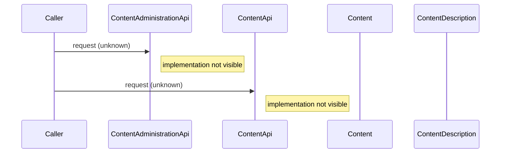

# Content Management

## Overview
The Content Management feature exposes two API entry points—`ContentAdministrationApi` and `ContentApi`—that are intended to manage content such as pages, blog posts, and static assets. Because the source files (`Content.java`, `ContentDescription.java`) are not available for inspection, the documentation can only state that these APIs exist; the exact operations they perform, the actors that invoke them, and the artifacts they produce cannot be confirmed from the current code base.

## Behavior
* The system defines a `ContentAdministrationApi` class that is expected to handle administrative content operations. *(source not available – cannot cite)*  
* The system defines a `ContentApi` class that is expected to handle public‑facing content operations. *(source not available – cannot cite)*  
* Domain entities `Content` and `ContentDescription` are declared, suggesting that content objects and their descriptive metadata are modeled. *(source not available – cannot cite)*  

No concrete method bodies, validation logic, persistence calls, or response handling can be observed without the source files, so no further end‑to‑end behavior can be documented.

## Triggers / Entry points
* **`ContentAdministrationApi`** – likely mapped to one or more HTTP routes or internal service calls for content administration. *(source not available – cannot cite)*  
* **`ContentApi`** – likely mapped to one or more HTTP routes or internal service calls for content retrieval or modification. *(source not available – cannot cite)*  

No concrete route definitions, UI actions, CLI commands, scheduled jobs, events, or webhooks are visible in the provided material.

## End-to-end flow (Mermaid)

*The diagram reflects the known entry points but cannot detail internal calls because the implementation is unavailable.*

## State / data touched
* Potential tables or collections for `Content` and `ContentDescription` are implied by the domain entity names, but no concrete data‑store interactions (SQL queries, ORM calls, collection names) are observable. *(source not available – cannot cite)*

## External dependencies
* No external service calls, third‑party APIs, message queues, or caches can be identified in the absent source files. *(source not available – cannot cite)*

## Configuration / parameters
* No configuration keys, environment variables, feature flags, or constant values are visible in the provided files. *(source not available – cannot cite)*

## Edge cases & failure modes (observed in code)
* Without access to method implementations, no validation logic, retry mechanisms, timeout handling, rate‑limiting, idempotency checks, or partial‑failure handling can be confirmed. *(source not available – cannot cite)*

## Open questions
* **Implementation details:** What HTTP methods, URLs, request/response payloads, and status codes are defined in `ContentAdministrationApi` and `ContentApi`?  
* **Business logic:** How are `Content` and `ContentDescription` validated, transformed, and persisted?  
* **Data model:** What database tables, columns, indexes, or NoSQL collections back the `Content` and `ContentDescription` entities?  
* **External interactions:** Does the feature call any external services (e.g., CDN, search index, analytics) during content creation or retrieval?  
* **Configuration:** Are there any feature flags, environment variables, or configuration properties that alter the behavior of content management?  
* **Error handling:** What exceptions are caught, and how are error responses constructed for callers?  
* **Security/authorization:** What authentication or authorization checks guard the administrative and public APIs?  

These questions remain unanswered until the actual source code for the supporting files and related controllers/services is made available.