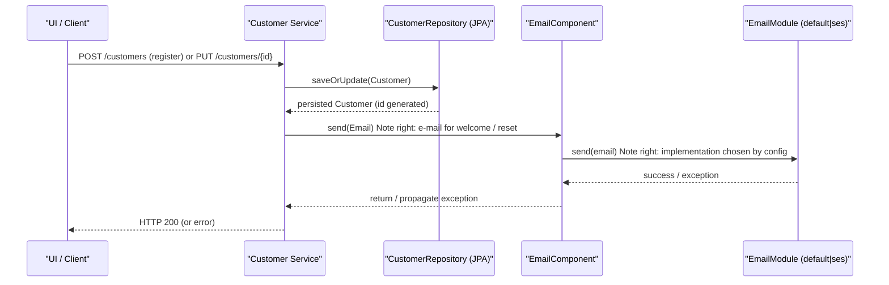

# Customer account management

## Overview
The customer‑account‑management feature stores and manipulates a **Customer** entity that represents a shopper’s profile (email, password, address, language, groups, etc.) and supplies an **EmailComponent** that dispatches e‑mail notifications (e.g., registration, password‑reset) using a configurable email implementation.  
When a client (web UI, mobile app, or other service) creates or updates a customer record, the system validates the supplied data, persists the changes, and may trigger an e‑mail via `EmailComponent.send(Email)`. The component returns a success response or throws an exception if the configured e‑mail provider is unknown.

## Behavior
- **Trigger** – A call to `EmailComponent.send(Email)` is made by higher‑level services after a customer‑related event (e.g., registration, password reset).  `EmailComponent` is a Spring component (`./sm-core/src/main/java/com/salesmanager/core/business/modules/email/EmailComponent.java:1‑37`).  
- **Input validation** – The `Email` object carries the e‑mail payload; its fields are plain POJOs with no internal validation (only getters/setters). Validation of the **Customer** payload occurs via JSR‑303 annotations on the entity:  
  - `@Email @NotEmpty` on `emailAddress` (`./sm-core-model/src/main/java/com/salesmanager/core/model/customer/Customer.java:55‑58`).  
  - `@NotEmpty` on `nick` is not present, but the column is defined as nullable (`./Customer.java:61‑63`).  
- **State read / change** –  
  - The `Customer` entity maps to the `CUSTOMER` table (`@Entity @Table(name = "CUSTOMER")` – `./Customer.java:1‑9`).  
  - Fields such as `emailAddress`, `password`, `billing`, `delivery`, `groups`, etc., are persisted via JPA (`@Column`, `@Embedded`, `@ManyToMany`, etc.).  
  - When a service updates a `Customer`, JPA’s dirty‑checking writes the modified columns back to the DB.  
- **Email dispatch** – `EmailComponent.send` selects an implementation based on the `emailSender` property (`@Value("${config.emailSender}")` – `./EmailComponent.java:9‑11`).  
  - If the value is `"default"` it calls `defaultEmailSender.send(email)` (`./EmailComponent.java:24‑26`).  
  - If the value is `"ses"` it calls `sesEmailSender.send(email)` (`./EmailComponent.java:27‑29`).  
  - Any other value causes an exception: `throw new Exception("No email implementation for " + emailSender);` (`./EmailComponent.java:30‑32`).  
- **Side‑effects** – The selected `EmailModule` implementation (not shown) performs the actual SMTP/SES call, which may send a message to the customer.  
- **Branching** –  
  - **Success path** – The chosen `EmailModule` returns normally; `EmailComponent.send` completes without exception.  
  - **Invalid configuration** – The `default` switch falls to the `default:` case and throws an exception (`./EmailComponent.java:30‑32`).  
  - **Down‑stream failure** – If the underlying `EmailModule.send` throws, the exception propagates out of `EmailComponent.send` (no catch block is present).  

## Triggers / Entry points
| Entry point | What it represents | Source |
|-------------|-------------------|--------|
| `EmailComponent.send(Email)` | Public method used by services to send e‑mail notifications for customer actions | `./sm-core/src/main/java/com/salesmanager/core/business/modules/email/EmailComponent.java:21‑33` |
| `EmailComponent.setEmailConfig(EmailConfig)` | Allows runtime configuration of the underlying e‑mail module | `./EmailComponent.java:35‑45` |
| `Customer` entity construction / persistence | Creation or update of a customer record (triggered by controllers/services not present in the supplied sources) | `./sm-core-model/src/main/java/com/salesmanager/core/model/customer/Customer.java:1‑201` |
| `CustomerCriteria` | DTO used by search services to filter customers (e.g., by name, email, country) | `./sm-core-model/src/main/java/com/salesmanager/core/model/customer/CustomerCriteria.java:1‑30` |

## End‑to‑end flow (Mermaid)

*The diagram reflects only the code that is present: the `Customer` persistence via JPA and the e‑mail dispatch via `EmailComponent`. Controllers, service classes, and the concrete `EmailModule` implementations are not part of the supplied sources.*

## State / data touched
| Data artifact | Description | Source |
|---------------|-------------|--------|
| `CUSTOMER` table | Stores all fields of the `Customer` entity (id, email, password, address, groups, etc.) | `Customer.java: @Entity @Table(name = "CUSTOMER")` (`./Customer.java:1‑9`) |
| `CUSTOMER_GROUP` join table | Persists many‑to‑many relationship between customers and groups | `@JoinTable(name = "CUSTOMER_GROUP")` (`./Customer.java:115‑124`) |
| `SM_SEQUENCER` table (via `TABLE_GEN`) | Generates primary‑key values for `CUSTOMER_ID` | `@TableGenerator(..., pkColumnValue = "CUSTOMER_SEQ_NEXT_VAL")` (`./Customer.java:27‑31`) |
| `Email` object (in‑memory) | Holds e‑mail payload (from, to, subject, template, tokens) passed to `EmailComponent` | `Email.java` fields (`./Email.java:1‑45`) |
| `EmailConfig` (if set) | Configuration object handed to the underlying `EmailModule` | `EmailComponent.setEmailConfig` (`./EmailComponent.java:35‑45`) |

## External dependencies
| Call site | External component / library | Purpose |
|-----------|-----------------------------|---------|
| `defaultEmailSender.send(email)` | Bean of type `EmailModule` named *default* (implementation not in supplied sources) | Sends e‑mail via the default provider |
| `sesEmailSender.send(email)` | Bean of type `EmailModule` named *ses* (implementation not in supplied sources) | Sends e‑mail via Amazon SES |
| `@Value("${config.emailSender}")` | Spring property source (environment, `application.properties`, etc.) | Determines which `EmailModule` bean to use |
| JPA/Hibernate (`@Entity`, `@ManyToOne`, etc.) | Hibernate ORM (runtime) | Persists `Customer` and related entities to the relational DB |

## Configuration / parameters
- **`config.emailSender`** – Spring property that selects the e‑mail implementation (`default` or `ses`). Used in `EmailComponent.emailSender` (`./EmailComponent.java:9‑11`).  
- No other feature flags or constants are referenced in the supplied files.

## Edge cases & failure modes (observed in code)
| Situation | Handling in code |
|-----------|------------------|
| **Unknown e‑mail provider** (`emailSender` not `"default"` or `"ses"`) | `EmailComponent.send` throws `new Exception("No email implementation for " + emailSender)` (`./EmailComponent.java:30‑32`). |
| **Down‑stream e‑mail error** (e.g., SMTP failure) | Propagates the exception from the chosen `EmailModule.send` up to the caller; no retry logic is present. |
| **Invalid customer fields** (e.g., malformed email) | Bean‑validation annotations (`@Email`, `@NotEmpty`) cause validation errors when the entity is persisted via JPA (outside of the shown code). |
| **Null `emailSender` property** | Spring would inject `null`; the `switch(emailSender)` would throw a `NullPointerException` before any case is matched (not explicitly guarded). |
| **Missing `EmailModule` beans** | If Spring cannot inject `defaultEmailSender` or `sesEmailSender`, the application fails at startup (dependency injection error). |

## Open questions
| Area | What is unclear from the available source |
|------|-------------------------------------------|
| **Customer service / controller layer** | No classes are provided that receive HTTP requests, map them to `Customer` objects, or invoke `EmailComponent`. The exact request URLs, HTTP methods, and response formats are unknown. |
| **Concrete `EmailModule` implementations** | The code for `defaultEmailSender` and `sesEmailSender` is absent, so we cannot describe how e‑mail is actually sent, what retries or templates are used, or which external services (SMTP server, AWS SES) are contacted. |
| **Search / filtering logic** | `CustomerCriteria` is defined but never used in the supplied snippets; the service that translates criteria into JPA queries is missing. |
| **Password handling** | The `Customer` entity stores a plain `password` column, but there is no code showing hashing, salting, or verification. |
| **Order‑history retrieval** | The initial description mentions “view order history,” yet no `Order` or `Purchase` entities are referenced in the provided files. |
| **Event publishing / async processing** | It is unknown whether e‑mail sending is performed synchronously or via a message queue; the current `EmailComponent.send` calls the module directly. |
| **Configuration source for `config.emailSender`** | The property key is referenced, but the location (e.g., `application.properties`, environment variable) is not shown. |

*The documentation above reflects only the code that is present in the supplied repository. Any functionality that depends on missing classes or external modules is listed under “Open questions.”*