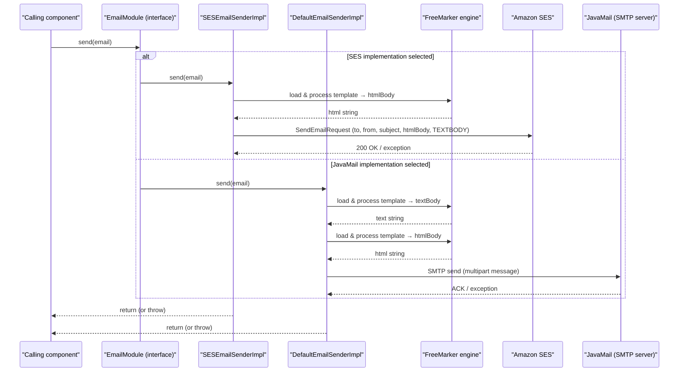

# Email and notification management

## Overview
The email and notification management feature sends transactional emails (e.g., order confirmations, password‑reset messages) and system notifications to users and merchants.  
When a component in the application creates an `Email` object and calls `EmailModule.send(email)`, the call is dispatched to one of the two concrete implementations of `EmailModule` – `SESEmailSenderImpl` (which uses Amazon SES) or `DefaultEmailSenderImpl` (which uses JavaMail). The selected implementation renders the email body from a FreeMarker template and delivers the message to the external mail service.

## Behavior
- **Trigger** – A call to `EmailModule.send(email)` invokes the concrete sender (`SESEmailSenderImpl.send` or `DefaultEmailSenderImpl.send`). `EmailModule` defines the method at `./sm-core/src/main/java/com/salesmanager/core/business/modules/email/EmailModule.java:5`.  
- **Input validation** – `SESEmailSenderImpl` validates that the AWS region property is not null (`Validate.notNull(region, …)` at `./sm-core/src/main/java/com/salesmanager/core/business/modules/email/SESEmailSenderImpl.java:58`). `DefaultEmailSenderImpl` checks whether an `EmailConfig` object is present before applying SMTP settings (`if (emailConfig != null)` at `./sm-core/src/main/java/com/salesmanager/core/business/modules/email/DefaultEmailSenderImpl.java:58`).  
- **Template rendering** – Both senders load a FreeMarker template from `templates/email/<templateName>` (`freemarkerMailConfiguration.getTemplate(...)` at `SESEmailSenderImpl.java:78‑79` and `DefaultEmailSenderImpl.java:86‑87`). The template is processed with the map of tokens supplied in the `Email` object (`htmlTemplate.process(email.getTemplateTokens(), …)` at `SESEmailSenderImpl.java:82` and `textTemplate.process(templateTokens, …)` / `htmlTemplate.process(templateTokens, …)` at `DefaultEmailSenderImpl.java:89` and `109`).  
- **Email construction**  
  * **SES path** – Builds a `SendEmailRequest` containing destination, subject, HTML body (generated above) and a plain‑text fallback (`TEXTBODY` constant at `SESEmailSenderImpl.java:49`). The request is sent with `client.sendEmail(request)` (`SESEmailSenderImpl.java:71`).  
  * **JavaMail path** – Creates a multipart/alternative message: a plain‑text part (`textPart`) and an HTML part (`htmlPart` inside a `MimeMultipart("related")`). The parts are attached to a `MimeMessage` (`mimeMessage.setContent(mp)` at `DefaultEmailSenderImpl.java:126`). The message is finally sent with `mailSender.send(preparator)` (`DefaultEmailSenderImpl.java:137`).  
- **State changes** – The only state touched inside the senders is the optional `EmailConfig` object, which may be populated from the database and applied to the `JavaMailSenderImpl` (`impl.setProtocol(...)` etc. at `DefaultEmailSenderImpl.java:59‑68`). No persistent entities are modified by the senders themselves.  
- **Success path** – If template processing succeeds and the external mail service accepts the request, the email is dispatched and the method returns normally.  
- **Failure paths**  
  * Missing AWS region → `Validate.notNull` throws an exception (`SESEmailSenderImpl.java:58`).  
  * FreeMarker processing error → `MailPreparationException` is thrown (`SESEmailSenderImpl.java:84` and `DefaultEmailSenderImpl.java:89` / `109`).  
  * Any exception from the external mail client (SES or JavaMail) propagates upward because the `send` method declares `throws Exception`.  

## Triggers / Entry points
| Entry point | Description |
|------------|-------------|
| `./sm-core/src/main/java/com/salesmanager/core/business/modules/email/EmailModule.java:5` | Interface method `send(Email)` that any caller invokes. |
| `./sm-core/src/main/java/com/salesmanager/core/business/modules/email/SESEmailSenderImpl.java:54` | Concrete SES implementation of `send`. |
| `./sm-core/src/main/java/com/salesmanager/core/business/modules/email/DefaultEmailSenderImpl.java:44` | Concrete JavaMail implementation of `send`. |

## End‑to‑end flow (Mermaid)

## State / data touched
- `SystemNotification` entity (`./sm-core-model/src/main/java/com/salesmanager/core/model/system/SystemNotification.java:1‑84`) – represents stored system notifications, but **is not accessed** by the email sender code shown.  
- `EmailConfig` (referenced in `DefaultEmailSenderImpl.java:39‑68`) – holds SMTP configuration that may be read from the database and applied at runtime.  
- FreeMarker template files under `templates/email/` – read from the classpath when rendering email bodies (`SESEmailSenderImpl.java:78‑79` and `DefaultEmailSenderImpl.java:86‑87`).  

## External dependencies
- **Amazon SES SDK** – `AmazonSimpleEmailServiceClientBuilder` and `SendEmailRequest` used in `SESEmailSenderImpl.java:60‑71`.  
- **JavaMail / Spring Mail** – `JavaMailSender`, `JavaMailSenderImpl`, `MimeMessagePreparator` used in `DefaultEmailSenderImpl.java:27‑137`.  
- **FreeMarker** – template engine (`freemarker.template.Configuration`, `Template`) used in both senders (`SESEmailSenderImpl.java:77‑82`, `DefaultEmailSenderImpl.java:85‑109`).  

## Configuration / parameters
- `config.emailSender.region` (Spring `@Value` injection) – determines the AWS region for SES (`SESEmailSenderImpl.java:15`).  
- `EmailConfig` fields (`protocol`, `host`, `port`, `username`, `password`, `smtpAuth`, `starttls`) – applied to the JavaMail sender when present (`DefaultEmailSenderImpl.java:59‑68`).  
- FreeMarker template base path – constant `TEMPLATE_PATH = "templates/email"` in both implementations (`SESEmailSenderImpl.java:40`, `DefaultEmailSenderImpl.java:41`).  

## Edge cases & failure modes (observed in code)
- **Missing AWS region** → `Validate.notNull` throws `IllegalArgumentException` (`SESEmailSenderImpl.java:58`).  
- **FreeMarker template not found or processing error** → `MailPreparationException` is thrown (`SESEmailSenderImpl.java:84`, `DefaultEmailSenderImpl.java:89` / `109`).  
- **SMTP configuration absent** – if `emailConfig` is `null`, the default `JavaMailSender` configuration (as defined elsewhere in the Spring context) is used; no explicit error is raised.  
- **External service errors** – any exception from `client.sendEmail(request)` (SES) or `mailSender.send(preparator)` (SMTP) propagates because the `send` method declares `throws Exception`. No retry logic is present in the shown code.  

## Open questions
- **`SESEmailSenderImpl.setEmailConfig`** is declared but contains only a TODO comment (`SESEmailSenderImpl.java:93`). It is unclear whether SES can be re‑configured at runtime and, if so, how the configuration would be applied.  
- **Structure of the `Email` class** – the source for `Email` (methods like `getFrom()`, `getFromEmail()`, `getTo()`, `getSubject()`, `getTemplateName()`, `getTemplateTokens()`) is not included, so the exact data types and any additional validation performed there are unknown.  
- **Selection logic between SES and JavaMail** – the code shows two implementations but does not reveal how the application decides which bean to inject or invoke for a given email. This wiring likely resides in Spring configuration that is not part of the provided files.