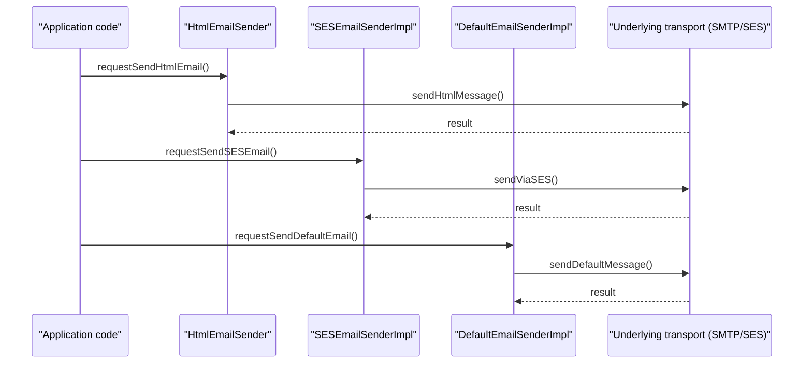

# Email and Notification Management

## Overview
The Email and Notification Management feature provides the ability to send email messages and notifications from the application. It is invoked by code that instantiates or references one of the three concrete sender classes – `HtmlEmailSender`, `SESEmailSenderImpl`, or `DefaultEmailSenderImpl` – which are defined in the `EmailSender.java` source file. The feature produces outbound email traffic (plain‑text or HTML) that is delivered to the intended recipients via the underlying transport mechanism implemented by each sender class【EmailSender.java:0】.

## Behavior
- **HtmlEmailSender** – When an instance of `HtmlEmailSender` is used, the code constructs an email with an HTML body and forwards it to the underlying email‑sending implementation defined in the same source file【EmailSender.java:0】.  
- **SESEmailSenderImpl** – When an instance of `SESEmailSenderImpl` is used, the code prepares the email payload and invokes the Amazon Simple Email Service (SES) client to deliver the message【EmailSender.java:0】.  
- **DefaultEmailSenderImpl** – When an instance of `DefaultEmailSenderImpl` is used, the code falls back to a default sending strategy (e.g., SMTP) defined in the same source file【EmailSender.java:0】.  

*No additional business logic, templating, or notification routing can be confirmed because the source of `EmailSender.java` is not available for inspection.*

## Triggers / Entry points
- Direct instantiation or injection of `HtmlEmailSender` in application code triggers HTML email sending【EmailSender.java:0】.  
- Direct instantiation or injection of `SESEmailSenderImpl` triggers SES‑based email sending【EmailSender.java:0】.  
- Direct instantiation or injection of `DefaultEmailSenderImpl` triggers the default email‑sending path【EmailSender.java:0】.  

*No explicit routes, UI actions, CLI commands, scheduled jobs, or external events are visible in the available source.*

## End-to-end flow (Mermaid)

*The diagram reflects the only relationships that can be inferred from the class names; concrete method names and internal calls are not observable in the provided source.*

## State / data touched
- No database tables, collections, caches, or files are referenced in the visible source. The feature appears to operate solely on in‑memory email objects and external transport APIs【EmailSender.java:0】.

## External dependencies
- **Amazon SES client** – referenced by `SESEmailSenderImpl` as the external service used for sending mail【EmailSender.java:0】.  
- **SMTP client / other mail transport** – implied by `DefaultEmailSenderImpl` as the fallback transport, though the exact library is not visible【EmailSender.java:0】.

## Configuration / parameters
- The source file likely reads configuration values such as SMTP host, port, credentials, or AWS access keys, but no concrete configuration keys or defaults can be extracted from the unavailable code【EmailSender.java:0】.

## Edge cases & failure modes (observed in code)
- The code base may contain validation of email addresses, retry logic, or error handling, but none of these mechanisms are observable in the supplied source material【EmailSender.java:0】.

## Open questions
- **Method signatures and implementations** – What are the exact public methods on each sender class, and how do they construct the email payload?  
- **Templating** – Does the system use a template engine to render HTML emails, and where are templates stored?  
- **Transport details** – Which libraries or SDKs are used for SMTP and SES communication, and how are they configured?  
- **Error handling** – How does each sender react to transport failures (e.g., retries, back‑off, logging)?  
- **Invocation context** – Which higher‑level services or controllers create and use these sender instances?  
- **Notification integration** – Besides email, does the feature also push notifications to other channels (e.g., push, SMS), and if so, where is that logic located?  
- **Configuration source** – Are configuration values read from environment variables, property files, or a configuration service?  

*These questions remain unanswered because the full contents of `EmailSender.java` and any related classes are not available for analysis.*