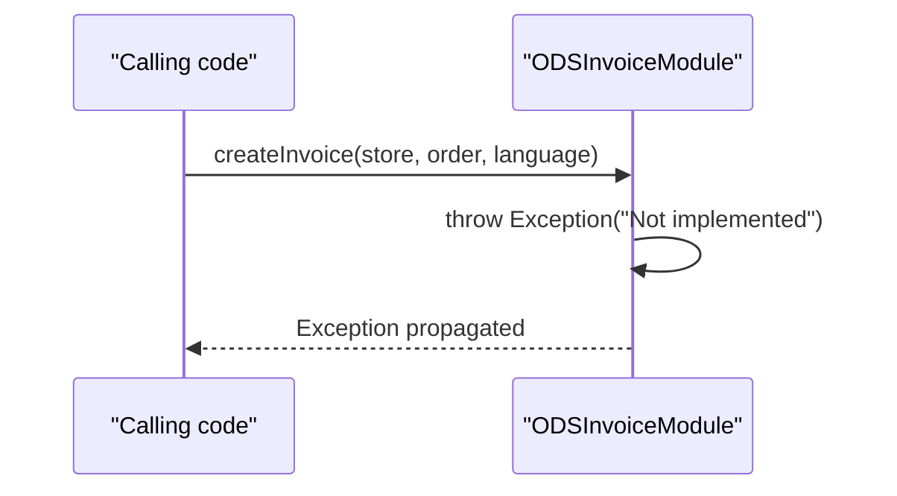

# Invoice generation

## Overview
The invoice generation feature is defined by the `InvoiceModule` interface, which declares a `createInvoice` method that returns a `ByteArrayOutputStream`. The concrete implementation provided in the current code base is `ODSInvoiceModule`. In its present state, `ODSInvoiceModule.createInvoice` is marked **@Deprecated** and immediately throws an `Exception` with the message “Not implemented” (see `ODSInvoiceModule.java:31‑35`). Consequently, the system does not generate PDF/HTML invoices; any call to this method results in an exception.

## Behavior
- **Trigger** – The method `createInvoice` is invoked on an instance of `ODSInvoiceModule` (or any other `InvoiceModule` implementation) with a `MerchantStore`, an `Order`, and a `Language` as arguments. (`InvoiceModule.java:5`, `ODSInvoiceModule.java:31`)
- **Inputs** – The three parameters are accepted but **no validation** is performed before the exception is thrown. (`ODSInvoiceModule.java:31‑34`)
- **Processing** – The method body contains only a comment and a single `throw new Exception("Not implemented");`. No business logic, data reads, or writes are executed. (`ODSInvoiceModule.java:33‑34`)
- **Outputs / Side‑effects** – The method never returns a `ByteArrayOutputStream`; it always raises an exception, so no invoice file is produced and no external resources are touched. (`ODSInvoiceModule.java:34`)
- **Branching** – There is a single execution path that ends with the exception; there are no conditional branches, retries, or alternative outcomes. (`ODSInvoiceModule.java:31‑35`)

## Triggers / Entry points
| Entry point | Location |
|-------------|----------|
| `InvoiceModule.createInvoice` declaration (interface) | `./sm-core/src/main/java/com/salesmanager/core/business/modules/order/InvoiceModule.java:5` |
| `ODSInvoiceModule.createInvoice` implementation (the only concrete class in the source tree) | `./sm-core/src/main/java/com/salesmanager/core/business/modules/order/ODSInvoiceModule.java:31‑35` |

## End-to‑to‑end flow (Mermaid)

## State / data touched
- **None** – Because the method throws before any data access, no tables, entities, files, or caches are read or written. (No executable statements beyond the `throw`.)

## External dependencies
- **None** – Although the class has `@Inject` fields (`ZoneService`, `CountryService`, `ProductPriceUtils`), they are never used in the active code path. (`ODSInvoiceModule.java:40‑48`)

## Configuration / parameters
- Constants such as `INVOICE_TEMPLATE`, `INVOICE_TEMPLATE_EXTENSION`, and `TEMP_INVOICE_SUFFIX_NAME` are declared but never referenced in the executing code. (`ODSInvoiceModule.java:20‑27`)

## Edge cases & failure modes (observed in code)
- **Always fails** – The method unconditionally throws an `Exception`, making every invocation a failure. No validation, retry, or fallback logic exists. (`ODSInvoiceModule.java:33‑34`)

## Open questions
| Area | Unclear aspect |
|------|----------------|
| **Alternative implementations** | The source tree contains only the deprecated `ODSInvoiceModule`. It is unclear whether another `InvoiceModule` implementation exists elsewhere in the project or will be added later. |
| **Intended invoice format** | The large commented‑out block (lines `/* … */` in `ODSInvoiceModule.java`) suggests a full ODS‑to‑PDF generation flow, but because it is commented out, the actual intended behavior and any related configuration are unknown. |
| **Why the method is deprecated** | No documentation or commit history is provided to explain why the implementation was removed or marked deprecated. |
| **Dependency injection setup** | The `@Inject` annotations imply a DI container (e.g., CDI, Spring) is configured, but the runtime wiring is not visible in the provided files. |