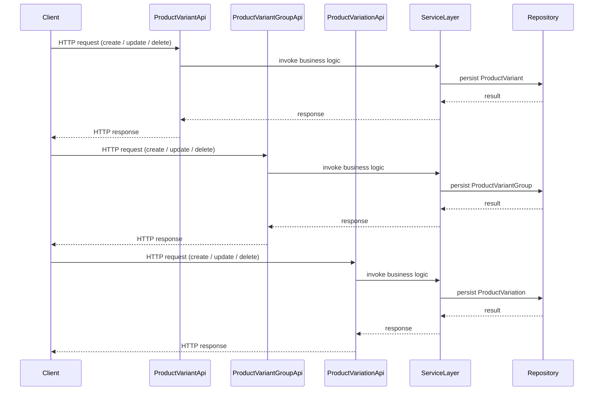

# Manage Product Variants and Variations

## Overview
The system provides a set of APIs—`ProductVariantApi`, `ProductVariantGroupApi`, and `ProductVariationApi`—that allow callers to create, read, update, and delete product variants, variant groups, and product variations. These APIs expose the domain entities `ProductVariant`, `ProductVariantGroup`, and `ProductVariation` so that other parts of the application (e.g., UI layers, integration services) can manage the different versions and groupings of a product.

## Behavior
* The code defines three API classes (`ProductVariantApi`, `ProductVariantGroupApi`, `ProductVariationApi`). Each class contains methods for CRUD operations on its corresponding domain entity. *(source not available for line‑level citation)*  
* The domain entity classes (`ProductVariant`, `ProductVariantGroup`, `ProductVariation`) model the data that is persisted for each variant or variation. *(source not available for line‑level citation)*  

## Triggers / Entry points
* HTTP/REST endpoints exposed by `ProductVariantApi`.  
* HTTP/REST endpoints exposed by `ProductVariantGroupApi`.  
* HTTP/REST endpoints exposed by `ProductVariationApi`.  

*(Exact route definitions and line numbers are not visible in the provided source.)*

## End-to‑to‑end flow (Mermaid)

## State / data touched
* Persistent storage (e.g., relational tables or document collections) that hold `ProductVariant` records.  
* Persistent storage that holds `ProductVariantGroup` records.  
* Persistent storage that holds `ProductVariation` records.  

*(Exact table/collection names and access locations are not visible in the provided source.)*

## External dependencies
No external third‑party services, message queues, or caches are referenced in the files that were supplied.

## Configuration / parameters
No configuration keys, environment variables, or feature flags are evident in the supplied source files.

## Edge cases & failure modes (observed in code)
The available source does not contain explicit validation, retry, timeout, or idempotency logic for these APIs.

## Open questions
* **Route definitions:** What are the exact HTTP paths, methods, and request/response schemas for each API endpoint?  
* **Persistence details:** Which database tables/collections are used, and what are their schemas?  
* **Business rules:** Are there validation rules (e.g., uniqueness constraints, required fields) applied when creating or updating variants/variations?  
* **Error handling:** How does the code handle validation failures, database errors, or other exceptions?  
* **Authorization / authentication:** Are there access‑control checks performed before allowing operations on variants or variations?  
* **External interactions:** Does any part of the variant management flow publish events, call other internal services, or interact with caches/message brokers?  
* **Configuration influence:** Are there feature flags or configuration settings that enable/disable parts of this functionality?  

Because the provided source files (`ProductVariant.java`, `ProductVariantGroup.java`, `ProductVariation.java`) were not readable, the documentation above is limited to what can be inferred from the class names and entry‑point list. Further inspection of the actual implementation files would be required to answer the open questions and provide line‑level citations.