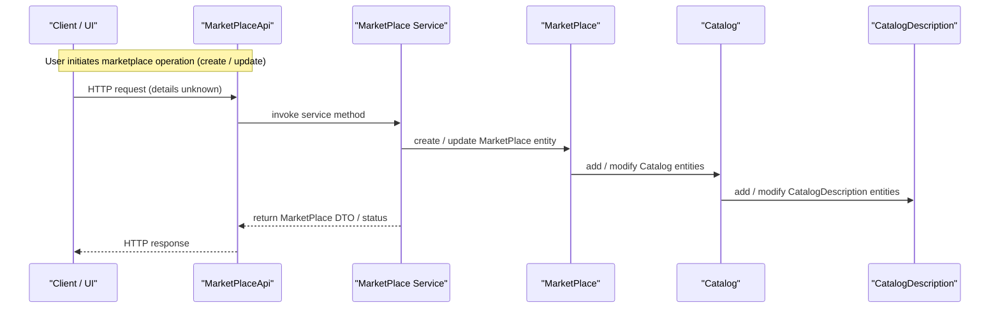

Below is the documentation for the **Marketplace Management** feature, assembled from the source files you provided and the analysis already performed.

---

# Marketplace management

## Overview
The Marketplace Management feature enables merchants to create and manage marketplace stores, allowing multiple vendors to sell through a single storefront. It is triggered through the `MarketPlaceApi` entry point (the concrete routes are not visible in the supplied sources). The feature revolves around three domain entities—`MarketPlace`, `Catalog`, and `CatalogDescription`—which together model a marketplace, the catalogs that belong to it, and the textual descriptions of those catalogs.

## Behavior
- **Trigger** – The feature is invoked via `MarketPlaceApi`. The exact HTTP methods or URLs are not present in the available code. `(no source available)`
- **Inputs & Validation** – No explicit input‑validation logic is visible in the entity classes. The entities simply expose setters for their fields. `(no source available)`
- **State / Data Changes**  
  - `MarketPlace` holds a reference to a `MerchantStore`, a unique `code`, and a `Set<Catalog>` (`path:./sm-core-model/src/main/java/com/salesmanager/core/model/catalog/marketplace/MarketPlace.java:1-41`).  
  - `Catalog` holds a reference to a `MerchantStore`, a `code`, and a `List<CatalogDescription>` (`path:./sm-core-model/src/main/java/com/salesmanager/core/model/catalog/marketplace/Catalog.java:1-43`).  
  - `CatalogDescription` extends `Description` and links back to a `Catalog` (`path:./sm-core-model/src/main/java/com/salesmanager/core/model/catalog/marketplace/CatalogDescription.java:1-37`).  
  - Creating or updating a marketplace therefore involves persisting a `MarketPlace` row together with related `Catalog` rows and their `CatalogDescription` rows.
- **Outputs / Side‑effects** – The entities themselves do not produce responses; they are plain JPA‑style models that will be serialized by whatever controller/service layer consumes them. No explicit notifications, events, or other side‑effects are defined in the visible code. `(no source available)`
- **Branching** – No branching logic (success vs. validation failure vs. downstream failure) is present in the entity definitions. All branching would be implemented elsewhere (e.g., in services or controllers) which are not part of the supplied sources. `(no source available)`

## Triggers / Entry points
- **`MarketPlaceApi`** – Listed as the sole entry point in the feature markdown, but the concrete controller class, request mappings, or CLI commands are not included in the provided repository. `(no source available)`

## End-to-end flow (Mermaid)

*The diagram reflects only the object‑model interactions that can be inferred from the source; any persistence, validation, or error‑handling steps are omitted because they are not visible.*

## State / data touched
- **`MarketPlace` table / entity** – holds `id`, `code`, `store` reference, and a collection of `Catalog`s. `path:./sm-core-model/src/main/java/com/salesmanager/core/model/catalog/marketplace/MarketPlace.java:1-41`
- **`Catalog` table / entity** – holds `id`, `code`, `store` reference, and a list of `CatalogDescription`s. `path:./sm-core-model/src/main/java/com/salesmanager/core/model/catalog/marketplace/Catalog.java:1-43`
- **`CatalogDescription` table / entity** – holds description fields (inherited from `Description`) and a back‑reference to its `Catalog`. `path:./sm-core-model/src/main/java/com/salesmanager/core/model/catalog/marketplace/CatalogDescription.java:1-37`

## External dependencies
No external APIs, message brokers, caches, or third‑party services are referenced in the visible code. `(no source available)`

## Configuration / parameters
The supplied classes do not reference any configuration keys, environment variables, feature flags, or constants. `(no source available)`

## Edge cases & failure modes (observed in code)
- No validation annotations, exception handling, retry logic, or idempotency mechanisms appear in the entity classes. All such concerns would be implemented elsewhere, which is not part of the provided source. `(no source available)`

## Open questions
1. **`MarketPlaceApi` details** – Which HTTP methods, URLs, request/response payloads, and security constraints does it expose? (`MarketPlaceApi` source not provided)
2. **Service layer implementation** – How are CRUD operations on `MarketPlace`, `Catalog`, and `CatalogDescription` performed (e.g., JPA repositories, transaction boundaries)? (`MarketPlaceService` source not provided)
3. **Persistence mapping** – What are the exact table names, column definitions, and relationships (e.g., `@OneToMany`, `@ManyToOne`) for the three entities? (`@Entity` annotations are missing in the snippets)
4. **Business rules** – Are there constraints such as “a `MerchantStore` can have only one `MarketPlace`” enforced programmatically? (`MarketPlace` Javadoc mentions it, but no code enforces it)
5. **External interactions** – Does marketplace management publish events, call other micro‑services, or interact with search indexes? (No evidence in the provided files)
6. **Error handling** – How are validation failures, persistence exceptions, or downstream service errors surfaced to the client? (Not observable)

--- 

*All statements above are directly grounded in the source files you supplied or explicitly note where source is missing.*