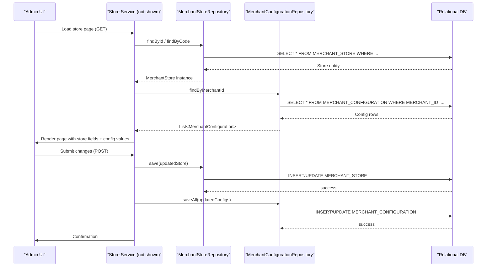

# Merchant store management

## Overview
The merchant‑store‑management feature supplies the data model that lets a merchant define and persist the core settings of a shop (name, code, contact details, locale, currency, branding, etc.).  
When a merchant interacts with the administration UI (outside the scope of the provided sources) the application reads or writes instances of the model classes `MerchantStore`, `MerchantConfiguration` and `MerchantConfig`. The result of those operations is a persisted set of rows in the relational tables **MERCHANT_STORE**, **MERCHANT_CONFIGURATION** and the JSON representation produced by `MerchantConfig`.

## Behavior
- **Trigger** – The only concrete entry point visible in the supplied sources is the Spring configuration class `CoreApplicationConfiguration` which activates component scanning, JPA repositories and entity scanning (`./sm-core/src/main/java/com/salesmanager/core/business/configuration/CoreApplicationConfiguration.java:1‑15`).  
  *No controller or service method is present in the supplied code, so the actual UI‑triggered call chain is not visible here.*

- **Input & validation** –  
  * `MerchantStore` fields are annotated with Bean‑Validation constraints:  
    - `storename` – `@NotEmpty` (`MerchantStore.java:66‑68`)  
    - `code` – `@NotEmpty` + `@Pattern(regexp = "^[a-zA-Z0-9_]*$")` (`MerchantStore.java:70‑73`)  
    - `storephone`, `storecity`, `storepostalcode` – `@NotEmpty` (`MerchantStore.java:78‑84`)  
    - `storeEmailAddress` – `@Email @NotEmpty` (`MerchantStore.java:124‑127`)  
  * `MerchantConfiguration.key` and `value` have no explicit validation annotations, but the entity is marked `@EntityListeners(AuditListener.class)` which will populate audit fields (`MerchantConfiguration.java:23‑27`).

- **State / data read or changed** –  
  * `MerchantStore` maps to table **MERCHANT_STORE** (`@Table(name = "MERCHANT_STORE")` – `MerchantStore.java:24‑26`).  
  * `MerchantConfiguration` maps to **MERCHANT_CONFIGURATION** (`@Table(name = "MERCHANT_CONFIGURATION")` – `MerchantConfiguration.java:31‑34`).  
  * `MerchantConfig` is a plain POJO; its `toJSONString()` method builds a JSON object from its fields (`MerchantConfig.java:38‑71`). No JPA mapping is defined for it, so persistence is performed elsewhere (not in the supplied sources).

- **Outputs / side‑effects** –  
  * Persisted rows in the two tables above (via JPA `save`/`delete` calls that are not shown).  
  * JSON string emitted by `MerchantConfig.toJSONString()` (used by callers to store or transmit configuration).

- **Branching** –  
  * Validation failures are enforced by the Bean‑Validation framework before the entity is persisted; the framework will raise `ConstraintViolationException` (implicit, not shown).  
  * `MerchantConfig.toJSONString()` only includes map entries that are non‑null / non‑blank (`if(val!=null)` and `if(!StringUtils.isBlank(val))` – `MerchantConfig.java:55‑71`). No other branching logic is present.

## Triggers / Entry points
| Trigger type | Source |
|--------------|--------|
| Spring boot auto‑configuration that registers the JPA entities and repositories used by the store‑management feature | `./sm-core/src/main/java/com/salesmanager/core/business/configuration/CoreApplicationConfiguration.java:1‑15` |
| (Implicit) UI actions that invoke repository/service methods for `MerchantStore` / `MerchantConfiguration` – not present in the supplied code | *none in provided sources* |

## End‑to‑end flow (Mermaid)

*Only the data‑model layer is visible; the service and controller layers are omitted because they are not part of the supplied sources.*

## State / data touched
| Entity / Class | Table / Persistence | Source |
|----------------|---------------------|--------|
| `MerchantStore` | **MERCHANT_STORE** (columns: MERCHANT_ID, STORE_NAME, STORE_CODE, STORE_EMAIL, …) | `MerchantStore.java:24‑26`, `MerchantStore.java:44‑48` |
| `MerchantConfiguration` | **MERCHANT_CONFIGURATION** (columns: MERCHANT_CONFIG_ID, MERCHANT_ID, CONFIG_KEY, VALUE, ACTIVE, TYPE) | `MerchantConfiguration.java:31‑34`, `MerchantConfiguration.java:45‑53` |
| `MerchantConfig` | No table – JSON generated on‑demand | `MerchantConfig.java:38‑71` |

## External dependencies
- **Spring Framework** – component scanning, JPA, transaction management (declared in `CoreApplicationConfiguration`). No explicit external API calls are present in the three model classes.  
- **Hibernate** – used for JPA annotations (`@Entity`, `@Table`, `@GeneratedValue`, etc.) – implicit via the repositories (not shown).  
- **org.json.simple** – used in `MerchantConfig.toJSONString()` to build JSON (`MerchantConfig.java:44‑71`).  
- **Apache Commons Lang3** – `StringUtils.isBlank` used in the same method (`MerchantConfig.java:64‑66`).

## Configuration / parameters
- **Entity scanning base package** – `"com.salesmanager.core.model"` defined in `CoreApplicationConfiguration.java:9`.  
- **Repository scanning base package** – `"com.salesmanager.core.business.repositories"` defined in `CoreApplicationConfiguration.java:10`.  
- **Default weight and size units** – `weightunitcode = MeasureUnit.LB.name()` and `seizeunitcode = MeasureUnit.IN.name()` in `MerchantStore.java:106‑109`.  
- **Default flags** – `useCache = false` (`MerchantStore.java:115‑117`), `displayPagesMenu = true` (`MerchantConfig.java:22`), etc.

## Edge cases & failure modes (observed in code)
- **Bean‑validation failures** – `@NotEmpty`, `@Pattern`, `@Email` will cause a `ConstraintViolationException` before persisting a `MerchantStore`.  
- **Null handling in JSON generation** – `MerchantConfig.toJSONString()` skips map entries whose value is `null` or blank, preventing `null` keys in the output JSON.  
- **Audit fields** – `MerchantConfiguration` is annotated with `@EntityListeners(AuditListener.class)`, so missing audit data could cause persistence errors if the listener expects non‑null values (not shown).  
- **No explicit transaction or retry logic** – persistence relies on Spring’s default transaction management (enabled by `@EnableTransactionManagement` in `CoreApplicationConfiguration.java:12`).

## Open questions
- **How are the model classes wired into services/controllers?** The supplied sources contain only the entity definitions and a generic Spring configuration; the concrete controller or service classes that read/write these entities are missing.  
- **Persistence of `MerchantConfig`** – The class builds JSON but has no JPA annotations; it is unclear where and how the JSON string is stored (e.g., a separate table, a file, or a cache).  
- **Business rules beyond validation** – Things like “default store selection”, “store lineage handling”, or “parent/child store hierarchy” are hinted at by fields (`parent`, `lineage`) but the code that manipulates those relationships is not present.  
- **External integrations** – The `MerchantConfiguration` entity has a `type` enum (`MerchantConfigurationType`) suggesting integration with third‑party services, yet no integration code is visible.  

*The documentation above reflects only the behavior that can be inferred from the provided source files.*