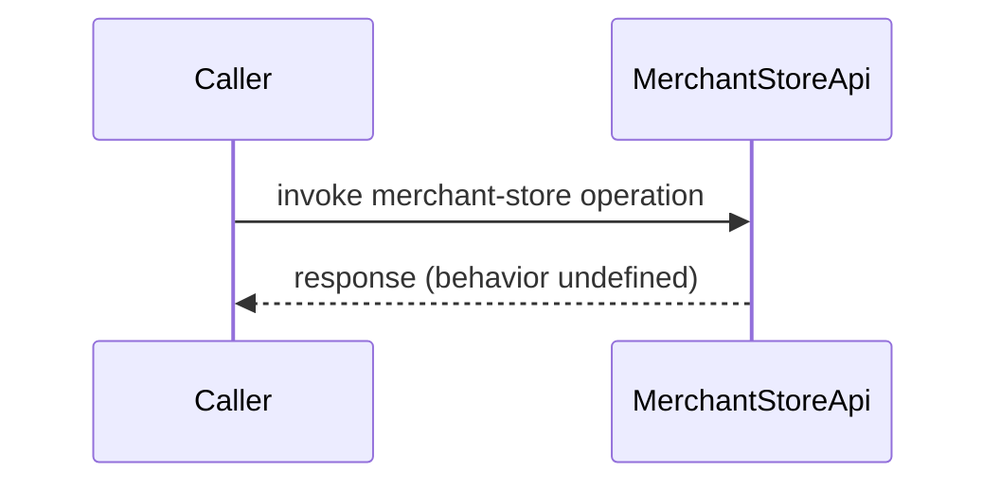

# Merchant Store Management

## Overview
The Merchant Store Management feature is intended to handle merchant store data such as settings and configurations. The only known entry point is `MerchantStoreApi`. Because the source files (`MerchantStoreApi`, `MerchantStore.java`) are not available, the documentation can only state the existence of these components without describing their internal logic.

## Behavior
* No concrete behavior can be extracted from the available source because the implementation files are missing.

## Triggers / Entry points
* `MerchantStoreApi` – listed as an entry point for this feature (source reference not available).

## End-to-end flow (Mermaid)

## State / data touched
* No tables, collections, caches, or files can be identified without source code.

## External dependencies
* No external services, APIs, queues, or message brokers are observable in the missing source.

## Configuration / parameters
* No configuration keys, environment variables, feature flags, or constants are visible.

## Edge cases & failure modes (observed in code)
* No validation, retry, timeout, or error‑handling logic can be confirmed.

## Open questions
* What HTTP routes, methods, or request payloads does `MerchantStoreApi` expose?
* How does `MerchantStore` model store settings and configurations (fields, validation rules, persistence)?
* Which data store (SQL table, NoSQL collection, etc.) backs the merchant store information?
* Are there any business rules, permissions checks, or audit logging performed?
* What external services (e.g., payment gateways, analytics) are called during store management?
* Which configuration parameters influence the feature’s behavior (e.g., feature flags, defaults)?
* How are errors reported to callers, and what retry or compensation mechanisms exist?