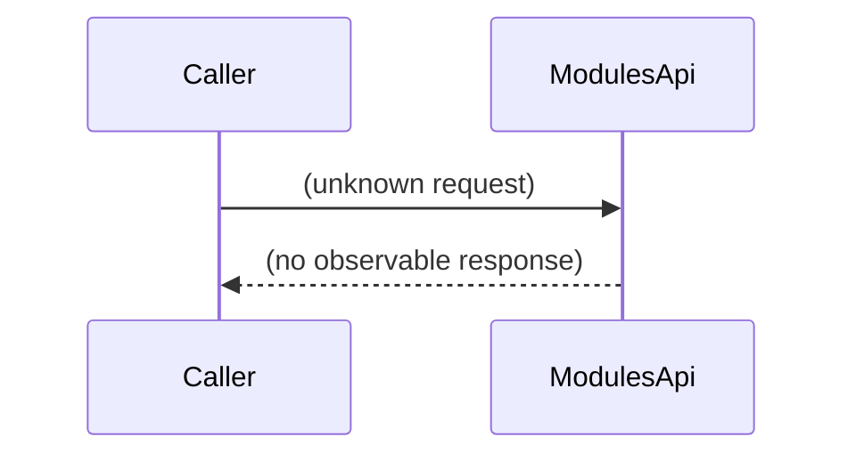

# Module and Plugin Management

## Overview
The Module and Plugin Management feature is intended to manage modules and plugins, including installing and uninstalling them. Because no source files are available for inspection, the current implementation details—such as which components invoke the feature, what data it returns, or how it signals success or failure—cannot be confirmed from the code base.

## Behavior
* No concrete code paths can be identified for installing or uninstalling modules/plugins, as the source files are not readable. Consequently, a step‑by‑step description of the end‑to‑end behavior cannot be provided.  

## Triggers / Entry points
* The only declared entry point is `ModulesApi`, but without source code there is no observable route, UI action, CLI command, scheduled job, event, or webhook that invokes it.  

## End-to-end flow (Mermaid)

*The diagram reflects that the exact request/response flow cannot be determined from the available code.*

## State / data touched
* No tables, collections, caches, or files are referenced in the accessible source, so the data stores read or written by this feature are unknown.

## External dependencies
* No third‑party APIs, internal services, queues, caches, or message brokers are referenced in the visible code, so external dependencies cannot be identified.

## Configuration / parameters
* No environment variables, feature flags, configuration keys, constants, or default values are observable in the provided source.

## Edge cases & failure modes (observed in code)
* Because the implementation is not visible, no validation logic, retry mechanisms, timeouts, rate‑limit handling, idempotency checks, or partial‑failure handling can be documented.

## Open questions
* What concrete methods or classes implement the install and uninstall operations for modules and plugins?  
* Which HTTP routes, RPC endpoints, or CLI commands map to `ModulesApi`?  
* What data models (e.g., database tables or document collections) are read or written during these operations?  
* Does the feature interact with external services (e.g., package registries, licensing servers) and, if so, how?  
* Are there configuration settings that enable/disable the feature or affect its behavior (e.g., paths, version constraints, feature flags)?  
* What error handling, validation, and rollback strategies are employed when an installation or uninstallation fails?  

*Because the source code for this feature is not available, the above points remain unanswered until the relevant files can be examined.*