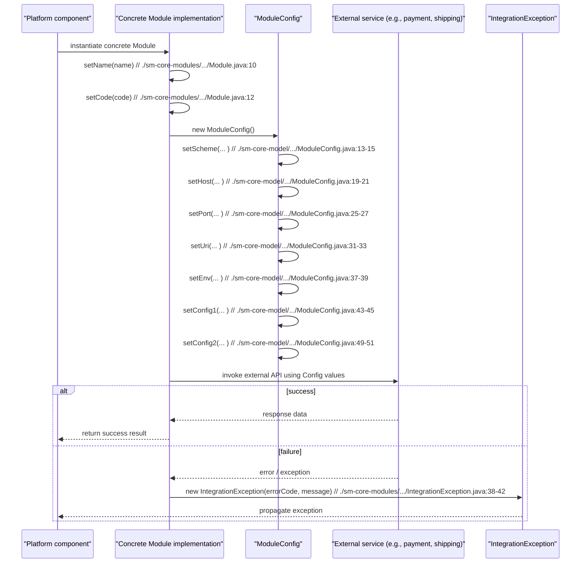

# Module and plugin management

## Overview
The module and plugin management feature enables the platform to load, configure, and manage optional modules and plugins such as payment or shipping integrations. Implementations of the `com.salesmanager.core.modules.Module` interface expose a module’s **name** and **code** (`./sm-core-modules/src/main/java/com/salesmanager/core/modules/Module.java:8-13`). Configuration values for a module are held in a `ModuleConfig` POJO (`./sm-core-model/src/main/java/com/salesmanager/core/model/system/ModuleConfig.java:6-12`). When an integration operation fails, an `IntegrationException` is thrown, carrying an error code and optional field‑level error details (`./sm-core-modules/src/main/java/com/salesmanager/core/modules/integration/IntegrationException.java:7-15,30-51`).

## Behavior
- **Trigger** – Any component that implements the `Module` interface is considered a loadable module (`./sm-core-modules/src/main/java/com/salesmanager/core/modules/Module.java:8-13`).  
- **Inputs** – Implementations receive a *name* and *code* via the `setName`/`setCode` methods; a `ModuleConfig` instance receives values for `scheme`, `host`, `port`, `uri`, `env`, `config1`, and `config2` through its setters (`./sm-core-model/src/main/java/com/salesmanager/core/model/system/ModuleConfig.java:13-54`).  
- **State read / write** – The feature reads the values stored in a `ModuleConfig` object and may write back updated values via the corresponding setters. No persistence logic is present in the supplied sources.  
- **Outputs / side‑effects** – The configured `ModuleConfig` object is made available to the rest of the platform for constructing URLs or client objects that talk to external services.  
- **Error handling** – When an integration operation encounters a problem, code can throw an `IntegrationException`. The exception carries an `errorCode` (e.g., `ERROR_VALIDATION_SAVE = 100`, `TRANSACTION_EXCEPTION = 99`) and an optional list of `errorFields` (`./sm-core-modules/src/main/java/com/salesmanager/core/modules/integration/IntegrationException.java:15-18,22-27,53-58`).  
- **Success path** – A module is instantiated, its name/code are set, a `ModuleConfig` is populated, and the platform proceeds to use the configuration.  
- **Validation failure path** – Not present in the supplied code; the only validation‑related artifact is the `ERROR_VALIDATION_SAVE` constant in `IntegrationException`.  
- **Downstream failure path** – Represented by throwing an `IntegrationException` with an appropriate `errorCode`.

## Triggers / Entry points
- **`Module` interface** – Any concrete class that implements this interface is an entry point for a loadable module (`./sm-core-modules/src/main/java/com/salesmanager/core/modules/Module.java:8-13`).  
- **`IntegrationException` constructors** – Various constructors allow callers to create the exception with a message, a cause, or an explicit error code (`./sm-core-modules/src/main/java/com/salesmanager/core/modules/integration/IntegrationException.java:30-51`).

## End-to‑end flow (Mermaid)

## State / data touched
- **`Module` enum** – Defines the logical module types the platform recognises (`PAYMENT`, `SHIPPING`) (`./sm-core-model/src/main/java/com/salesmanager/core/model/system/Module.java:3-5`).  
- **`ModuleConfig` fields** – `scheme`, `host`, `port`, `uri`, `env`, `config1`, `config2` are read and written in memory (`./sm-core-model/src/main/java/com/salesmanager/core/model/system/ModuleConfig.java:6-12,13-54`).  
- No database tables, caches, or files are accessed in the supplied sources.

## External dependencies
- **`ServiceException`** – `IntegrationException` extends `com.salesmanager.core.business.exception.ServiceException` (`./sm-core-modules/src/main/java/com/salesmanager/core/modules/integration/IntegrationException.java:7`). The base class is internal to the platform; no external third‑party API is invoked directly in the shown code.  
- **Potential external services** – The diagram references an “External service” (payment or shipping provider), but the actual HTTP client or SDK calls are not present in the provided files.

## Configuration / parameters
- **Constants in `IntegrationException`** – `ERROR_VALIDATION_SAVE = 100` and `TRANSACTION_EXCEPTION = 99` (`./sm-core-modules/src/main/java/com/salesmanager/core/modules/integration/IntegrationException.java:15-18`).  
- **`ModuleConfig` properties** – `scheme`, `host`, `port`, `uri`, `env`, `config1`, `config2` are the only configurable parameters that affect module behaviour (`./sm-core-model/src/main/java/com/salesmanager/core/model/system/ModuleConfig.java:6-12`).

## Edge cases & failure modes (observed in code)
- **IntegrationException usage** – Callers can supply an explicit error code, a message, or both; the exception also carries a list of field‑level errors (`errorFields`) (`./sm-core-modules/src/main/java/com/salesmanager/core/modules/integration/IntegrationException.java:22-27,53-58`).  
- **No built‑in validation** – The only validation‑related artifact is the `ERROR_VALIDATION_SAVE` constant; actual validation logic is not present in the supplied sources.  
- **Error propagation** – When an external call fails, the module is expected to throw `IntegrationException`, which propagates up to the caller.

## Open questions
- **Loading mechanism** – How does the platform discover concrete classes that implement `Module` and instantiate them? No factory or scanning code is present in the supplied files.  
- **Persistence of `ModuleConfig`** – Is a `ModuleConfig` instance persisted to a database or configuration store, and if so, where? No DAO or repository code is provided.  
- **Validation rules** – What concrete checks are performed on the values set in `ModuleConfig` (e.g., URL format, required fields)? The source only defines setters without validation.  
- **External service interaction** – Which HTTP client or SDK is used to communicate with payment/shipping providers, and how are retries or timeouts configured? No call‑site code is visible.  
- **Usage of the `Module` enum** – Apart from defining `PAYMENT` and `SHIPPING`, how is this enum consulted at runtime? No lookup or switch statements are present in the provided snippets.