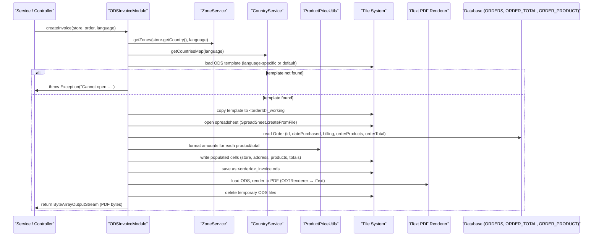

# Order management  

## Overview  
The order‑management feature lets a **customer** create an order and a **merchant** view or modify that order (process, update, cancel).  
When an order is ready to be billed, the system generates an invoice document (ODS → PDF) by reading the persisted `Order` entity together with its related `OrderProduct` and `OrderTotal` rows and writing a formatted file that is returned to the caller. The entry point for invoice generation is the `InvoiceModule` interface, whose concrete implementation is `ODSInvoiceModule` (currently marked `@Deprecated`).  

## Behavior  

- **Trigger** – A component that needs an invoice calls `ODSInvoiceModule.createInvoice(..)` (the only public method of the implementation) `[ODSInvoiceModule.java:31]`.  
- **Inputs** –  
  - `MerchantStore store` – provides store name, address, phone, zone, country, etc. `[ODSInvoiceModule.java:33]`  
  - `Order order` – the persisted order whose `id`, `datePurchased`, `billing`, `orderProducts` and `orderTotal` collections are read. `[ODSInvoiceModule.java:34]`  
  - `Language language` – selects the language‑specific ODS template. `[ODSInvoiceModule.java:35]`  
- **Validation / pre‑checks** –  
  - The method is annotated `@Deprecated` and the active implementation simply throws `new Exception("Not implemented")` `[ODSInvoiceModule.java:44‑46]`.  
  - The commented‑out implementation (kept for reference) validates that the template file can be loaded; if not, it logs a warning and throws an exception `[ODSInvoiceModule.java:71‑84]`.  
  - Throughout the commented code, blank address lines are stripped and `StringUtils.isBlank(..)` checks guard against null/empty strings before writing to the spreadsheet `[ODSInvoiceModule.java:106‑150]`.  
- **State / data read** –  
  - `order.getId()`, `order.getDatePurchased()`, `order.getBilling()` and `order.getOrderProducts()` are accessed repeatedly to fill the spreadsheet `[ODSInvoiceModule.java:124‑127, 166‑210]`.  
  - `store.getStoreaddress()`, `store.getStorecity()`, `store.getZone()`, `store.getCountry()`, etc., are read to compose the “store address” block `[ODSInvoiceModule.java:106‑138]`.  
  - `zoneService.getZones(..)` and `countryService.getCountriesMap(..)` are consulted to resolve zone and country names `[ODSInvoiceModule.java:68‑70, 143‑146]`.  
  - `priceUtil` is used to format monetary values for each `OrderProduct` and each `OrderTotal` `[ODSInvoiceModule.java:197‑215, 224‑232]`.  
- **Outputs / side‑effects** –  
  - An ODS spreadsheet is written to a temporary file named `<orderId>_working` `[ODSInvoiceModule.java:92‑95]`.  
  - The spreadsheet is populated with store info, billing address, product lines, and totals.  
  - The ODS file is saved as `<orderId>_invoice.ods` and then loaded into an `OpenDocument` object, rendered to a PDF via iText (`PdfWriter`, `PdfContentByte`, `ODTRenderer`), and the resulting PDF bytes are returned in a `ByteArrayOutputStream` `[ODSInvoiceModule.java:236‑285]`.  
  - Temporary files are deleted after rendering `[ODSInvoiceModule.java:287‑289]`.  
- **Branching** –  
  - If the template cannot be found, a warning is logged and an exception is thrown `[ODSInvoiceModule.java:78‑84]`.  
  - In the active (non‑commented) implementation the method always throws `Exception("Not implemented")` `[ODSInvoiceModule.java:44‑46]`.  

## Triggers / Entry points  

| Entry point | File & line |
|-------------|-------------|
| `InvoiceModule` interface – defines `createInvoice` contract | `./sm-core/src/main/java/com/salesmanager/core/business/modules/order/InvoiceModule.java:9‑13` |
| `ODSInvoiceModule` concrete class (deprecated) – implements `createInvoice` | `./sm-core/src/main/java/com/salesmanager/core/business/modules/order/ODSInvoiceModule.java:31‑46` |

## End‑to‑end flow (Mermaid)

## State / data touched  

| Entity / Table | Accessed in | Purpose |
|----------------|-------------|---------|
| `Order` (`ORDERS`) | `Order.java` fields & getters (`getId()`, `getDatePurchased()`, `getBilling()`, `getOrderProducts()`, `getOrderTotal()`) – used by `ODSInvoiceModule` to fill the invoice `[ODSInvoiceModule.java:124‑127, 166‑210]` | Read‑only for invoice generation |
| `OrderProduct` (`ORDER_PRODUCT`) | `order.getOrderProducts()` – iterated to list each line item `[ODSInvoiceModule.java:166‑210]` | Read‑only |
| `OrderTotal` (`ORDER_TOTAL`) | `order.getOrderTotal()` – iterated to list subtotals, tax, shipping, etc. `[ODSInvoiceModule.java:224‑232]` | Read‑only |
| `MerchantStore` (store table) | `store.getStoreaddress()`, `store.getStorecity()`, `store.getZone()`, `store.getCountry()`, `store.getStorephone()` `[ODSInvoiceModule.java:106‑138]` | Read‑only |
| Temporary files on disk | Creation of `<orderId>_working` and `<orderId>_invoice.ods` `[ODSInvoiceModule.java:92‑95, 236‑242]` | Write‑only, then deleted |
| PDF byte stream | `ByteArrayOutputStream` returned to caller `[ODSInvoiceModule.java:285‑286]` | Write‑only (response) |

## External dependencies  

| Dependency | Used where | Reason |
|------------|------------|--------|
| `ZoneService` | `ODSInvoiceModule.java:68` & `ODSInvoiceModule.java:143` | Resolve zone names for store and billing addresses |
| `CountryService` | `ODSInvoiceModule.java:69` & `ODSInvoiceModule.java:146` | Resolve country names |
| `ProductPriceUtils` (`priceUtil`) | `ODSInvoiceModule.java:197‑215, 224‑232` | Format monetary values and compute line totals |
| `IOUtils` (Apache Commons) | `ODSInvoiceModule.java:92‑95` | Copy template stream to temporary file |
| `SpreadSheet` / `Sheet` (jOpenDocument) | `ODSInvoiceModule.java:98‑102, 108‑215` | Load and manipulate ODS spreadsheet |
| `OpenDocument`, `ODTRenderer` (jOpenDocument) | `ODSInvoiceModule.java:236‑260` | Render ODS to PDF |
| iText (`Document`, `PdfWriter`, `PdfContentByte`, etc.) | `ODSInvoiceModule.java:236‑285` | Build PDF output |
| `StringUtils` (Apache Commons Lang) | Various address checks `[ODSInvoiceModule.java:106‑150]` | Null/blank string handling |
| `Logger` (SLF4J) | `ODSInvoiceModule.java:71‑84` | Log warnings when template cannot be opened |

## Configuration / parameters  

| Constant / field | Value | Where defined |
|------------------|-------|----------------|
| `INVOICE_TEMPLATE` | `"templates/invoice/Invoice"` | `ODSInvoiceModule.java:38` |
| `INVOICE_TEMPLATE_EXTENSION` | `".ods"` | `ODSInvoiceModule.java:39` |
| `TEMP_INVOICE_SUFFIX_NAME` | `"_invoice.ods"` | `ODSInvoiceModule.java:40` |
| `ADDRESS_ROW_START` / `ADDRESS_ROW_END` | `2` / `5` | `ODSInvoiceModule.java:41‑42` |
| `BILLTO_ROW_START` / `BILLTO_ROW_END` | `8` / `13` | `ODSInvoiceModule.java:44‑45` |
| `PRODUCT_ROW_START` | `16` | `ODSInvoiceModule.java:47` |
| Logger name | `ODSInvoiceModule.class` | `ODSInvoiceModule.java:53` |

These constants drive the row positions inside the ODS template and the naming of temporary files.

## Edge cases & failure modes (observed in code)  

* **Template missing** – If the language‑specific ODS template cannot be loaded, the code falls back to the default template; if that also fails, it logs a warning and throws an `Exception` `[ODSInvoiceModule.java:78‑84]`.  
* **Blank address lines** – The code explicitly clears any rows between the last populated address line and the defined end (`ADDRESS_ROW_END` / `BILLTO_ROW_END`) to avoid stray empty rows `[ODSInvoiceModule.java:150‑155, 210‑215]`.  
* **Deprecated / not‑implemented path** – The currently active `createInvoice` method simply throws `Exception("Not implemented")` `[ODSInvoiceModule.java:44‑46]`.  
* **IO errors** – Any `IOException` while copying the template or writing temporary files would propagate as an `Exception` (not caught locally).  
* **Null checks** – The code guards against `null` or blank strings for store address, billing fields, and product quantities before writing to the sheet.  

## Open questions  

* **Order lifecycle (creation, update, cancel)** – The provided sources contain only the invoice‑generation path; the code that creates, updates, or cancels an `Order` (e.g., service methods, controllers, or event listeners) is not present.  
* **How the `createInvoice` method is invoked** – No controller, REST endpoint, or service call is shown that calls `InvoiceModule.createInvoice`. The integration point remains unknown.  
* **Current production implementation** – The `ODSInvoiceModule` implementation is marked `@Deprecated` and throws “Not implemented”. It is unclear whether another `InvoiceModule` implementation is active in the live system.  
* **Concurrency / idempotency** – The code writes temporary files named `<orderId>_working` and `<orderId>_invoice.ods` without any locking; the behavior under concurrent invoice generation for the same order is not defined.  
* **Error handling strategy** – Apart from the explicit template‑missing check, there is no structured error handling (e.g., retries, fallback to another format).  

These gaps would require additional source files (controllers, services, configuration) to answer definitively.