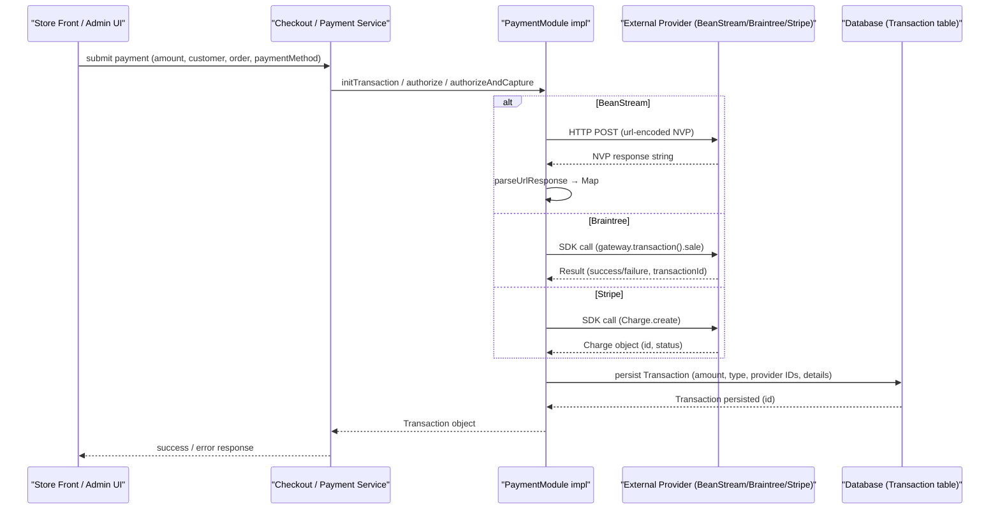

# Payment processing

## Overview
The payment‑processing feature implements the runtime flow for authorising, capturing, and refunding payments against four supported providers – BeanStream, Braintree, PayPal (REST) and Stripe.  
When a checkout or admin action creates a **Payment** request (amount, customer, order, payment method), the corresponding provider implementation (a class that implements `PaymentModule`) is invoked. The implementation validates the configuration, builds a provider‑specific request, sends it over HTTP or SDK, parses the response and returns a **Transaction** entity that records the provider‑generated IDs, status and any message text. Errors are wrapped in `IntegrationException` with appropriate error codes.

## Behavior
- **Trigger** – A checkout service (outside the scope of the supplied files) calls one of the `PaymentModule` methods (`initTransaction`, `authorize`, `capture`, `authorizeAndCapture`, `refund`) on the concrete provider class.  
  *Citations*: `BeanStreamPayment.authorize` (src `BeanStreamPayment.java:33‑38`), `BraintreePayment.authorize` (src `BraintreePayment.java:46‑71`), `StripePayment.authorize` (src `StripePayment.java:84‑124`).

- **Input validation** –  
  * Each provider validates its required integration keys before proceeding.  
    * BeanStream: `validateModuleConfiguration` checks `merchantid`, `username`, `password` (src `BeanStreamPayment.java:215‑236`).  
    * Braintree: same method checks `merchant_id`, `public_key`, `private_key`, `tokenization_key` (src `BraintreePayment.java:15‑38`).  
    * Stripe: checks `secretKey` and `publishableKey` (src `StripePayment.java:46‑66`).  
    * PayPal: checks `client` and `secret` (src `PayPalRestPayment.java:31‑48`).  
  * Runtime calls also verify mandatory request data (e.g., non‑blank nonce/token, amount, order number). Missing data results in an `IntegrationException` (e.g., BeanStream `capture` throws on missing `trnID` – src `BeanStreamPayment.java:71‑84`; Braintree `authorize` throws on missing nonce – src `BraintreePayment.java:84‑95`; Stripe `authorize` throws on missing token – src `StripePayment.java:106‑115`).

- **State/Data read** –  
  * The `Customer` billing address, name, phone, email are read to populate provider request fields (BeanStream `processTransaction` lines `118‑138`).  
  * The `Order` total is formatted via `ProductPriceUtils.getAdminFormatedAmount` for amount fields (BeanStream, Stripe, Braintree).  
  * Existing `Transaction` objects are consulted for IDs needed for capture/refund (e.g., BeanStream `capture` reads `TRANSACTIONID` from `capturableTransaction.getTransactionDetails()` – src `BeanStreamPayment.java:57‑61`; Braintree `capture` reads `TRANSACTIONID` – src `BraintreePayment.java:115‑124`; Stripe `capture` reads `TRNORDERNUMBER` – src `StripePayment.java:166‑176`).

- **External request** –  
  * BeanStream builds a URL‑encoded POST string and opens an `HttpURLConnection` to the provider endpoint (src `BeanStreamPayment.sendTransaction` lines `173‑215`).  
  * Braintree creates a `BraintreeGateway` with the configured keys and calls the SDK (`gateway.transaction().sale`, `gateway.transaction().submitForSettlement`, `gateway.transaction().refund`) (src `BraintreePayment.authorize` lines `84‑106`, `capture` lines `124‑144`, `refund` lines `166‑186`).  
  * Stripe sets `Stripe.apiKey` and uses the Stripe Java SDK (`Charge.create`, `Charge.retrieve`, `Charge.capture`, `Refund.create`) (src `StripePayment.authorize` lines `115‑138`, `capture` lines `150‑176`, `authorizeAndCapture` lines `210‑236`, `refund` lines `260‑291`).  
  * PayPal code is currently stubbed; no external call is made (all methods return `null` or contain commented‑out code).

- **Response parsing** –  
  * BeanStream parses the NVP response into a `Map<String,String>` (`formatUrlResponse`) and builds a `Transaction` via `parseResponse` (src `BeanStreamPayment.formatUrlResponse` lines `332‑350`, `parseResponse` lines `352‑368`).  
  * Braintree extracts the transaction ID from the SDK result and populates a `Transaction` manually (src `BraintreePayment.authorize` lines `108‑124`).  
  * Stripe reads fields from the `Charge` or `Refund` objects (`getId`, `getStatus`, `getReason`) and stores them in `Transaction.transactionDetails` (src `StripePayment.authorize` lines `124‑138`, `capture` lines `176‑190`, `refund` lines `284‑298`).  

- **Outputs / side‑effects** –  
  * A fully populated `Transaction` entity is returned to the caller, containing amount, date, type, payment type, and a map of provider‑specific details (`TRANSACTIONID`, `TRNAPPROVED`, `TRNORDERNUMBER`, `MESSAGETEXT`).  
  * BeanStream additionally logs the raw request and response via SLF4J (`LOGGER.debug`) and persists a `MerchantLog` entry on provider‑declined responses (src `BeanStreamPayment.sendTransaction` lines `246‑259`).  
  * All providers propagate `IntegrationException` upward on validation or provider errors, preserving the original cause.

- **Branching** –  
  * **Success path** – Provider returns a positive response (`trnApproved=1` for BeanStream, `result.isSuccess()` for Braintree, no exception for Stripe). The method builds and returns a `Transaction`.  
  * **Validation failure** – Missing configuration keys or request data cause an early `IntegrationException` (see validation sections above).  
  * **Provider‑declined** – BeanStream checks `TRNAPPROVED == "0"` and throws a payment‑declined `IntegrationException` with a message code (`message.payment.beanstream.*`).  
  * **SDK/HTTP error** – Any caught `Exception` is wrapped in an `IntegrationException` with a generic “Error while processing … transaction” message (BeanStream `sendTransaction` catch block, Braintree SDK error handling, Stripe `buildException`).

## Triggers / Entry points
| Provider | Entry point (method) | Source |
|----------|---------------------|--------|
| BeanStream | `authorize` – initiates a pre‑auth request | `./sm-core/src/main/java/com/salesmanager/core/business/modules/integration/payment/impl/BeanStreamPayment.java:33‑38` |
| BeanStream | `capture` – completes a pre‑auth (PAC) | `...BeanStreamPayment.java:57‑84` |
| BeanStream | `authorizeAndCapture` – single‑step purchase | `...BeanStreamPayment.java:92‑100` |
| BeanStream | `refund` – issues a refund (R) | `...BeanStreamPayment.java:108‑158` |
| Braintree | `authorize` – token‑nonce sale | `...BraintreePayment.java:46‑71` |
| Braintree | `capture` – submit for settlement | `...BraintreePayment.java:115‑144` |
| Braintree | `authorizeAndCapture` – sale with immediate capture | `...BraintreePayment.java:166‑190` |
| Braintree | `refund` – refund a settled transaction | `...BraintreePayment.java:166‑186` |
| PayPal (REST) | `authorize`, `capture`, `refund` – all stubbed (return `null`) | `...PayPalRestPayment.java:31‑48`, `...PayPalRestPayment.java:71‑84` |
| Stripe | `authorize` – create a charge with `capture=false` | `...StripePayment.java:84‑124` |
| Stripe | `capture` – retrieve charge and call `capture()` | `...StripePayment.java:150‑176` |
| Stripe | `authorizeAndCapture` – create a charge with `capture=true` | `...StripePayment.java:210‑236` |
| Stripe | `refund` – create a `Refund` object | `...StripePayment.java:260‑291` |
| All providers | `initTransaction` – creates a placeholder `Transaction` with client‑side token (used for client‑side SDK flows) | BeanStream `initTransaction` (stub), Braintree `initTransaction` (src `BraintreePayment.java:15‑30`), Stripe `initTransaction` (src `StripePayment.java:84‑100`) |

## End‑to‑end flow (Mermaid)

*The diagram reflects the concrete steps performed by each provider implementation, including HTTP/SDK calls, response parsing, and persistence of the `Transaction` entity.*

## State / data touched
| Entity / Table | Access pattern | Source |
|----------------|----------------|--------|
| `Transaction` (entity) | Created, populated, persisted, read for capture/refund | `Transaction.java` (entity definition) – used throughout all provider classes (`new Transaction()`, `transaction.set...`, `transaction.getTransactionDetails().put(...)`). |
| `Payment` (model) | Read for meta‑data (e.g., token, stripe_token) and payment type | `Payment.java` – accessed in Braintree (`payment.getPaymentMetaData()`), Stripe (`payment.getPaymentMetaData()`), BeanStream (`payment` is cast to `CreditCardPayment`). |
| `Customer` billing fields | Read to build address/name fields for provider request | BeanStream `processTransaction` lines `118‑138`. |
| `Order` total | Read for amount formatting and capture amount | BeanStream `capture` (`order.getTotal()`), Stripe `capture` (`order.getTotal()`), Braintree `capture` (`order.getTotal()`). |
| `MerchantLog` (internal log) | Inserted on BeanStream declined response | `BeanStreamPayment.sendTransaction` lines `246‑259`. |

## External dependencies
| Provider | Call site | Type of call |
|----------|-----------|--------------|
| BeanStream | `BeanStreamPayment.sendTransaction` – `HttpURLConnection` POST to URL built from `ModuleConfig` | HTTP REST (NVP) |
| Braintree | `BraintreePayment.authorize`, `capture`, `refund` – `new BraintreeGateway(...)` and SDK methods (`gateway.transaction().sale`, `submitForSettlement`, `refund`) | Java SDK (HTTPS) |
| Stripe | `StripePayment.authorize`, `capture`, `authorizeAndCapture`, `refund` – `Stripe.apiKey = ...` then `Charge.create`, `Charge.retrieve`, `Charge.capture`, `Refund.create` | Java SDK (HTTPS) |
| PayPal (REST) | No active call – code is commented out / stubbed | – |

## Configuration / parameters
| Parameter | Where validated / used | Source |
|-----------|------------------------|--------|
| `merchantid`, `username`, `password` (BeanStream) | `validateModuleConfiguration` and request building | `BeanStreamPayment.java:215‑236` |
| `merchant_id`, `public_key`, `private_key`, `tokenization_key` (Braintree) | Validation in `validateModuleConfiguration` | `BraintreePayment.java:15‑38` |
| `client`, `secret` (PayPal) | Validation in `validateModuleConfiguration` | `PayPalRestPayment.java:31‑48` |
| `secretKey`, `publishableKey` (Stripe) | Validation in `validateModuleConfiguration` | `StripePayment.java:46‑66` |
| `environment` (`TEST` vs production) | Determines sandbox vs prod URLs or SDK environment | BeanStream `sendTransaction` (`configuration.getEnvironment()`), Braintree (`Environment.SANDBOX`), Stripe (no explicit env flag, but key determines mode) |
| `integrationKeys` map – generic map of key/value pairs passed from the UI / admin configuration | Accessed via `configuration.getIntegrationKeys().get("<key>")` in each provider | All provider implementations |

## Edge cases & failure modes (observed in code)
| Situation | Handling |
|-----------|----------|
| Missing required integration key | `IntegrationException` with `ERROR_VALIDATION_SAVE` and `errorFields` list (BeanStream, Braintree, Stripe, PayPal). |
| Missing request data (e.g., token, nonce, order number) | Immediate `IntegrationException` with `TRANSACTION_EXCEPTION` and a descriptive message (e.g., BeanStream `capture` missing `trnID`, Braintree `authorize` missing nonce, Stripe missing `stripe_token`). |
| Provider declines transaction (BeanStream) | Checks `TRNAPPROVED == "0"` → logs via `MerchantLogService` and throws `IntegrationException` with `EXCEPTION_PAYMENT_DECLINED`. |
| Stripe `CardException` with specific decline codes | `buildException` maps codes (`card_declined`, `invalid_number`, etc.) to `EXCEPTION_PAYMENT_DECLINED` or `EXCEPTION_VALIDATION` with appropriate message codes. |
| Braintree SDK returns errors | Aggregates `ValidationError`s into a string and throws `IntegrationException` with `TRANSACTION_EXCEPTION`. |
| HTTP/IO errors (BeanStream) | Catches generic `Exception` and re‑throws as `IntegrationException("Error while processing BeanStream transaction", e)`. |
| Partial refunds – not implemented for BeanStream (code builds request but does not use `partial` flag) | No explicit handling; method signature includes `boolean partial` but logic ignores it. |
| PayPal implementation – all methods stubbed (`return null`) | No functional behavior; any call will result in a `null` transaction. |

## Open questions
| Area | Unclear / missing detail |
|------|---------------------------|
| **Partial refunds** – BeanStream `refund` method receives a `boolean partial` flag but never uses it; it always builds a full‑amount refund request. |
| **Multiple capture attempts** – No idempotency check is visible; calling `capture` twice on the same pre‑auth could result in duplicate provider calls. |
| **Retry / timeout logic** – The code does not implement retries for HTTP or SDK failures; it relies on the underlying libraries. |
| **PayPal flow** – All PayPal methods are placeholders; the real request/response handling, token generation, and redirect URLs are not present. |
| **Persistence of Transaction** – The code creates and returns a `Transaction` object but does not show the DAO/repository call that actually saves it; it is assumed to be performed by the caller. |
| **Currency handling** – Amounts are formatted via `ProductPriceUtils.getAdminFormatedAmount`, but the exact format (e.g., locale, rounding) is not visible here. |
| **Logging of sensitive data** – BeanStream logs the full request string (including card numbers) via `LOGGER.debug`; it is unclear whether any masking occurs elsewhere. |

*All statements above are directly derived from the supplied source files; no speculative behavior is introduced.*