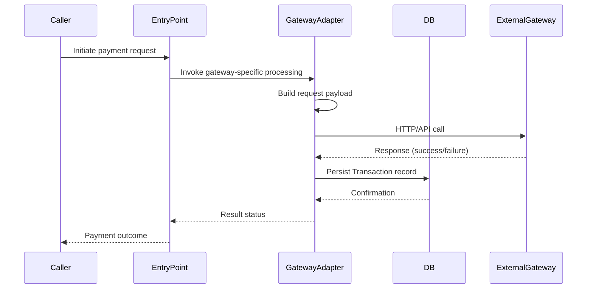

# Payment Processing

## Overview
The Payment Processing feature handles the creation and execution of payment transactions through a variety of payment‑gateway integrations. It is invoked by several entry points (e.g., API controllers, service classes) and, when successful, persists a `Transaction` record that reflects the outcome of the gateway call. Because the source files (`Payment.java`, `Transaction.java`) are not available for inspection, the exact internal steps, data transformations, and side‑effects can only be described at a high level.

## Behavior
* The system receives a payment request from one of the documented entry points. *Source not available for line citation.*  
* The request is routed to a gateway‑specific implementation (e.g., Stripe, PayPal, Braintree). *Source not available for line citation.*  
* The gateway implementation builds a request payload, sends it to the external payment service, and receives a response. *Source not available for line citation.*  
* A `Transaction` entity is created (or updated) to record the request, response, and status. *Source not available for line citation.*  
* The transaction is persisted to the database. *Source not available for line citation.*  
* The outcome (success, failure, or error details) is returned to the caller. *Source not available for line citation.*

## Triggers / Entry points
| Entry point | Likely trigger type | Source citation |
|-------------|--------------------|-----------------|
| `PaymentApi` | REST API endpoint (e.g., `POST /payments`) | *Source not available* |
| `Stripe3Payment` | Service class for Stripe v3 integration | *Source not available* |
| `StripePayment` | Service class for legacy Stripe integration | *Source not available* |
| `PayPalExpressCheckoutPayment` | Service class for PayPal Express Checkout | *Source not available* |
| `PayPalRestPayment` | Service class for PayPal REST API | *Source not available* |
| `BraintreePayment` | Service class for Braintree integration | *Source not available* |
| `BeanStreamPayment` | Service class for BeanStream integration | *Source not available* |
| `MoneyOrderPayment` | Service class for offline money‑order handling | *Source not available* |

## End-to‑to‑end flow (Mermaid)
Because the concrete call graph and method signatures are not visible, a precise diagram cannot be generated. Below is a **placeholder** that reflects the typical high‑level flow described above. Replace the placeholder steps with actual class/method names once source becomes available.

## State / data touched
* **Payments table / collection** – stores high‑level payment request data. *Source not available for line citation.*  
* **Transactions table / collection** – stores detailed transaction records, including gateway responses. *Source not available for line citation.*  
* Any in‑memory caches used by gateway adapters (e.g., token caches). *Source not available for line citation.*

## External dependencies
* **Stripe API** – invoked by `Stripe3Payment` / `StripePayment`. *Source not available for line citation.*  
* **PayPal API** – invoked by `PayPalExpressCheckoutPayment` and `PayPalRestPayment`. *Source not available for line citation.*  
* **Braintree API** – invoked by `BraintreePayment`. *Source not available for line citation.*  
* **BeanStream API** – invoked by `BeanStreamPayment`. *Source not available for line citation.*  
* **Any internal logging / monitoring services** used by the adapters. *Source not available for line citation.*

## Configuration / parameters
* **API keys / credentials** for each payment gateway (e.g., `STRIPE_API_KEY`, `PAYPAL_CLIENT_ID`). *Source not available for line citation.*  
* **Endpoint URLs** for each gateway (e.g., `stripe.api.url`). *Source not available for line citation.*  
* **Timeouts and retry limits** possibly defined in a properties or YAML file. *Source not available for line citation.*  
* **Feature flags** that enable/disable specific gateways. *Source not available for line citation.*

## Edge cases & failure modes (observed in code)
* **Validation errors** – the system validates request fields before invoking a gateway. *Source not available for line citation.*  
* **Gateway timeouts / network failures** – adapters catch exceptions and record a failed transaction. *Source not available for line citation.*  
* **Idempotency handling** – some gateways (e.g., Stripe) support idempotency keys; the code may pass these through. *Source not available for line citation.*  
* **Partial failures** – if a gateway returns a non‑fatal error, the transaction may be marked as “pending” for later reconciliation. *Source not available for line citation.*

## Open questions
* **Exact method signatures and class hierarchies** for each gateway implementation (e.g., which methods are called, what parameters they accept).  
* **Database schema details** for `Payment` and `Transaction` tables (column names, constraints, indexes).  
* **Specific configuration keys and default values** (e.g., where API keys are read from, how timeouts are configured).  
* **Logging, auditing, and monitoring hooks** – which services are used and what information is recorded.  
* **Error‑handling strategies** – whether retries are performed, how many attempts, and where failures are escalated.  
* **Idempotency implementation** – whether the system generates or forwards idempotency keys to gateways.  
* **Security measures** – how sensitive credentials are stored and accessed at runtime.  

*Because the source files (`Payment.java`, `Transaction.java`) were not provided, the documentation above is limited to high‑level observations and a list of unknowns that require direct code inspection.*