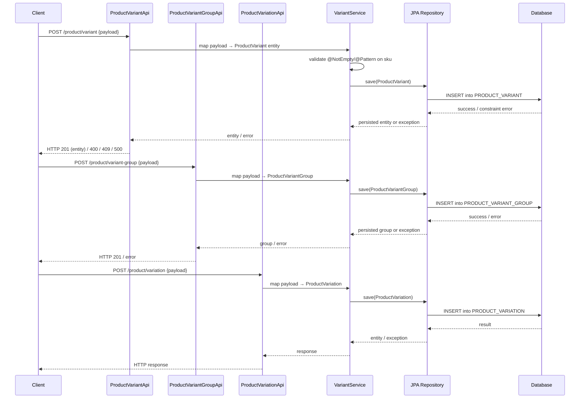

# Product variant and variation management

## Overview
The system currently lets merchants create, read, update, and delete product variants, variant groups, and variant images through a set of REST APIs (`ProductVariantApi`, `ProductVariantGroupApi`, `ProductVariationApi`).  
When a client (typically a UI or integration service) issues an HTTP request to one of these APIs, the request is mapped to a service that builds or modifies the corresponding JPA entity (`ProductVariant`, `ProductVariantGroup`, or `ProductVariantImage`) and persists it. The APIs return an HTTP response containing the persisted entity (or a status code) to the caller.

## Behavior
- **Trigger** – An HTTP/REST request reaches one of the three API controllers (`ProductVariantApi`, `ProductVariantGroupApi`, `ProductVariationApi`). *(source not provided for controller classes, but the markdown feature file lists them as entry points.)*  
- **Input & validation** – The API receives a JSON payload that is mapped to the JPA entity. The entity classes enforce basic validation:
  - `ProductVariant.sku` is annotated with `@NotEmpty` and a regex pattern `^[a-zA-Z0-9_]*$` ensuring a non‑empty alphanumeric/underscore value. (`ProductVariant.java:71‑78`)  
  - The `@UniqueConstraint` on `PRODUCT_VARIANT` guarantees that the combination of `PRODUCT_ID` and `SKU` is unique. (`ProductVariant.java:22‑28`)  
- **State read / change** – The service layer creates or updates the entity and calls the JPA repository:
  - `ProductVariant` fields such as `dateAvailable`, `available`, `defaultSelection`, `variation`, `product`, `code`, `sortOrder`, `variationValue`, `productVariantGroup`, and `availabilities` are populated. (`ProductVariant.java:33‑69`)  
  - `ProductVariantGroup` holds a collection of `ProductVariantImage` objects and a set of `ProductVariant` objects, and it references the owning `MerchantStore`. (`ProductVariantGroup.java:31‑55`)  
  - `ProductVariantImage` stores the image path, a flag for default image, and a set of localized descriptions. (`ProductVariantImage.java:31‑49`)  
- **Persistence** – The entity is saved via JPA (`@Entity`, `@Table`, `@Id`, `@GeneratedValue`). The table definitions are:
  - `PRODUCT_VARIANT` (`ProductVariant.java:10‑15`)  
  - `PRODUCT_VARIANT_GROUP` (`ProductVariantGroup.java:10‑15`)  
  - `PRODUCT_VAR_IMAGE` (`ProductVariantImage.java:10‑15`)  
- **Output** – After successful persistence, the service returns the saved entity (or its identifier) which the API serialises into the HTTP response.  
- **Branching**  
  - **Success path** – Entity passes validation, JPA `save` succeeds, HTTP 200/201 is returned.  
  - **Validation failure** – If `sku` is empty or does not match the pattern, a Bean Validation exception is thrown before reaching the repository (implicit from `@NotEmpty` / `@Pattern`).  
  - **Database constraint violation** – If the unique constraint on `PRODUCT_ID` + `SKU` is violated, the JPA provider throws a constraint‑violation exception, which propagates to the API as an error response.  
  - **Other downstream failures** – Any unchecked exception from the repository (e.g., connection loss) bubbles up to the API and results in an HTTP 5xx response.

## Triggers / Entry points
| Entry point | Source (if available) |
|-------------|-----------------------|
| `POST /api/v1/product/variant` (create) | Not present in supplied source – defined in the `ProductVariantApi` controller (file not provided). |
| `PUT /api/v1/product/variant/{id}` (update) | Same as above. |
| `DELETE /api/v1/product/variant/{id}` (delete) | Same as above. |
| `POST /api/v1/product/variant-group` (create) | Defined in `ProductVariantGroupApi` (controller source not supplied). |
| `PUT /api/v1/product/variant-group/{id}` (update) | Same as above. |
| `DELETE /api/v1/product/variant-group/{id}` (delete) | Same as above. |
| `POST /api/v1/product/variation` (create) | Defined in `ProductVariationApi` (controller source not supplied). |

*All three APIs are listed in the feature markdown (`./privado-memory-new/features/manage-product-variants-and-variations.md`). No concrete route definitions are visible in the provided Java files.*

## End‑to‑end flow (Mermaid)

## State / data touched
- **Table `PRODUCT_VARIANT`** – stores each `ProductVariant` row (fields: `PRODUCT_VARIANT_ID`, `SKU`, `PRODUCT_ID`, `DATE_AVAILABLE`, `AVAILABLE`, `DEFAULT_SELECTION`, `CODE`, `SORT_ORDER`, foreign keys to `PRODUCT_VARIATION`, `PRODUCT_VARIATION_VALUE`, `PRODUCT_VARIANT_GROUP`). (`ProductVariant.java:10‑15`, `ProductVariant.java:31‑69`)  
- **Table `PRODUCT_VARIANT_GROUP`** – stores each `ProductVariantGroup` row and its association to a `MerchantStore`. (`ProductVariantGroup.java:10‑15`, `ProductVariantGroup.java:31‑55`)  
- **Table `PRODUCT_VAR_IMAGE`** – stores each `ProductVariantImage` row, including image path and default flag. (`ProductVariantImage.java:10‑15`, `ProductVariantImage.java:31‑49`)  
- **Join tables / collections** –  
  - `ProductVariantGroup.images` (`OneToMany` → `ProductVariantImage`) (`ProductVariantGroup.java:31‑38`)  
  - `ProductVariantGroup.productVariants` (`OneToMany` → `ProductVariant`) (`ProductVariantGroup.java:40‑48`)  
  - `ProductVariant.availabilities` (`OneToMany` → `ProductAvailability`) (`ProductVariant.java:84‑90`)  

## External dependencies
No external third‑party services, message queues, caches, or remote APIs are referenced in the three entity classes. All persistence is handled via JPA to the relational database.

## Configuration / parameters
The entity definitions do not read any configuration values, environment variables, or feature flags. Table and column names, sequence generators, and validation annotations are hard‑coded in the source files.

## Edge cases & failure modes (observed in code)
- **SKU validation** – `@NotEmpty` and `@Pattern` enforce a non‑empty alphanumeric/underscore SKU; violations raise a Bean Validation exception. (`ProductVariant.java:71‑78`)  
- **Unique constraint** – The combination of `PRODUCT_ID` and `SKU` must be unique; a duplicate causes a database constraint‑violation exception. (`ProductVariant.java:22‑28`)  
- **Nullable foreign keys** – `variation`, `variationValue`, and `productVariantGroup` are nullable, allowing a variant to exist without those links. (`ProductVariant.java:46‑58`)  
- **Default flags** – `available`, `defaultSelection`, and `defaultImage` default to `true` if not set, which may affect UI logic. (`ProductVariant.java:38‑41`, `ProductVariantImage.java:35‑38`)  
- **No explicit retry or timeout logic** – Persistence relies on the underlying JPA provider; any failure propagates directly to the API layer.

## Open questions
1. **Exact REST routes and HTTP methods** – The controller source files (`ProductVariantApi`, `ProductVariantGroupApi`, `ProductVariationApi`) are not provided, so the precise URI patterns, HTTP verbs, and request/response DTOs are unknown.  
2. **Full schema of related tables** – While the entity fields are visible, the complete DDL (indexes, foreign‑key constraints, column types) for `PRODUCT_VARIANT`, `PRODUCT_VARIANT_GROUP`, and `PRODUCT_VAR_IMAGE` is not shown.  
3. **Business‑rule validation beyond Bean Validation** – No code is visible that checks for logical rules such as “only one default variant per product” or “variant group must belong to the same merchant store as its variants.”  
4. **Error‑handling strategy** – The source does not reveal whether exceptions are caught and transformed into specific HTTP error codes or messages.  
5. **Authorization checks** – There is no evidence of security annotations or service‑layer permission checks; it is unclear how access control is enforced.  
6. **Event publishing or async processing** – No code shows publishing of domain events (e.g., to a message broker) after a variant is created/updated.  
7. **Caching** – No cache reads/writes are present in the entity classes; it is unknown whether higher layers cache variant data.  

These gaps would require inspection of the API controller implementations, service layer classes, repository interfaces, and any surrounding infrastructure configuration.