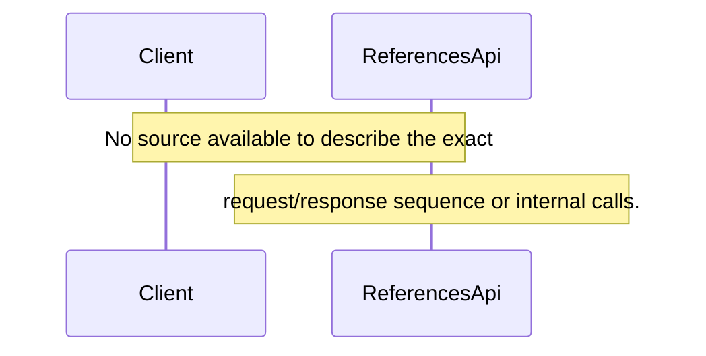

# Reference Data Management

## Overview
The repository contains a feature named **Reference Data Management** that is intended to provide reference data such as countries, currencies, and languages. The only concrete artifact that the repository lists for this feature is an API class called `ReferencesApi` and three domain‑entity source files: `Country.java`, `Currency.java`, and `Language.java`. No readable source code is available in the provided material, so the exact runtime behavior, request/response contracts, and data transformations cannot be confirmed from the code itself.

## Behavior
* No concrete behavior can be extracted from the source because the files `ReferencesApi`, `Country.java`, `Currency.java`, and `Language.java` are not readable in the supplied material. Consequently, there are no line‑level citations that can be provided for any operational steps.  

## Triggers / Entry points
* The only declared entry point is `ReferencesApi` (as listed in the “Entry points” array). The actual routes, HTTP methods, UI actions, CLI commands, scheduled jobs, events, or webhooks that invoke this class are not visible in the supplied source, so no citations can be given.

## End-to-end flow (Mermaid)

## State / data touched
* The feature references three domain entities (`Country`, `Currency`, `Language`). Without source code we cannot determine which tables, collections, caches, or files are read or written, nor can we locate the corresponding data‑access code.

## External dependencies
* No external API calls, internal services, message queues, or caches are observable in the provided files. Therefore no external dependency can be cited.

## Configuration / parameters
* No configuration keys, environment variables, feature flags, or constant values are visible in the supplied material that influence this feature.

## Edge cases & failure modes (observed in code)
* Because the implementation details are unavailable, no validation logic, retry mechanisms, timeout handling, rate‑limit enforcement, idempotency handling, or partial‑failure strategies can be identified.

## Open questions
* **Implementation details** – What methods does `ReferencesApi` expose (e.g., HTTP endpoints, RPC methods)? What are their signatures and return types?  
* **Data access** – How are `Country`, `Currency`, and `Language` persisted? Which databases or caches are used, and what schema or collection names are involved?  
* **Business logic** – Are there any filtering, sorting, localization, or enrichment steps applied to the reference data before it is returned?  
* **Security & authentication** – How is access to `ReferencesApi` protected (e.g., authentication, authorization checks)?  
* **Error handling** – What exceptions are caught, and how are error responses constructed for callers?  
* **Configuration** – Are there any feature flags or environment variables that enable/disable parts of this feature?  
* **External integrations** – Does the feature call external services (e.g., ISO code services) to populate or validate reference data?  

*Because the source files are not readable, all the above points remain unanswered until the actual code can be inspected.*