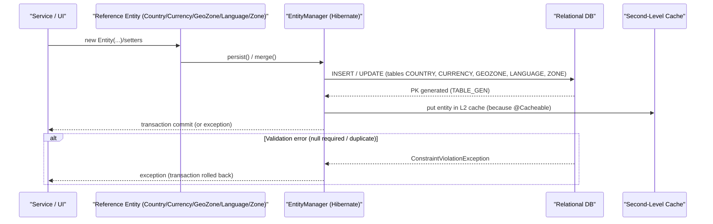

# Reference data management

## Overview
The reference‑data management feature stores and maintains the static lookup tables that the platform relies on – countries, currencies, geo‑zones, languages and zones.  Entity objects (`Country`, `Currency`, `GeoZone`, `Language`, `Zone`) are instantiated, persisted and linked together by the JPA/Hibernate layer.  When an entity is created or updated the corresponding row in the relational tables (`COUNTRY`, `CURRENCY`, `GEOZONE`, `LANGUAGE`, `ZONE`) is written, and relationships (e.g., a country’s zones or its geo‑zone) are materialised through foreign‑key columns.

## Behavior
- **What triggers it** – Any code path that constructs or modifies one of the reference entities and invokes the JPA `EntityManager.persist()` / `merge()` operation triggers the feature. The entities themselves are the entry points (e.g., `new Country(..)`, `new Currency(..)`, `new GeoZone(..)`, `new Language(..)`, `new Zone(..)`).  
  *Citations*: `Country.java:1`, `Currency.java:1`, `GeoZone.java:1`, `Language.java:1`, `Zone.java:1`.

- **Inputs accepted and validation applied**  
  - `Country` – `isoCode` (must be non‑null, unique, column `COUNTRY_ISOCODE`), `supported` flag, optional `GeoZone` reference.  
    *Citations*: `Country.java:31-38` (field definitions, `@Column(... unique=true, nullable = false)`).
  - `Currency` – `java.util.Currency` object (non‑null, unique via column `CURRENCY_CURRENCY_CODE`), optional `supported` flag, derived `code` (set in `setCurrency`).  
    *Citations*: `Currency.java:23-30` (field definitions, `@Column(nullable = false, unique = true)`), `Currency.java:45-49` (setter logic).
  - `GeoZone` – `name` and `code` (both simple strings, no explicit validation).  
    *Citations*: `GeoZone.java:31-38`.
  - `Language` – `code` (non‑null, column `CODE`), optional `sortOrder`.  
    *Citations*: `Language.java:31-38` (`@Column(name = "CODE", nullable = false)`).
  - `Zone` – `code` (non‑null, unique, column `ZONE_CODE`), mandatory `country` reference (`@JoinColumn(nullable = false)`).  
    *Citations*: `Zone.java:31-38` (field definitions, `@JoinColumn(name = "COUNTRY_ID", nullable = false)`).

- **State / data it reads or changes**  
  - Persists the entity itself to its table (`COUNTRY`, `CURRENCY`, `GEOZONE`, `LANGUAGE`, `ZONE`).  
    *Citations*: `Country.java:10-15`, `Currency.java:10-15`, `GeoZone.java:10-15`, `Language.java:10-15`, `Zone.java:10-15`.  
  - Updates relationship collections:  
    - `Country.descriptions` (`Set<CountryDescription>`), `Country.zones` (`Set<Zone>`).  
      *Citations*: `Country.java:18-23`.  
    - `GeoZone.countries` (`List<Country>`).  
      *Citations*: `GeoZone.java:41-45`.  
    - `Zone.descriptions` (`List<ZoneDescription>`).  
      *Citations*: `Zone.java:22-27`.  

- **Outputs, responses, side‑effects**  
  - After a successful JPA transaction the new or updated rows become visible to any subsequent read operation.  
  - The `@Cacheable` annotation on each entity enables second‑level cache population (e.g., Hibernate’s L2 cache).  
    *Citations*: `Country.java:13`, `Currency.java:13`, `Language.java:13`, `GeoZone.java:13`.  
  - No explicit event publishing or messaging is present in the source; side‑effects are limited to DB writes and cache updates.

- **Branches**  
  - **Success path** – All required fields are present, uniqueness constraints are satisfied, JPA transaction commits, cache is refreshed.  
  - **Validation failure** – If a required column is null or a unique constraint (e.g., `COUNTRY_ISOCODE`, `CURRENCY_CURRENCY_CODE`, `ZONE_CODE`) is violated, the underlying database throws a constraint‑violation exception, causing the transaction to roll back. The source does not contain explicit try‑catch handling; the exception propagates to the caller.  
    *Citations*: column definitions with `unique=true` / `nullable = false` in the entity files.  
  - **Downstream failure** – Any failure in the persistence provider (e.g., connection loss) aborts the transaction; again, the code does not contain custom retry logic.

## Triggers / Entry points
| Entity | File & line where the class is declared (entry point) |
|--------|-------------------------------------------------------|
| Country | `./sm-core-model/src/main/java/com/salesmanager/core/model/reference/country/Country.java:1` |
| Currency | `./sm-core-model/src/main/java/com/salesmanager/core/model/reference/currency/Currency.java:1` |
| GeoZone | `./sm-core-model/src/main/java/com/salesmanager/core/model/reference/geozone/GeoZone.java:1` |
| Language | `./sm-core-model/src/main/java/com/salesmanager/core/model/reference/language/Language.java:1` |
| Zone | `./sm-core-model/src/main/java/com/salesmanager/core/model/reference/zone/Zone.java:1` |

These classes are instantiated by higher‑level services or UI controllers (not present in the supplied sources) and then persisted via JPA.

## End‑to‑end flow (Mermaid)

## State / data touched
| Table / Cache | Access type | Source citation |
|---------------|-------------|-----------------|
| `COUNTRY` | INSERT / UPDATE / SELECT | `Country.java:10-15` |
| `CURRENCY` | INSERT / UPDATE / SELECT | `Currency.java:10-15` |
| `GEOZONE` | INSERT / UPDATE / SELECT | `GeoZone.java:10-15` |
| `LANGUAGE` | INSERT / UPDATE / SELECT | `Language.java:10-15` |
| `ZONE` | INSERT / UPDATE / SELECT | `Zone.java:10-15` |
| Hibernate L2 cache (enabled by `@Cacheable`) | read/write | `Country.java:13`, `Currency.java:13`, `GeoZone.java:13`, `Language.java:13`, `Zone.java:13` |

## External dependencies
The reference‑data code does **not** invoke external services, REST APIs, message brokers, or third‑party libraries beyond standard JPA/Hibernate and Jackson for JSON handling. No external call sites are present in the supplied files.

## Configuration / parameters
No explicit configuration keys, environment variables, or feature flags are referenced in the entity classes. The only configurable aspects are the JPA `TABLE_GENERATOR` settings (sequence table `SM_SEQUENCER`) which are defined in each entity:

- `TABLE_GEN` definition in each entity (e.g., `Country.java:20-23`, `Currency.java:20-23`, `GeoZone.java:20-23`, `Language.java:20-24`, `Zone.java:20-23`).

## Edge cases & failure modes (observed in code)
- **Uniqueness constraints** – `COUNTRY_ISOCODE` (Country), `CURRENCY_CURRENCY_CODE` (Currency), `ZONE_CODE` (Zone), `CODE` (Language) are declared `unique=true`. Violations raise DB exceptions.  
  *Citations*: `Country.java:34-36`, `Currency.java:23-26`, `Zone.java:34-36`, `Language.java:31-33`.
- **Non‑null foreign keys** – `Zone.country` is `nullable = false`; persisting a `Zone` without a `Country` causes a DB constraint error.  
  *Citation*: `Zone.java:38-40`.
- **Cacheability** – `@Cacheable` may cause stale reads if the cache is not evicted after external updates (not handled in code).  
  *Citation*: `Country.java:13`, `Currency.java:13`, `Language.java:13`, `GeoZone.java:13`, `Zone.java:13`.

## Open questions
- **Description entities** – `CountryDescription`, `GeoZoneDescription`, and `ZoneDescription` are referenced as collections but their classes and usage (e.g., how descriptions are populated, localized, or persisted) are not present in the provided sources.  
  *File & line*: `Country.java:18-23`, `GeoZone.java:41-45`, `Zone.java:22-27`.
- **Audit handling for Language** – `Language` implements `Auditable` and contains an `AuditSection` field, but the code that writes audit information (e.g., timestamps, user IDs) is not shown. The `AuditListener` class is referenced but not included.  
  *File & line*: `Language.java:20-25`.
- **Service / controller layer** – The actual callers that instantiate these entities (REST controllers, admin UI actions, batch jobs) are not part of the supplied repository, so the exact request‑or‑event triggers cannot be pinpointed beyond the entity constructors.  
  *File*: all entity files listed above.