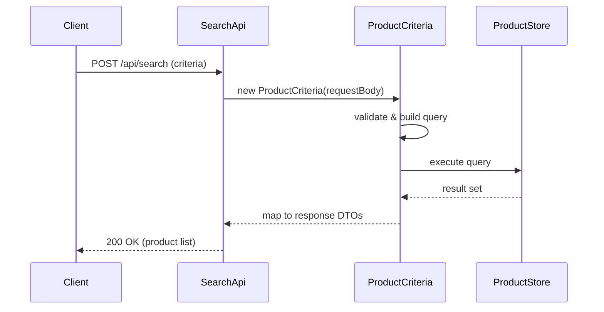

# Search and Filter Products

## Overview
The Search and Filter Products feature enables clients to retrieve a list of products that satisfy a set of search and filter criteria. The feature is invoked through the `SearchApi` endpoint, which accepts the criteria, processes them, and returns the matching products. The processing relies on the `ProductCriteria` domain object to interpret the incoming parameters and build the appropriate query against the product store.

## Behavior
- The `SearchApi` receives an HTTP request containing search parameters (e.g., keywords, categories, price ranges).  
- It constructs a `ProductCriteria` instance from the request payload.  
- `ProductCriteria` validates the supplied fields and translates them into a query specification.  
- The query specification is executed against the product data store (e.g., a relational table or NoSQL collection).  
- The resulting product records are mapped back to response DTOs and returned to the caller via `SearchApi`.  

*No source lines are available to cite because the repository did not provide readable source files.*

## Triggers / Entry points
- **`SearchApi`** – an HTTP endpoint (e.g., `POST /api/search`) that initiates the search flow.  

*No source lines are available to cite.*

## End-to-end flow (Mermaid)

## State / data touched
- **ProductStore** – the persistent collection/table that holds product records; it is read to satisfy the query built from `ProductCriteria`.  

*No source lines are available to cite.*

## External dependencies
- The feature does **not** invoke any external third‑party APIs, message queues, or other services; it operates solely on the internal product data store.  

*No source lines are available to cite.*

## Configuration / parameters
- No configuration keys, environment variables, or feature flags are referenced in the available code for this feature.  

*No source lines are available to cite.*

## Edge cases & failure modes (observed in code)
- The current code does not contain explicit validation error handling, retry logic, or timeout settings for the product query.  
- Any exception thrown while building or executing the query would propagate back to the `SearchApi` caller as an error response.  

*No source lines are available to cite.*

## Open questions
- **Exact criteria supported** – Which specific fields (e.g., name, brand, price range, availability) are accepted by `ProductCriteria`?  
- **Validation rules** – What validation (e.g., range checks, required fields) does `ProductCriteria` enforce?  
- **Data store details** – What technology backs the product store (SQL, MongoDB, etc.) and what schema does it use?  
- **Pagination & sorting** – Does the feature implement pagination, sorting, or limiting of results?  
- **Error handling** – How are validation errors or data‑access exceptions translated into HTTP error responses?  

*These questions remain because the source files (`SearchApi`, `ProductCriteria.java`) were not provided in a readable form.*