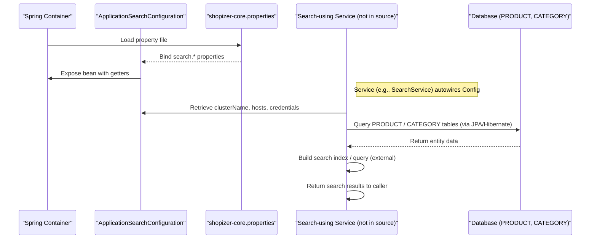

# Search and filter products

## Overview
The **search and filter products** feature currently provides the configuration needed for a full‑text search engine and defines the domain entities (`Product` and `Category`) that are indexed and queried. When the application starts, `ApplicationSearchConfiguration` reads search‑related properties (cluster name, credentials, hosts, supported languages) from `shopizer‑core.properties`. These settings are later used by the (external) search starter to connect to the search cluster. The `Product` and `Category` classes expose the fields that can be searched or used for faceted filtering (e.g., SKU, descriptions, categories, attributes, availability, etc.). The feature is therefore a combination of **configuration loading** and **entity definition** that together enable other components to perform product search and filtering.

## Behavior
- **Configuration loading** – Spring creates an instance of `ApplicationSearchConfiguration` and binds properties prefixed with `search` from `shopizer‑core.properties` to its fields (`clusterName`, `credentials`, `host`, `searchLanguages`). `path:./sm-core/src/main/java/com/salesmanager/core/business/configuration/ApplicationSearchConfiguration.java:1-15`
- **Getter/Setter exposure** – The class provides standard getters and setters for each configuration property, allowing other beans to retrieve the search settings at runtime. `path:./sm-core/src/main/java/com/salesmanager/core/business/configuration/ApplicationSearchConfiguration.java:17-46`
- **Entity definition – Product** – The `Product` class maps to the `PRODUCT` table and contains collections for descriptions, availabilities, attributes, images, relationships, categories, and variants. These collections are the data sources that a search engine can index and later filter on. `path:./sm-core-model/src/main/java/com/salesmanager/core/model/catalog/product/Product.java:1-200`
- **Entity definition – Category** – The `Category` class maps to the `CATEGORY` table and holds a set of `CategoryDescription` objects, a parent/child hierarchy, and flags such as `visible`, `featured`, and `categoryStatus`. These fields support faceted filtering (e.g., by visibility or featured status). `path:./sm-core-model/src/main/java/com/salesmanager/core/model/catalog/category/Category.java:1-150`
- **No direct search execution** – The provided source does **not** contain any service, repository, or controller that builds a query, sends it to a search engine, or returns results. Consequently, the feature’s runtime behavior beyond configuration loading and entity definition is not observable in the supplied files.

## Triggers / Entry points
- **Spring Boot startup** – The `@Configuration` and `@ConfigurationProperties(prefix = "search")` annotations cause Spring to instantiate `ApplicationSearchConfiguration` and bind the properties when the application context is initialized. `path:./sm-core/src/main/java/com/salesmanager/core/business/configuration/ApplicationSearchConfiguration.java:1-15`
- **Other beans** – Any bean that autowires `ApplicationSearchConfiguration` (not shown) can retrieve the search settings and trigger the actual search process. The exact entry point (e.g., a REST controller) is not present in the supplied code.

## End-to‑end flow (Mermaid)

*The diagram reflects only the observable steps (configuration loading and entity access). The actual search‑engine interaction is represented as a placeholder because its implementation is not present in the provided sources.*

## State / data touched
- **`shopizer-core.properties`** – Read to populate `ApplicationSearchConfiguration` fields. `path:./sm-core/src/main/java/com/salesmanager/core/business/configuration/ApplicationSearchConfiguration.java:1-15`
- **`PRODUCT` table** – Mapped by `Product` (`@Entity(name = "PRODUCT")`). Reads all columns and related collections (descriptions, attributes, etc.) when a JPA query loads a product. `path:./sm-core-model/src/main/java/com/salesmanager/core/model/catalog/product/Product.java:1-200`
- **`CATEGORY` table** – Mapped by `Category` (`@Entity(name = "CATEGORY")`). Reads columns and hierarchical relationships when a category is loaded. `path:./sm-core-model/src/main/java/com/salesmanager/core/model/catalog/category/Category.java:1-150`

## External dependencies
- **Search host / cluster** – The configuration holds a list of `SearchHost` objects and credentials that are intended for an external search service (e.g., Elasticsearch, Solr). The actual client/library calls are not present in the supplied code. `path:./sm-core/src/main/java/com/salesmanager/core/business/configuration/ApplicationSearchConfiguration.java:1-15`

## Configuration / parameters
- `search.clusterName` – Name of the search cluster. `path:./sm-core/src/main/java/com/salesmanager/core/business/configuration/ApplicationSearchConfiguration.java:13`
- `search.credentials` – Holds username/password or token for the search service. `path:./sm-core/src/main/java/com/salesmanager/core/business/configuration/ApplicationSearchConfiguration.java:14`
- `search.host` – List of `SearchHost` objects (host + port). `path:./sm-core/src/main/java/com/salesmanager/core/business/configuration/ApplicationSearchConfiguration.java:15`
- `search.searchLanguages` – Languages supported for full‑text analysis. `path:./sm-core/src/main/java/com/salesmanager/core/business/configuration/ApplicationSearchConfiguration.java:16`

## Edge cases & failure modes (observed in code)
- **Missing properties** – If any `search.*` property is absent, Spring will bind `null` (or an empty list) to the corresponding field; no explicit validation or default values are defined in `ApplicationSearchConfiguration`. `path:./sm-core/src/main/java/com/salesmanager/core/business/configuration/ApplicationSearchConfiguration.java:1-15`
- **Entity lazy loading** – Collections in `Product` and `Category` are marked `FetchType.LAZY`. Accessing them outside an active Hibernate session can cause `LazyInitializationException`. This is a potential runtime failure when the search service attempts to read entity data. `path:./sm-core-model/src/main/java/com/salesmanager/core/model/catalog/product/Product.java:45-70` and `path:./sm-core-model/src/main/java/com/salesmanager/core/model/catalog/category/Category.java:45-70`
- **No validation of search inputs** – The source does not contain any validation logic for user‑supplied search strings or filter parameters, so malformed input could propagate to the external search engine. *No source line to cite (absence).*

## Open questions
- **Search execution code** – Which class/method builds the actual search query, sends it to the external search cluster, and returns results? No such code is present in the supplied files. `path: N/A`
- **Indexing strategy** – How and when are `Product` and `Category` instances indexed (e.g., on save, via a background job, or on demand)? The indexing hooks are not visible. `path: N/A`
- **Filter mapping** – Which fields are exposed as faceted filters (price range, brand, availability, etc.) and how are they translated into search‑engine facets? Not defined in the current source. `path: N/A`
- **Error handling for external search service** – Retry policies, timeout handling, and fallback behavior are not shown. `path: N/A`
- **Security of credentials** – How are `Credentials` objects populated (encrypted values, vault integration)? The implementation of `modules.commons.search.configuration.Credentials` is not included. `path: N/A`