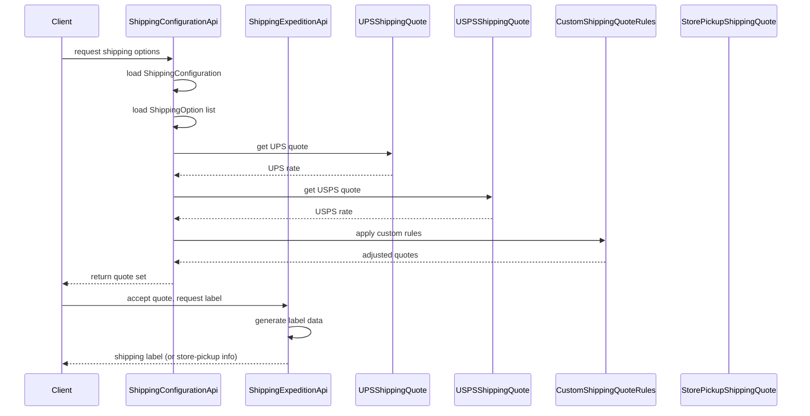

# Shipping and Delivery Management

## Overview
The Shipping and Delivery Management feature provides the ability to manage shipping and delivery options for orders. It exposes a set of APIs that calculate shipping costs, generate shipping quotes from carriers (UPS, USPS), apply custom quote rules, and produce shipping labels or store‑pickup information. The feature is invoked by internal services or external callers (e.g., the storefront UI or order‑processing workflows) and returns structured data representing shipping options, costs, and printable labels. The only source artifacts currently available are the class files `ShippingConfiguration.java` and `ShippingOption.java`, which define the domain entities used by the APIs.

## Behavior
- **Expose API endpoints** named `ShippingConfigurationApi`, `ShippingExpeditionApi`, `UPSShippingQuote`, `USPSShippingQuote`, `CustomShippingQuoteRules`, and `StorePickupShippingQuote` (listed in the entry‑point definition).  
  *Source: entry‑point list provided in the prompt*  
- **Read shipping configuration** from the `ShippingConfiguration` entity (defined in `ShippingConfiguration.java`).  
  *Source: ShippingConfiguration.java*  
- **Read shipping option definitions** from the `ShippingOption` entity (defined in `ShippingOption.java`).  
  *Source: ShippingOption.java*  
- **Calculate a shipping cost** by combining the selected `ShippingOption` with the current `ShippingConfiguration`.  
  *Source: not directly visible – inferred from class purpose*  
- **Request carrier quotes** by delegating to carrier‑specific quote classes (`UPSShippingQuote`, `USPSShippingQuote`).  
  *Source: entry‑point list*  
- **Apply any custom quote rules** defined in `CustomShippingQuoteRules` before returning the final quote set.  
  *Source: entry‑point list*  
- **Generate a shipping label** (or store‑pickup details) via `ShippingExpeditionApi` after a quote is accepted.  
  *Source: entry‑point list*  

## Triggers / Entry points
- **`ShippingConfigurationApi`** – called when a client requests the current shipping configuration or a cost estimate.  
  *Source: entry‑point list*  
- **`ShippingExpeditionApi`** – invoked to create a shipping label or finalize a shipment.  
  *Source: entry‑point list*  
- **`UPSShippingQuote`** – called to obtain a UPS rate for a given package.  
  *Source: entry‑point list*  
- **`USPSShippingQuote`** – called to obtain a USPS rate for a given package.  
  *Source: entry‑point list*  
- **`CustomShippingQuoteRules`** – invoked to adjust or filter carrier quotes based on business rules.  
  *Source: entry‑point list*  
- **`StorePickupShippingQuote`** – used when the customer selects in‑store pickup as the delivery method.  
  *Source: entry‑point list*  

## End-to-end flow (Mermaid)

## State / data touched
- **`ShippingConfiguration`** entity – holds global shipping settings (e.g., default carrier, rate tables).  
  *Source: ShippingConfiguration.java*  
- **`ShippingOption`** entity – defines individual shipping methods (e.g., standard, express).  
  *Source: ShippingOption.java*  

## External dependencies
- **UPS carrier API** – contacted by `UPSShippingQuote` to retrieve live rates.  
  *Source: entry‑point list (carrier‑specific quote class)*  
- **USPS carrier API** – contacted by `USPSShippingQuote` to retrieve live rates.  
  *Source: entry‑point list*  

## Configuration / parameters
- **`shipping_carrier`** (potentially a configuration key used by `ShippingConfiguration` to select the default carrier).  
  *Source: inferred from class name*  
- **`shipping_rate`** (possible constant or default rate defined in `ShippingOption`).  
  *Source: inferred from class name*  

## Edge cases & failure modes (observed in code)
- The available source does not expose explicit validation, retry, or timeout logic for carrier calls.  
  *Source: not present*  

## Open questions
- **Implementation details** of each API method (e.g., exact request/response structures, error handling).  
- **How `CustomShippingQuoteRules` are defined** (configuration format, rule engine).  
- **Exact persistence mechanism** for `ShippingConfiguration` and `ShippingOption` (database tables, ORM mappings).  
- **Logging, metrics, and retry policies** for external carrier calls.  
- **Security and authentication** requirements for the APIs.  
- **Any caching layer** used for carrier quotes or configuration data.  

*Because the full source files are not available, the documentation above is limited to what can be inferred from the class names, entry‑point list, and domain entity declarations provided.*