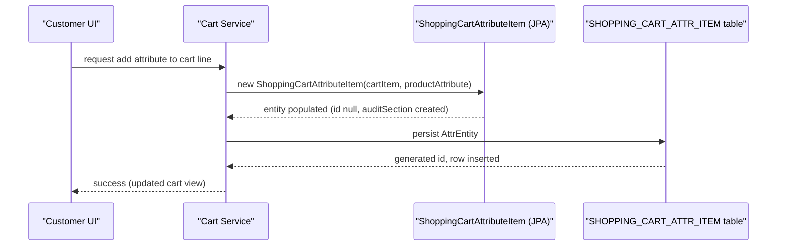

# Shopping cart management

## Overview
The shopping‑cart feature stores a customer’s selected products together with any chosen product attributes until checkout.  
When a `ShoppingCartItem` is created or updated, the system can attach one or more `ShoppingCartAttributeItem` objects that record the selected attribute (e.g., size, colour). The attribute items are persisted in the **SHOPPING_CART_ATTR_ITEM** table and participate in the audit infrastructure.

## Behavior
- **Trigger** – A `ShoppingCartAttributeItem` instance is created by calling one of its constructors from application code that is handling a cart update. (`ShoppingCartAttributeItem.java:23‑30` and `ShoppingCartAttributeItem.java:32‑36`)  
- **Inputs** –  
  * `ShoppingCartItem shoppingCartItem` – the owning cart line item (mandatory). (`ShoppingCartAttributeItem.java:23‑24`, `ShoppingCartAttributeItem.java:32‑33`)  
  * `ProductAttribute productAttribute` **or** `Long productAttributeId` – the attribute being recorded. (`ShoppingCartAttributeItem.java:23‑26`, `ShoppingCartAttributeItem.java:32‑35`)  
- **Validation** – No explicit validation is performed in this class; it simply stores the supplied IDs/objects.  
- **State changes** –  
  * The JPA entity fields `shoppingCartItem`, `productAttributeId`, and (optionally) `productAttribute` are populated. (`ShoppingCartAttributeItem.java:23‑35`)  
  * The entity inherits `id` and `auditSection` from `SalesManagerEntity` and `Auditable`; the `auditSection` is instantiated on construction (`ShoppingCartAttributeItem.java:15‑18`).  
  * When the entity is persisted, JPA writes a row to **SHOPPING_CART_ATTR_ITEM** (`ShoppingCartAttributeItem.java:9‑12`).  
- **Outputs / side‑effects** – Persisting the entity creates a database row that links the attribute to the owning `ShoppingCartItem`. No direct response is returned from this class; callers receive the managed entity after the transaction commits.  
- **Branches** –  
  * **Success** – Entity is persisted; the foreign‑key `SHP_CART_ITEM_ID` references the owning cart line.  
  * **Failure** – Any JPA exception (e.g., constraint violation) propagates to the caller; the class itself does not catch or transform errors.

## Triggers / Entry points
| Entry point | Location (line) |
|-------------|-----------------|
| Creation of an attribute item with a full `ProductAttribute` object | `ShoppingCartAttributeItem.java:23‑26` |
| Creation of an attribute item with only the attribute ID | `ShoppingCartAttributeItem.java:32‑35` |
| Default no‑arg constructor (used by JPA) | `ShoppingCartAttributeItem.java:38‑40` |
| Getter / setter methods used by service layers | `ShoppingCartAttributeItem.java:42‑78` |

> **Note:** The higher‑level cart operations (add, update, remove) are defined in `ShoppingCart.java` and `ShoppingCartItem.java`, but their source bodies are not present in the provided snapshot, so they cannot be described concretely here.

## End‑to‑end flow (Mermaid)

## State / data touched
- **Table** `SHOPPING_CART_ATTR_ITEM` – stores each attribute row (`@Table(name = "SHOPPING_CART_ATTR_ITEM")` at `ShoppingCartAttributeItem.java:9`).  
- **Columns**  
  * `SHP_CART_ATTR_ITEM_ID` – primary key (`@Id @Column …` at `ShoppingCartAttributeItem.java:13‑16`).  
  * `PRODUCT_ATTR_ID` – foreign key to the product attribute (`@Column(name="PRODUCT_ATTR_ID", nullable=false)` at `ShoppingCartAttributeItem.java:27‑28`).  
  * `SHP_CART_ITEM_ID` – foreign key to the owning `ShoppingCartItem` (`@JoinColumn(name = "SHP_CART_ITEM_ID", nullable = false)` at `ShoppingCartAttributeItem.java:31‑33`).  
- **Audit fields** – `auditSection` columns are added by the `Auditable` infrastructure (inherited, not shown in this file).

## External dependencies
- **JPA / Hibernate** – Entity manager used implicitly when the service layer persists the entity (no explicit call site in the provided file).  
- **ProductAttribute model** – referenced only as a transient field; no method calls are made from this class (`@Transient private ProductAttribute productAttribute;` at `ShoppingCartAttributeItem.java:30‑31`).  

## Configuration / parameters
- No configuration keys, environment variables, or feature flags are referenced in `ShoppingCartAttributeItem.java`. The primary‑key generation uses a table‑based sequence (`TABLE_GEN`) defined in the `@TableGenerator` annotation (`ShoppingCartAttributeItem.java:14‑16`).

## Edge cases & failure modes (observed in code)
- **Null `productAttribute`** – The constructor that receives only an ID (`ShoppingCartAttributeItem(ShoppingCartItem, Long)`) allows `productAttribute` to remain `null`; downstream code must handle the transient field. (`ShoppingCartAttributeItem.java:32‑35`)  
- **Audit section** – The `auditSection` is always instantiated (`new AuditSection()`) so audit‑related null‑pointer failures are avoided. (`ShoppingCartAttributeItem.java:15‑18`)  
- **Persistence errors** – Any constraint violation (e.g., missing `SHP_CART_ITEM_ID`) would raise a JPA exception; the class itself does not catch it.

## Open questions
| Area | What is unknown from the available source |
|------|-------------------------------------------|
| **Cart‑level operations** | The concrete methods that add, update, or remove `ShoppingCartItem`s (and consequently `ShoppingCartAttributeItem`s) are in `ShoppingCart.java` and `ShoppingCartItem.java`, but their implementations are not provided, so the exact flow of validation, quantity handling, and stock checks cannot be described. |
| **Transaction management** | It is unclear whether cart modifications are wrapped in a single transaction, what isolation level is used, and how roll‑backs are handled. |
| **Concurrency handling** | No information is available about optimistic locking, version columns, or other mechanisms to prevent lost updates when multiple requests modify the same cart simultaneously. |
| **Error propagation** | The surrounding service layer’s strategy for translating JPA exceptions into user‑visible messages is not visible. |
| **Attribute loading** | The `productAttribute` field is marked `@Transient`; how and when the full `ProductAttribute` object is populated (e.g., lazy loading, separate service call) is not shown. |
| **Audit persistence** | While `AuditSection` is present, the concrete audit listener (`AuditListener.class`) implementation and the audit columns written to the DB are not part of the provided files. |

These gaps would require inspection of the missing `ShoppingCart.java`, `ShoppingCartItem.java`, and related service/repository classes to complete the documentation.