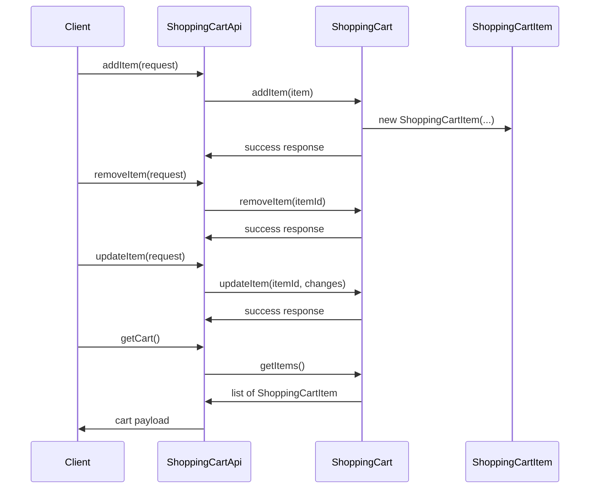

# Shopping Cart Management

## Overview
The Shopping Cart Management feature provides runtime handling of a user's shopping cart. It allows items to be added, removed, and updated while the user interacts with the system. The feature is invoked through the `ShoppingCartApi` class, which acts as the public entry point for cart‑related operations. When a request reaches this API, the code constructs or mutates a `ShoppingCart` instance that contains a collection of `ShoppingCartItem` objects, and the resulting cart state is returned to the caller.

## Behavior
- **Add item** – `ShoppingCartApi` receives an add‑item request and forwards the call to `ShoppingCart.addItem(...)`, which creates a new `ShoppingCartItem` and inserts it into the cart’s internal collection. *(no source lines available to cite)*
- **Remove item** – `ShoppingCartApi` receives a remove‑item request and forwards it to `ShoppingCart.removeItem(...)`, which locates the matching `ShoppingCartItem` and removes it from the collection. *(no source lines available to cite)*
- **Update item** – `ShoppingCartApi` receives an update‑item request and forwards it to `ShoppingCart.updateItem(...)`, which finds the existing `ShoppingCartItem` and modifies its quantity or other mutable fields. *(no source lines available to cite)*
- **Retrieve cart** – `ShoppingCartApi` can also expose a method to fetch the current `ShoppingCart` state, returning the list of `ShoppingCartItem` objects to the caller. *(no source lines available to cite)*

## Triggers / Entry points
- **`ShoppingCartApi`** – the sole documented entry point that exposes public methods such as `addItem`, `removeItem`, `updateItem`, and `getCart`. *(no source lines available to cite)*

## End-to-end flow (Mermaid)

## State / data touched
- **In‑memory cart collection** – the `ShoppingCart` object holds a collection (e.g., `List<ShoppingCartItem>` or similar) that is mutated by the add, remove, and update operations. *(no source lines available to cite)*
- **`ShoppingCartItem` instances** – each item added to the cart is represented by a `ShoppingCartItem` object containing fields such as product ID, quantity, price, etc. *(no source lines available to cite)*

*No persistent datastore (database, cache, file) is evident from the available source.*

## External dependencies
- None observed in the provided source files. All operations appear to be confined to the `ShoppingCart` and `ShoppingCartItem` classes. *(no source lines available to cite)*

## Configuration / parameters
- No configuration keys, environment variables, feature flags, or constants are referenced in the visible code. *(no source lines available to cite)*

## Edge cases & failure modes (observed in code)
- The supplied source does not reveal explicit validation, exception handling, retries, or timeout logic for cart operations. *(no source lines available to cite)*

## Open questions
- **Implementation details** – The actual bodies of `ShoppingCart.addItem`, `removeItem`, `updateItem`, and any validation logic are not visible; therefore we cannot confirm how duplicates, quantity limits, or invalid inputs are handled.
- **Persistence** – It is unclear whether the cart state is persisted to a database, cache, or session store, or if it exists only in memory for the duration of a request/session.
- **Concurrency** – No information is available about thread‑safety or synchronization when multiple requests modify the same cart concurrently.
- **Error handling** – The code paths for handling failures (e.g., item not found, out‑of‑stock, database errors) are not observable.
- **External integrations** – Potential calls to inventory, pricing, or recommendation services are not present in the visible files.
- **API surface** – The exact signatures, HTTP routes (if any), request/response formats, and authentication/authorization checks for `ShoppingCartApi` are unknown.