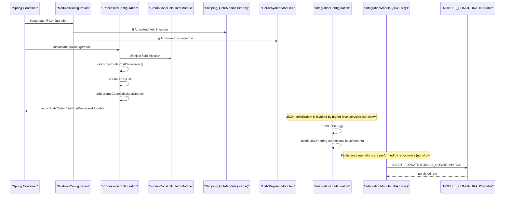

# System configuration management

## Overview
The system‑configuration‑management feature wires external integration modules and order‑total processors into the Spring application context and provides model objects that hold integration settings.  
When the Spring container starts it creates the `ModulesConfiguration` and `ProcessorsConfiguration` beans; the former autowires concrete `ShippingQuoteModule` and a list of `PaymentModule` implementations, while the latter injects a `PromoCodeCalculatorModule` and exposes it as a `List<OrderTotalPostProcessorModule>` bean.  
The domain entities `IntegrationConfiguration` and `IntegrationModule` are plain Java objects (the former implements `JSONAware` to produce a JSON representation, the latter is a JPA entity persisted in the `MODULE_CONFIGURATION` table). Administrators ultimately manipulate instances of these entities through UI or API layers that are not part of the supplied source.

## Behavior
- **Spring bean creation** – The `ModulesConfiguration` class is detected as a `@Configuration` component and instantiated at context start (`ModulesConfiguration.java:1`).  
- **Module injection** – Spring autowires a concrete `ShippingQuoteModule` implementation into the field `canadapost` (`ModulesConfiguration.java:15‑18`) and a `List<PaymentModule>` containing all live payment modules into `liveModules` (`ModulesConfiguration.java:22‑25`). No further processing is performed in this class.  
- **Processor configuration** – The `ProcessorsConfiguration` class is also a `@Configuration` component (`ProcessorsConfiguration.java:1`). Spring injects a `PromoCodeCalculatorModule` instance into the field `promoCodeCalculatorModule` (`ProcessorsConfiguration.java:13‑15`).  
- **Bean exposure** – The method `orderTotalsPostProcessors()` is annotated with `@Bean`; when invoked by Spring it creates a new `ArrayList<OrderTotalPostProcessorModule>`, adds the injected `promoCodeCalculatorModule` (`ProcessorsConfiguration.java:27‑29`), and returns the list (`ProcessorsConfiguration.java:30‑31`). This list is later used by order‑total calculation logic (not shown).  
- **IntegrationConfiguration JSON serialization** – An `IntegrationConfiguration` instance holds fields such as `moduleCode`, `active`, `defaultSelected`, `environment`, `integrationKeys`, and `integrationOptions`. Its `toJSONString()` method builds a JSON string:
  - Starts with core fields (`moduleCode`, `active`, `defaultSelected`, `environment`) (`IntegrationConfiguration.java:46‑55`).  
  - If `integrationKeys` is non‑empty, it creates a `JSONObject` from the map and appends it (`IntegrationConfiguration.java:61‑73`).  
  - If `integrationOptions` is non‑empty, it iterates over the map, builds a JSON object where each key maps to an array of strings, and appends it (`IntegrationConfiguration.java:75‑108`).  
  - The method always returns a well‑formed JSON object (`IntegrationConfiguration.java:110‑112`).  
- **IntegrationModule persistence** – `IntegrationModule` is a JPA `@Entity` mapped to the table `MODULE_CONFIGURATION` (`IntegrationModule.java:33‑38`). Its fields (`module`, `code`, `regions`, `configuration`, `configDetails`, `type`, `image`, `customModule`, etc.) are persisted via standard Hibernate mechanisms. Transient fields (`regionsSet`, `binaryImage`, `moduleConfigs`, `details`, `configurable`) are kept only in memory.  
- **No explicit branching** – The only conditional logic resides in `IntegrationConfiguration.toJSONString()` where inclusion of `integrationKeys` and `integrationOptions` depends on map size checks (`if (this.getIntegrationKeys().size() > 0)` and `if (this.getIntegrationOptions() != null && this.getIntegrationOptions().size() > 0)`). All other paths are straight‑line bean wiring.

## Triggers / Entry points
| Trigger | Source |
|--------|--------|
| Spring context initialization creates `ModulesConfiguration` bean | `ModulesConfiguration.java:1` |
| Spring autowires `ShippingQuoteModule` and `List<PaymentModule>` into `ModulesConfiguration` | `ModulesConfiguration.java:15‑25` |
| Spring context initialization creates `ProcessorsConfiguration` bean | `ProcessorsConfiguration.java:1` |
| Spring injects `PromoCodeCalculatorModule` into `ProcessorsConfiguration` | `ProcessorsConfiguration.java:13‑15` |
| Spring calls `orderTotalsPostProcessors()` to register the post‑processor list | `ProcessorsConfiguration.java:22‑31` |
| Any service that serializes an `IntegrationConfiguration` calls `toJSONString()` | `IntegrationConfiguration.java:46‑112` |
| JPA repository operations on `IntegrationModule` cause reads/writes to `MODULE_CONFIGURATION` table | `IntegrationModule.java:33‑38` |

## End‑to‑end flow (Mermaid)

## State / data touched
- **`MODULE_CONFIGURATION` table** – persisted by `IntegrationModule` (`IntegrationModule.java:33‑38`).  
- **In‑memory maps** – `IntegrationConfiguration.integrationKeys` and `integrationOptions` are held in the object while building JSON (`IntegrationConfiguration.java:31‑34`, `IntegrationConfiguration.java:36‑38`).  
- **Transient fields** – `IntegrationModule.regionsSet`, `binaryImage`, `moduleConfigs`, `details`, `configurable` exist only in the JVM and are never written to the database (`IntegrationModule.java:55‑71`).

## External dependencies
- **`ShippingQuoteModule`** – a Spring‑Boot starter providing shipping quote functionality, injected into `ModulesConfiguration` (`ModulesConfiguration.java:15‑18`).  
- **`PaymentModule`** – interface for payment integrations; all implementations are collected into `liveModules` (`ModulesConfiguration.java:22‑25`).  
- **`PromoCodeCalculatorModule`** – a concrete order‑total post‑processor injected into `ProcessorsConfiguration` (`ProcessorsConfiguration.java:13‑15`).  
- **`org.json.simple.JSONObject`** – used to build the `integrationKeys` JSON object (`IntegrationConfiguration.java:71‑73`).  
- **Jackson annotations** (`@JsonProperty`) for JSON deserialization (`IntegrationConfiguration.java:18‑31`).  

## Configuration / parameters
- **Environment constants** – `IntegrationConfiguration.TEST_ENVIRONMENT` = `"TEST"` and `IntegrationConfiguration.PRODUCTION_ENVIRONMENT` = `"PRODUCTION"` (`IntegrationConfiguration.java:13‑14`).  
- **`environment` field** – holds the selected environment string for an integration (`IntegrationConfiguration.java:84‑90`).  
- No external feature flags or environment variables are referenced in the supplied source.

## Edge cases & failure modes (observed in code)
- **Empty `integrationKeys`** – the `integrationKeys` section is omitted from the JSON output if the map is empty (`if (this.getIntegrationKeys().size() > 0)` – `IntegrationConfiguration.java:61`).  
- **Empty or null `integrationOptions`** – the `integrationOptions` section is omitted if the map is null or empty (`if (this.getIntegrationOptions() != null && this.getIntegrationOptions().size() > 0)` – `IntegrationConfiguration.java:75`).  
- **No validation of field values** – setters accept any values; the only constraints are the JSON‑building conditionals above.  
- **Bean creation failures** – would surface as Spring context startup errors if required modules are missing, but such handling is outside the shown code.

## Open questions
- **Usage of `IntegrationConfiguration`** – The source shows only the POJO and its JSON conversion; it is unclear which service or controller creates, populates, or persists these objects.  
- **Consumption of the `orderTotalsPostProcessors` bean** – The list is exposed as a Spring bean, but the downstream component that iterates over it during order total calculation is not present in the provided files.  
- **Definition of `ModuleConfig`** – `IntegrationModule` contains a transient `Map<String, ModuleConfig> moduleConfigs`, yet the `ModuleConfig` class is not included, leaving its structure and purpose unknown.  
- **Purpose of the transient `configurable` field** in `IntegrationModule` – It is stored but never used in the supplied code, so its role in the configuration workflow is ambiguous.