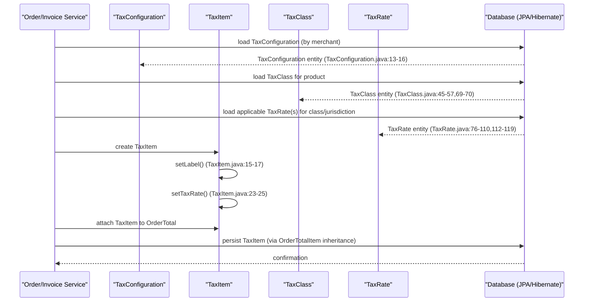

# Tax management

## Overview
The tax‑management feature stores and exposes the data needed to calculate taxes for orders and invoices.  
* `TaxConfiguration` holds merchant‑level settings that determine how tax is calculated (e.g., which address is used as the tax basis and whether tax is collected when the shipping province or country differs from the store’s) and can be serialized to JSON (`TaxConfiguration.toJSONString()` — `TaxConfiguration.java:20‑24`).  
* `TaxItem` represents a line‑item on an order/invoice that contains a label and a reference to a `TaxRate` (`TaxItem.java:12‑13`).  
* `TaxClass` groups products under a tax classification and links to one or more `TaxRate` records (`TaxClass.java:69‑70`).  
* `TaxRate` defines a concrete tax percentage together with jurisdiction information (country, zone, state/province), priority, and optional piggy‑back behavior (`TaxRate.java:76‑87`, `TaxRate.java:100‑110`, `TaxRate.java:112‑119`).  

These entities are persisted via JPA and are read by the order‑processing code (not shown) to compute the tax amount that is added to an order or invoice.

## Behavior
- **Configuration handling** – `TaxConfiguration` stores four fields (`taxBasisCalculation`, `collectTaxIfDifferentProvinceOfStoreCountry`, `collectTaxIfDifferentCountryOfStoreCountry`) with standard JavaBean getters/setters (`TaxConfiguration.java:13‑16`, `TaxConfiguration.java:27‑33`, `TaxConfiguration.java:35‑42`, `TaxConfiguration.java:44‑51`).  
- **JSON serialization** – `TaxConfiguration.toJSONString()` builds a `JSONObject` containing the enum name of the tax‑basis calculation and returns its string representation (`TaxConfiguration.java:20‑24`).  
- **Tax item creation** – `TaxItem` provides `setLabel/getLabel` and `setTaxRate/getTaxRate` to attach a human‑readable label and a `TaxRate` instance to an order total item (`TaxItem.java:15‑21`, `TaxItem.java:23‑29`).  
- **Tax class persistence** – `TaxClass` is a JPA entity with a primary key (`TaxClass.java:45‑49`), a unique code (`TaxClass.java:51‑53`), a title (`TaxClass.java:55‑57`), a many‑to‑one link to `MerchantStore` (`TaxClass.java:64‑66`), a one‑to‑many list of `Product` objects (`TaxClass.java:60‑61`), and a one‑to‑many list of `TaxRate` objects (`TaxClass.java:69‑70`). Standard getters/setters expose these fields (`TaxClass.java:103‑109`, `TaxClass.java:112‑118`).  
- **Tax rate definition** – `TaxRate` is a JPA entity with:
  * primary key (`TaxRate.java:64‑68`);
  * audit section (`TaxRate.java:70‑71`);
  * priority (`TaxRate.java:73‑74`);
  * numeric rate (`TaxRate.java:76‑77`);
  * code (`TaxRate.java:79‑81`);
  * piggy‑back flag (`TaxRate.java:84‑85`);
  * link to a `TaxClass` (`TaxRate.java:87‑89`);
  * link to a `MerchantStore` (`TaxRate.java:92‑94`);
  * optional jurisdiction fields: `Country` (`TaxRate.java:100‑102`), `Zone` (`TaxRate.java:104‑106`), `stateProvince` (`TaxRate.java:108‑109`);
  * hierarchical relationship to a parent `TaxRate` (`TaxRate.java:111‑113`) and a collection of child rates (`TaxRate.java:115‑116`);
  * transient `rateText` used for UI display (`TaxRate.java:118‑124`);
  * full set of getters/setters for each field (`TaxRate.java:133‑248`).  

No business‑logic methods (e.g., tax calculation, validation beyond JPA constraints) are present in these classes.

## Triggers / Entry points
- **Persistence layer** – JPA/Hibernate instantiates `TaxConfiguration`, `TaxItem`, `TaxClass`, and `TaxRate` when loading from the database (implicit entry point; no explicit code in the provided files).  
- **Application code** – Other services (outside the supplied sources) create or modify these objects via the public setters (e.g., `setTaxRate()` in `TaxItem.java:23‑25`).  
- **JSON export** – `TaxConfiguration` is serialized to JSON when its `toJSONString()` method is invoked (`TaxConfiguration.java:20‑24`).

## End-to‑to‑flow (Mermaid)

## State / data touched
| Entity | Table (JPA) | Fields accessed / modified | Source |
|--------|-------------|----------------------------|--------|
| `TaxConfiguration` | No dedicated table (stored in `MerchantConfiguration` elsewhere) | `taxBasisCalculation`, `collectTaxIfDifferentProvinceOfStoreCountry`, `collectTaxIfDifferentCountryOfStoreCountry` | `TaxConfiguration.java:13‑16`, `TaxConfiguration.java:27‑51` |
| `TaxItem` | Inherited from `OrderTotalItem` (table not shown) | `label`, `taxRate` | `TaxItem.java:12‑13`, `TaxItem.java:15‑29` |
| `TaxClass` | `TAX_CLASS` | `id`, `code`, `title`, `merchantStore`, `products`, `taxRates` | `TaxClass.java:45‑57`, `TaxClass.java:64‑66`, `TaxClass.java:60‑61`, `TaxClass.java:69‑70` |
| `TaxRate` | `TAX_RATE` | All columns listed in the class (e.g., `taxRate`, `code`, `country`, `zone`, `stateProvince`, `parent`, `taxRates`, `piggyback`, `taxPriority`) | `TaxRate.java:64‑68`, `TaxRate.java:73‑77`, `TaxRate.java:79‑81`, `TaxRate.java:84‑85`, `TaxRate.java:87‑89`, `TaxRate.java:92‑94`, `TaxRate.java:100‑110`, `TaxRate.java:111‑119` |

## External dependencies
- **JPA / Hibernate** – used for entity mapping and persistence (`@Entity`, `@Table`, `@ManyToOne`, etc.) across all four classes.  
- **org.json.simple** – used only by `TaxConfiguration` for JSON serialization (`TaxConfiguration.java:3‑4`, `TaxConfiguration.java:20‑24`).  

No external web services, message brokers, or caches are invoked directly in the supplied code.

## Configuration / parameters
- `TaxBasisCalculation` enum value stored in `taxBasisCalculation` (default `SHIPPINGADDRESS`) – controls which address is used as tax basis (`TaxConfiguration.java:13`).  
- Boolean flags `collectTaxIfDifferentProvinceOfStoreCountry` (default `true`) and `collectTaxIfDifferentCountryOfStoreCountry` (default `false`) – control tax collection when shipping location differs from store location (`TaxConfiguration.java:15‑16`).  

These values are exposed via the JSON output (`TaxConfiguration.toJSONString()`).

## Edge cases & failure modes (observed in code)
- **Null handling** – `TaxItem.taxRate` is initialized to `null` (`TaxItem.java:13`); callers must ensure a non‑null `TaxRate` is set before persisting.  
- **JPA constraints** – `TaxClass.code` and `TaxClass.title` are annotated with `@NotEmpty`, causing validation errors if empty (`TaxClass.java:51‑57`).  
- **Unique constraints** – `TaxClass` has a unique constraint on `(MERCHANT_ID, TAX_CLASS_CODE)` (`TaxClass.java:31‑33`); duplicate inserts will raise a database error.  
- **Unique constraint on `TaxRate`** – combination of `TAX_CODE` and `MERCHANT_ID` must be unique (`TaxRate.java:54‑59`).  
- **Transient field** – `TaxRate.rateText` is not persisted (`TaxRate.java:118‑124`); it is safe for UI use but will be lost on reload.

## Open questions
- **Tax calculation logic** – No method in the provided sources performs the actual tax amount computation; it must reside in another service or utility class not included here.  
- **How `TaxConfiguration` is populated** – The source shows getters/setters but does not reveal where the configuration is read