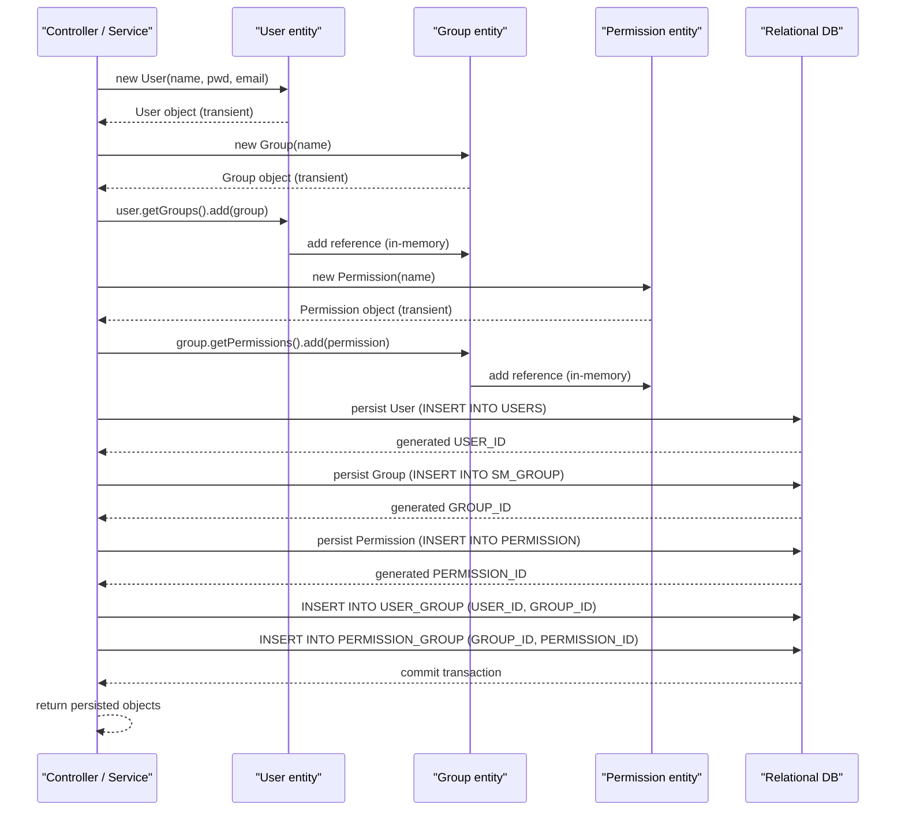

# User and access management

## Overview
The **User and access management** feature implements role‑based access control by persisting three core entities – `User`, `Group`, and `Permission` – in the database.  
A `User` belongs to one or more `Group`s (`User.groups`), and a `Group` aggregates a set of `Permission`s (`Group.permissions`). The JPA mappings create the join tables `USER_GROUP` and `PERMISSION_GROUP` that materialise the many‑to‑many relationships. The feature is exercised whenever the application creates, updates, or queries these entities (e.g., during administrator onboarding, group definition, or permission assignment).

## Behavior
- **Entity construction** – New instances are created via the public constructors:  
  - `new User(String userName, String password, String email)` (adds admin name, password, email) – `User.java:31‑38`.  
  - `new Group(String groupName)` (sets the group name) – `Group.java:45‑48`.  
  - `new Permission(String permissionName)` (sets the permission name) – `Permission.java:31‑35`.
- **Validation on fields** – Bean‑validation annotations enforce basic constraints:  
  - `adminName` and `adminPassword` are `@NotEmpty` (`User.java:55‑56`).  
  - `adminEmail` is `@NotEmpty @Email` (`User.java:61‑63`).  
  - `groupName` is `@NotEmpty` and `unique` (`Group.java:53‑55`).  
  - `permissionName` is `@NotEmpty` and `unique` (`Permission.java:44‑46`).
- **Persisting a user‑group relationship** – The `groups` collection in `User` is mapped with `@ManyToMany` and a join table `USER_GROUP` (`User.java:66‑84`). When a `User` entity is saved, Hibernate writes rows to `USER_GROUP` linking `USER_ID` to `GROUP_ID`.
- **Persisting a group‑permission relationship** – The `permissions` collection in `Group` is mapped with `@ManyToMany` and a join table `PERMISSION_GROUP` (`Group.java:71‑84`). Saving a `Group` causes rows in `PERMISSION_GROUP` that link `GROUP_ID` to `PERMISSION_ID`.
- **Bidirectional navigation** – `Permission.groups` is the inverse side of the relationship (`Permission.java:58‑60`). Updating either side updates the join table accordingly.
- **Audit information** – All three entities embed an `AuditSection` (`User.java:124‑126`, `Group.java:92‑94`, `Permission.java:71‑73`) that is populated by `AuditListener` (`@EntityListeners` on each class). This records create/modify timestamps.
- **State changes** – Setting collections (`setGroups`, `setPermissions`) replaces the in‑memory list/set; the JPA provider synchronises these changes to the database on transaction commit.
- **Success path** – When all validation constraints pass and the transaction commits, the new rows appear in the corresponding tables (`USERS`, `SM_GROUP`, `PERMISSION`, `USER_GROUP`, `PERMISSION_GROUP`).
- **Failure paths** –  
  - Bean‑validation failures raise `ConstraintViolationException` before any SQL is issued.  
  - Database unique‑constraint violations (e.g., duplicate `ADMIN_NAME` per merchant – `User.java:71‑73`) cause a `PersistenceException`.  
  - No explicit retry or compensation logic exists in these model classes.

## Triggers / Entry points
| Trigger | Source location |
|--------|-----------------|
| Instantiating a new admin user | `User.java:31‑38` (constructor) |
| Instantiating a new group | `Group.java:45‑48` (constructor) |
| Instantiating a new permission | `Permission.java:31‑35` (constructor) |
| Adding a group to a user (`user.setGroups(...)` or `user.getGroups().add(...)`) | `User.java:115‑119` (setter) |
| Adding a permission to a group (`group.setPermissions(...)` or `group.getPermissions().add(...)`) | `Group.java:86‑90` (setter) |
| Persisting any of the three entities (via JPA repository/service layer – not shown in the provided files) | Implicit via `@Entity` annotations (`User.java:23`, `Group.java:23`, `Permission.java:23`) |

## End-to‑to‑end flow (Mermaid)

## State / data touched
| Table / column | Entity / mapping | Source |
|----------------|------------------|--------|
| `USERS` (all columns) | `User` fields | `User.java:41‑112` |
| `USER_GROUP` (join table) | `User.groups` many‑to‑many | `User.java:66‑84` |
| `SM_GROUP` (all columns) | `Group` fields | `Group.java:31‑70` |
| `PERMISSION_GROUP` (join table) | `Group.permissions` many‑to‑many | `Group.java:71‑84` |
| `PERMISSION` (all columns) | `Permission` fields | `Permission.java:38‑66` |
| `AUDIT_SECTION` (embedded) | Audit metadata for each entity | `User.java:124‑126`, `Group.java:92‑94`, `Permission.java:71‑73` |

## External dependencies
The model classes themselves do **not** invoke external services or APIs. Their only external dependency is the JPA provider / relational database that materialises the entity mappings.

## Configuration / parameters
No feature‑specific configuration keys, environment variables, or flags appear in the provided source. All behaviour is driven by annotations and hard‑coded enum values (`GroupType` in `Group.java:41‑44`).

## Edge cases & failure modes (observed in code)
- **Bean‑validation failures** – `@NotEmpty` and `@Email` on `User` fields, `@NotEmpty` on `Group` and `Permission` names will cause validation errors before persistence (`User.java:55‑63`, `Group.java:53‑55`, `Permission.java:44‑46`).
- **Unique constraints** – Database‑level uniqueness on `ADMIN_NAME` per merchant (`User.java:71‑73`), `GROUP_NAME` (`Group.java:53‑55`), and `PERMISSION_NAME` (`Permission.java:44‑46`). Violations raise `PersistenceException`.
- **Lazy loading** – `User.groups` and `Group.permissions` are fetched lazily (`FetchType.LAZY`), so accessing them outside an active transaction can trigger `LazyInitializationException`.
- **No cascade on persist for groups/permissions** – The `User.groups` mapping only cascades `REFRESH`; persisting a new `User` does **not** automatically persist new `Group`s. Similarly, `Group.permissions` cascades `PERSIST` and `MERGE`, so new permissions are saved when a group is persisted.

## Open questions
| Area | What is unclear from the available source |
|------|-------------------------------------------|
| **Password handling** | The code stores `adminPassword` as a plain `String` (`User.java:71‑73`). It is not evident whether hashing occurs elsewhere (e.g., in a service layer). |
| **Permission checks** | No method in these entities evaluates whether a `User` has a given `Permission`. The runtime enforcement logic resides outside the shown model classes. |
| **Merchant scoping** | `User` references a `MerchantStore` (`User.java:84‑88`), but the impact on group/permission visibility per merchant is not shown. |
| **GroupType usage** | The enum `GroupType` (`GroupType.java`) is defined, but the code that distinguishes ADMIN vs CUSTOMER groups is absent. |
| **Deletion semantics** | How cascade delete or orphan removal is handled for users, groups, or permissions is not defined in the mappings. |
| **Auditing details** | The `AuditListener` populates `AuditSection`, but its implementation is not included, so the exact audit fields (created/modified dates, user) are unknown. |
| **Error handling strategy** | The model layer does not contain try/catch or transaction management; it is unclear how the application surfaces validation or DB errors to callers. |
| **Integration with UI / services** | No controller, service, or repository classes are provided, so the exact request endpoints or service methods that trigger these model operations are unknown. |

*All line references correspond to the files listed in the initial prompt.*