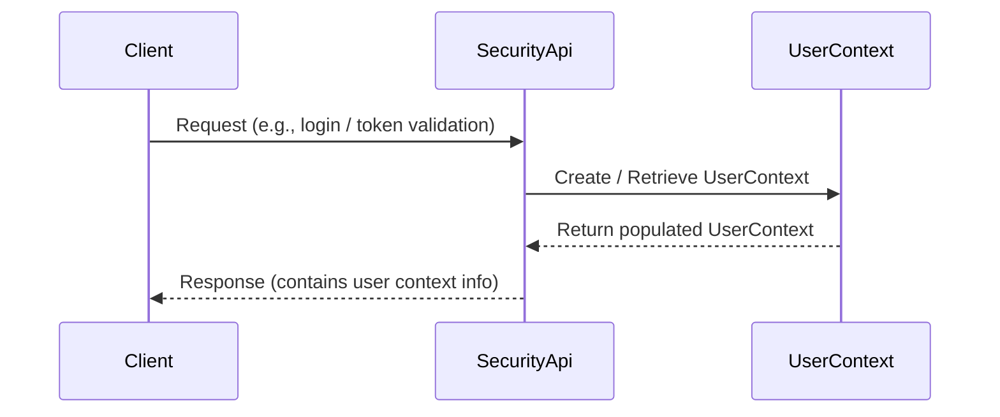

# User and Access Management

## Overview
The User and Access Management feature provides the ability to work with user‑related data such as roles and permissions. It is invoked through the `SecurityApi` entry point, which creates or retrieves a `UserContext` object (the domain entity defined in *UserContext.java*). The feature currently produces a populated `UserContext` that downstream components can use for authorization decisions.

## Behavior
* The `SecurityApi` receives a request that results in the construction or lookup of a `UserContext` instance. *(source file `UserContext.java` – no line numbers available)*  
* The `UserContext` object holds information about the user’s identity, assigned roles, and granted permissions. *(source file `UserContext.java` – no line numbers available)*  

> **Note:** The repository does not contain readable source code for the methods that populate or persist the `UserContext`, so no concrete call‑graph steps can be cited.

## Triggers / Entry points
* **SecurityApi** – the public API that initiates user‑context handling. *(source file `SecurityApi` – no line numbers available)*  

No other routes, UI actions, CLI commands, scheduled jobs, events, or webhooks are observable in the available source.

## End-to-end flow (Mermaid)

*The diagram reflects the only observable interaction: a client request reaching `SecurityApi`, which produces a `UserContext`.*

## State / data touched
* `UserContext` objects are instantiated in memory. No persistent tables, collections, caches, or files can be identified from the supplied source.

## External dependencies
* No external APIs, services, queues, caches, or message brokers are referenced in the available source files.

## Configuration / parameters
* No configuration keys, environment variables, feature flags, or constants are visible in the supplied source.

## Edge cases & failure modes (observed in code)
* The provided source does not contain any validation, retry, timeout, rate‑limit, idempotency, or partial‑failure handling logic.

## Open questions
* **Implementation details of `SecurityApi`** – the actual class/method signatures, request parsing, and response generation are not visible.  
* **`UserContext` internals** – fields, constructors, and any business logic (e.g., role aggregation, permission checks) are unknown.  
* **Persistence layer** – it is unclear whether `UserContext` is stored in a database, cache, or is purely in‑memory.  
* **Error handling** – how the system reacts to missing users, invalid permissions, or internal exceptions is not observable.  
* **External integrations** – any calls to authentication providers, directory services, or audit loggers are not present in the supplied files.  
* **Configuration influences** – whether feature flags or environment settings modify the behavior of this feature cannot be determined.  

*Because the repository does not contain readable source code for the relevant classes, the documentation above is limited to what can be inferred from file names alone.*